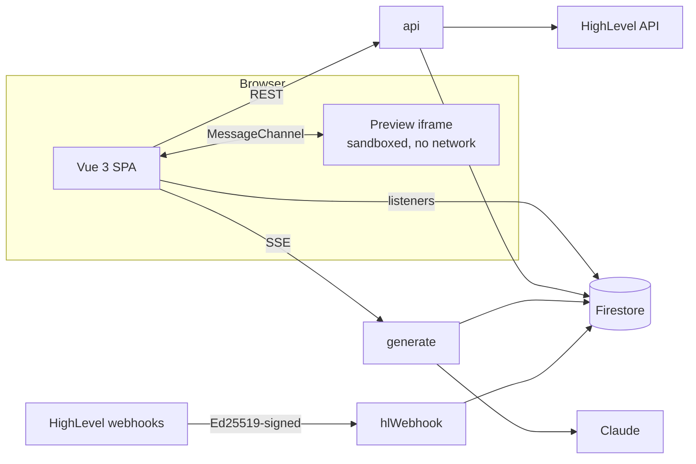

# Genesis — AI app builder for HighLevel

Describe an app in chat. Claude writes it file by file into a live editor, and a sandboxed preview runs it against your real HighLevel contacts, conversations and calendars. Every generation is a snapshot you can diff and restore.

All six assignment bonuses are implemented: cancellation, iterative refinement, per-generation diff, rate limiting, HighLevel pagination, and webhooks (a running preview can react when contacts, appointments or messages change in HighLevel).

|                        |                                                                                                                                                                                     |
| ---------------------- | ----------------------------------------------------------------------------------------------------------------------------------------------------------------------------------- |
| **App**                | [https://test-3ff4c.web.app](https://test-3ff4c.web.app)                                                                                                                            |
| **Cloud Functions**    | `https://us-central1-test-3ff4c.cloudfunctions.net` — `/api`, `/generate` (SSE), `/hlWebhook`                                                                                       |
| **Health**             | `[/api/v1/health](https://us-central1-test-3ff4c.cloudfunctions.net/api/v1/health)` · `[/generate/v1/health](https://us-central1-test-3ff4c.cloudfunctions.net/generate/v1/health)` |
| **Demo (Loom, 5 min)** | _link_                                                                                                                                                                              |
| **Reviewer account**   | In the submission email (Genesis login only). The HighLevel sandbox sub-account is not shared.                                                                                      |

## Architecture



## Architecture decisions

1. **Generated code is untrusted, so it gets capabilities, never credentials.** The preview is a `srcdoc` iframe (`sandbox="allow-scripts allow-forms"`, CSP `connect-src 'none'`), so it cannot reach the network. It calls HighLevel only through `window.genesis.highlevel`: a MessageChannel bridge allow-lists the method, validates params and enforces call budgets, then the `api` proxy uses the user's encrypted OAuth token.

   **Trade-off:** The model hand-writes things like charts, because generated apps are plain HTML, CSS and JavaScript with no CDNs or npm packages. The `srcdoc` preview also inherits the builder page's CSP, so the builder cannot adopt a strict CSP until previews move to their own origin (improvement 4).

2. **The model codes against a small typed SDK, not HighLevel's REST API.** Seven read methods return normalized records and opaque cursors. They are defined once in a shared manifest that generates the proxy routes and the bridge allow-list, and a test checks the system prompt against it. A narrow, documented surface is what makes the model's integrations reliable.

   **Trade-off:** New HighLevel capabilities need an adapter. Writes (create contact, send message) are left out on purpose until there is a confirmation step.

3. **SSE straight from a 2nd-gen function, with Firestore as the source of truth.** Firebase Hosting rewrites buffer responses and cut off at 60 s, so the SPA streams from the function URL directly. Events are versioned, with heartbeats and exactly one terminal event. Requests are idempotent (`clientRequestId`), a lease allows one active generation per project, and a dropped stream reconciles from the generation document instead of re-running the model.

   **Trade-off:** A generation lives as long as its request (capped at 300 s). Closing the tab ends it as _interrupted_, with finished files kept for Apply or Discard.

4. **A marker-based file protocol and a streaming parser instead of tool-call JSON.** Tokens land in the editor as they are written. Each file is validated as it completes (path rules, size caps, JavaScript syntax, and a policy that rejects credentials, HighLevel URLs and remote scripts), then staged.

   **Trade-off:** We own the handling of malformed output; tests re-split recorded streams at random boundaries to cover it.

5. **One atomic commit path for generations, partial applies and restores.** A single transaction writes content-addressed blobs, a snapshot manifest and the working tree. Manual edits are saved as a checkpoint before anything overwrites them. An interrupted run never leaves a half-written project, and nothing is lost to a restore.

   **Trade-off:** History is kept forever. Blobs are deduplicated by content hash, but there is no retention policy yet.

6. **OAuth tokens are treated as secrets, with refresh built for concurrency.** Tokens are encrypted with AES-256-GCM at rest, with the user and field bound as associated data, in a collection clients cannot read. HighLevel issues a new refresh token on every refresh and invalidates the old one, so two refreshes racing each other would break the connection. Refresh is therefore single-flight per instance plus a Firestore lease across instances, with network calls kept outside transactions. A 401 triggers one forced refresh, then a clear _Reconnect required_.

   **Trade-off:** The key lives in Secret Manager rather than KMS envelope encryption, so rotation is manual.

7. **Cost and abuse limits are part of the design.** Generation, HighLevel calls, OAuth start, saves and restores have per-user limits; generations also have a per-user daily and a global daily cap, and a kill switch (`GENERATION_ENABLED`) turns generation off without a code change. `generate` is capped at 5 instances × 20 streams, so at most 100 generations run at once. Output is bounded by `max_tokens` and a deadline, the system prompt is cached, and every generation records tokens, latency and estimated cost.

   **Trade-off:** HighLevel-proxy limits are kept in memory per instance, which avoids a Firestore write on every call but makes the limit approximate once `api` scales out. Fixed windows are also coarse; a per-user token budget would be fairer.

8. **Tenancy by path; privileged work only in functions.** Projects, files, snapshots, and the connection status the client can read live under `users/{uid}`. Encrypted HighLevel tokens live in `hlConnections/{uid}`, which the security rules deny to every client. The client creates, renames, and soft-deletes projects directly under those rules (tested in the emulator). Anything needing a secret, an external call, or a multi-document transaction runs in a function. Shared zod contracts for REST, SSE, the bridge, errors, and Firestore documents are copied to the frontend and drift-checked in CI.

   **Trade-off:** Projects belong to a Genesis user, not to a HighLevel location or agency, so teammates cannot share a project. Changing that later is a data migration.

9. **Webhooks make generated apps live without polling.** `hlWebhook` verifies HighLevel's Ed25519 signature over the raw body, dedupes deliveries, and stores ID-only events with a 24-hour TTL, so no contact data is copied into Firestore. The SPA relays them to `genesis.on` in the preview, and the app refetches through the SDK.

   **Trade-off:** Events reach the app only while the preview is open.

10. **Claude gets a bounded context with no contact or message data.** Each turn sends the current files, recent turns and location metadata (name, timezone, calendar names, contact count). Contact and message records never reach the model, and the system prompt marks everything it is given as data, not instructions. That keeps customer data away from the model provider and shrinks the prompt-injection surface. Sonnet 5 runs with adaptive thinking, a versioned cached system prompt and a server-side fallback model; a scripted provider behind the same interface (`LLM_PROVIDER=fake`) makes the whole pipeline testable offline.

    **Trade-off:** The whole project goes into every prompt, so a project is capped at 25 files / 300 KB; larger apps would need to send only the relevant files. Quality is guarded by validators and tests, not yet by an evaluation suite (improvement 1).

## HighLevel setup

Reviewers do not need a HighLevel login, and this project's sandbox sub-account is not shared. Sign in with the Genesis reviewer account from the submission email. That account is already connected, so the dashboard shows the location name and the preview loads real contacts, conversations, and appointments.

To use your own HighLevel account, run your own copy (deployed or on the emulators) with your own marketplace app. The URLs below are this deployment's; replace `test-3ff4c` with your Firebase project ID.

1. In the [marketplace developer portal](https://marketplace.gohighlevel.com), create an app with **Target user: Sub-account**. This deployment uses the draft app _GENESIS_ASSIGNMENT_ (unpublished).
2. **Advanced settings → Auth**

- Scopes: `contacts.readonly`, `conversations.readonly`, `conversations/message.readonly`, `calendars.readonly`, `calendars/events.readonly`, `locations.readonly`.
- Redirect URL (must match exactly): `https://us-central1-test-3ff4c.cloudfunctions.net/api/v1/hl/oauth/callback`
- For OAuth against the emulators, also add `http://127.0.0.1:5001/demo-genesis/us-central1/api/v1/hl/oauth/callback`.
- HighLevel rejects a redirect URL that contains `highlevel`, `leadconnector`, or `ghl`.
- Create client keys (**Client Keys → Add**) and store them as `HL_CLIENT_ID` and `HL_CLIENT_SECRET`: in Secret Manager when deployed (see Deployment notes), or in `functions/.secret.local` on the emulators. Do not commit them.

3. **Advanced settings → Webhooks:** set the default URL to `https://us-central1-test-3ff4c.cloudfunctions.net/hlWebhook` and enable `ContactCreate`, `ContactUpdate`, `ContactDelete`, `AppointmentCreate`, `AppointmentUpdate`, `AppointmentDelete`, `InboundMessage`, and `OutboundMessage`. Signatures are verified with HighLevel's published Ed25519 key; there is nothing else to configure.
4. **Sandbox:** in the developer portal (**Testing**), create an app test account, which is a free sandbox agency, then create a sub-account inside it. Add test data: 30+ contacts (the SDK returns 20 per page, so **Load more** has a second page), two calendars with appointments in the next two weeks, and a few conversations. You do not need access to this project's sandbox.
5. In Genesis, click **Connect HighLevel** on the dashboard and choose that sandbox **sub-account**. Choosing an agency is rejected, with an explanation.

## Local setup

Requires Node 24, Java 21 (Firestore emulator) and Firebase CLI 15 (`npm i -g firebase-tools@15`). No Firebase project is needed: the emulators run as the offline project `demo-genesis`. Generation uses real Claude by default, so you need an Anthropic API key. Without one, turn the model switch off (below).

```bash
npm run install:all
npm --prefix functions run build        # the Functions emulator loads functions/lib

cp functions/.env.example functions/.env.local
cp functions/.secret.local.example functions/.secret.local
cp frontend/.env.example frontend/.env.local
```

Set these values:

```bash
# functions/.env.local
APP_BASE_URL=http://localhost:5173
ALLOWED_ORIGINS=http://localhost:5173,http://127.0.0.1:5173
HL_REDIRECT_URI=http://127.0.0.1:5001/demo-genesis/us-central1/api/v1/hl/oauth/callback
LLM_PROVIDER=anthropic         # model switch (below)
ANTHROPIC_WORKSPACE_ID=        # wrkspc_...; required if your API key is not scoped to a workspace

# functions/.secret.local
ANTHROPIC_API_KEY=             # required while LLM_PROVIDER=anthropic
TOKEN_ENCRYPTION_KEY=          # output of: openssl rand -base64 32

# frontend/.env.local
VITE_FIREBASE_API_KEY=demo-key
VITE_FIREBASE_AUTH_DOMAIN=localhost
VITE_FIREBASE_PROJECT_ID=demo-genesis
VITE_FIREBASE_APP_ID=demo-app
VITE_API_BASE_URL=http://127.0.0.1:5001/demo-genesis/us-central1/api
VITE_GENERATE_BASE_URL=http://127.0.0.1:5001/demo-genesis/us-central1/generate
VITE_USE_EMULATORS=true
```

Run:

```bash
firebase emulators:start --project demo-genesis --only auth,firestore,functions   # Emulator UI: http://127.0.0.1:4000
npm --prefix frontend run dev                                                    # http://localhost:5173
```

**Model switch (**`LLM_PROVIDER` **in** `functions/.env.local`**).** Claude is on by default, locally and in production. Turn it off only to run without an API key.

| `LLM_PROVIDER`        | Model                                                                             | Needs                                                                                                                                                                                                                                                                                       |
| --------------------- | --------------------------------------------------------------------------------- | ------------------------------------------------------------------------------------------------------------------------------------------------------------------------------------------------------------------------------------------------------------------------------------------- |
| `anthropic` (default) | Claude (`claude-sonnet-5`, set by `ANTHROPIC_MODEL`), the same path as production | `ANTHROPIC_API_KEY` in `functions/.secret.local`. If the key is not scoped to a workspace (this project's org key is not), also `ANTHROPIC_WORKSPACE_ID` in `functions/.env.local`, or every generation fails. Generations are billed to that key, and the per-user and daily limits apply. |
| `fake`                | Scripted model, offline                                                           | Nothing. Any prompt writes a working contacts-and-appointments app. Add `#slow`, `#error`, `#truncate`, `#badjs` or `#refuse` to a prompt to exercise Stop, partial results (Apply / Discard / Retry) and error handling.                                                                   |

Restart the emulators after changing the switch or the key. If the switch is on and the key is empty, generation stays off: sending a prompt shows _Generation is temporarily unavailable_, and the Functions log shows `generate.model_not_configured` with the fix. The emulator also prints _Unable to access secret environment variables from Google Cloud Secret Manager_ for each secret left blank; for the HighLevel client ID and secret, which only **Connect HighLevel** needs, that is expected.

**Real HighLevel data locally:** sign up in the local app, copy your uid from the Emulator UI (Authentication), create a Private Integration Token in your sandbox sub-account (HighLevel setup, step 4; Settings → Private Integrations), then:

```bash
FIRESTORE_EMULATOR_HOST=127.0.0.1:8080 GCLOUD_PROJECT=demo-genesis \
HL_PIT=<token> HL_LOCATION_ID=<location id> FIREBASE_UID=<uid> \
TOKEN_ENCRYPTION_KEY=<same value as functions/.secret.local> \
npm --prefix functions run seed:pit
```

**Tests:** `npm test` (unit, both packages), `npm run test:rules` and `npm run test:integration` (start their own emulators).

## Deployment notes

1. **Firebase project** on the Blaze plan (Functions and Secret Manager need it). Enable Authentication → Email/Password, create Firestore (this project uses `nam5`), then `firebase use <project>`.
2. **Secrets** (Secret Manager):

```bash
 firebase functions:secrets:set ANTHROPIC_API_KEY
 firebase functions:secrets:set HL_CLIENT_ID
 firebase functions:secrets:set HL_CLIENT_SECRET
 firebase functions:secrets:set TOKEN_ENCRYPTION_KEY    # openssl rand -base64 32
```

3. **Runtime params:** copy `functions/.env.example` to `functions/.env.<project>` and set `APP_BASE_URL` (Hosting URL), `ALLOWED_ORIGINS` (Hosting origins) and `HL_REDIRECT_URI`, plus `ANTHROPIC_WORKSPACE_ID` if your API key is not scoped to a workspace. The same file holds the model settings (keep `LLM_PROVIDER=anthropic`), the generation kill switch and caps, and min instances. The root `.env.example` documents every variable.
4. **Frontend build config:** `frontend/.env.production` holds the Firebase web config and the function URLs. These values are public by design.
5. **Deploy:** `firebase deploy --only firestore,functions,hosting`. Predeploy hooks lint and build the functions and build the SPA. Functions run on Node 24 in `us-central1`: `api`, `generate` and `hlWebhook`.
6. **After the first functions deploy:** register the redirect URL and webhook URL in the HighLevel app (HighLevel setup, steps 2–3), then create the TTL policies that expire webhook claims and preview events after a day:

```bash
 gcloud firestore fields ttls update expiresAt --collection-group=webhookEvents --enable-ttl --project=<project>
 gcloud firestore fields ttls update expiresAt --collection-group=events --enable-ttl --project=<project>
```

7. **Review window:** `API_MIN_INSTANCES=1` and `GENERATE_MIN_INSTANCES=1` avoid cold starts; set them back to `0` afterwards and redeploy functions. `GENERATION_ENABLED=false` stops generation without a code change.
8. **CI** (GitHub Actions, on pushes to `main` and on PRs): secret scan, contract drift check, lint, typecheck, unit tests and build for both packages, Firestore rules and integration tests on the emulators, and a first-load bundle budget. Deploys are run manually.

## What I would improve next

Each item answers a trade-off above.

1. **An evaluation loop for generation quality.** Quality is currently protected by validators, contract tests and a scripted model. Next: a golden-prompt suite run against the real model whenever the prompt or model changes, tracking validator pass rate, SDK methods used, time to first token and cost per generation.
2. **Durable generations.** Run the model call as a background job (Cloud Tasks) that writes events to Firestore, so a generation survives a closed tab and any client can resume the stream.
3. **Write actions with explicit consent.** Create and update contacts, send messages and book slots, behind write scopes and a confirmation step in the preview. Read-only is deliberate until that exists.
4. **A separate origin for previews and a hosted runtime.** Serving previews from their own domain would let the builder adopt a strict CSP, and would let generated apps be published as HighLevel custom pages that keep receiving webhooks after the preview closes.
5. **Operational dashboards.** Tokens, latency and cost are already recorded per generation. Next: dashboards and alerts for failure rate by error code, p95 time to first token and spend per user, plus tracing across SPA → functions → HighLevel and Claude.
6. **Agency-level projects and single sign-on inside HighLevel.** Let projects belong to a location so an agency's users can share them, and open Genesis as a HighLevel custom page with SSO, so there is no second login.
