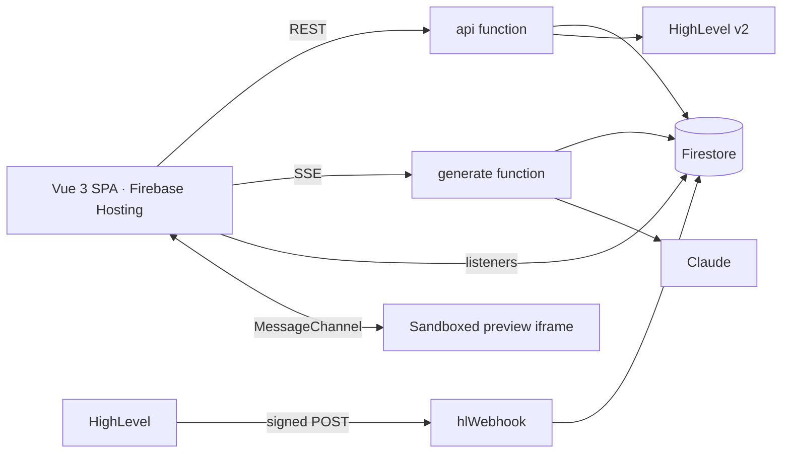

# Genesis — AI app builder for HighLevel

Describe an app in chat; Claude writes it live into a code editor; a sandboxed preview runs it against your real HighLevel contacts, conversations and calendars. Every generation is a restorable snapshot.

**Live app:** https://test-3ff4c.web.app
**Functions:** `https://us-central1-test-3ff4c.cloudfunctions.net/api` · `…/generate` (SSE) · `…/hlWebhook`
**Demo video (≤ 5 min):** add the Loom URL before submission
**Reviewer account:** sent in the submission email (sandbox location already connected).

## What it does

- Email/password sign-in (Firebase Auth), HighLevel OAuth per user (one location), tokens encrypted server-side and refreshed automatically.
- Projects dashboard; three-panel workspace: chat, Monaco editor with file tree and tabs, live preview.
- Server-Sent Events stream Claude's output: tokens appear in the chat and in the file being written; interrupted runs keep finished files (Apply / Discard / Retry).
- **Stop** cancels a running generation. A follow-up prompt edits the app that is already in the project.
- Generated apps call `window.genesis.highlevel.*` (seven read methods: location, contacts, conversations, calendars) — the preview never holds a credential. List screens use **Load more**. `genesis.on` refreshes a list when HighLevel sends a contact, appointment, or message webhook.
- Snapshot history with restore, and a side-by-side **View changes** diff against the previous snapshot or the current files.
- Per-user rate limits, a daily cap, and a generation kill switch on the Cloud Functions.

## Architecture



Design docs: `docs/00-index.md` (analysis, HLD, backend/frontend/end-to-end design, implementation plans).

## Key architecture decisions

1. **Capabilities, not credentials, in the preview** — `srcdoc` iframe, `sandbox="allow-scripts allow-forms"`, CSP with `connect-src 'none'`; HighLevel calls go through a validated, budgeted MessageChannel bridge to the SPA, then the `api` proxy.
2. **One typed runtime SDK** (seven read methods, normalized models, opaque cursors) generated from a shared manifest that also drives the proxy routes, the bridge allow-list and the system prompt.
3. **SSE directly from a 2nd-gen function** (not through Hosting rewrites) with a versioned event envelope, heartbeats and exactly one terminal event; the Firestore generation document is the source of truth after a disconnect.
4. **Marker-based file protocol + streaming parser** instead of JSON tool output — files stream token by token into the editor; every file is validated (paths, size, JS syntax, policy) and staged before commit.
5. **One atomic commit primitive** for generations, partial applies and restores: checkpoint → content-addressed blobs → snapshot manifest → working tree, in a single transaction.
6. **Token lifecycle built for concurrency** — AES-256-GCM at rest (AAD bound to user and field), single-flight refresh per instance plus a Firestore lease across instances, HTTP never inside transactions.
7. **Path-based tenancy + security rules** — everything under `users/{uid}`; clients write only validated project metadata; tokens live in a server-only collection.
8. **Shared zod contracts** (`functions/src/contracts` → copied to the frontend, drift-checked in CI) for REST, SSE, bridge, errors and Firestore documents.
9. **Firestore listeners as the UI's source of truth**, Pinia only for ephemeral state, Monaco models for unsaved text.
10. **Claude with adaptive thinking**, cached system prompt, bounded project/session/HighLevel context, server-side fallback, and Anthropic console spend limits. Webhooks are verified with Ed25519 over the raw body and relayed as id-only events.

## Local development

Requirements: Node 24, Java 21 (emulators), Firebase CLI 15.

```bash
npm run install:all
cp .env.example functions/.env.local            # keep LLM_PROVIDER=fake to work without an API key
cp functions/.secret.local.example functions/.secret.local   # fill TOKEN_ENCRYPTION_KEY (openssl rand -base64 32)
cp frontend/.env.example frontend/.env.local     # use the emulator values from docs/09-frontend-implementation-plan/01-foundation.md FE-0.4
npm run contracts:sync
npm run emulators                                 # auth, firestore, functions, UI on :4000
npm --prefix frontend run dev                     # http://localhost:5173
```

Real HighLevel data locally (emulator only): sign up in the local app, copy your uid from the Emulator UI, then
`FIRESTORE_EMULATOR_HOST=127.0.0.1:8080 HL_PIT=<private integration token> HL_LOCATION_ID=<location> FIREBASE_UID=<uid> TOKEN_ENCRYPTION_KEY=<same as .secret.local> npm --prefix functions run seed:pit`. Real Claude locally: set `LLM_PROVIDER=anthropic` and `ANTHROPIC_API_KEY` in `functions/.secret.local`. `ANTHROPIC_WORKSPACE_ID` is optional.

Tests: `npm test` (unit), `npm run test:rules`, `npm run test:integration` (emulators).

## HighLevel setup

1. Marketplace developer account → create a **Private** app, distribution **Sub-account**.
2. Scopes: `contacts.readonly conversations.readonly conversations/message.readonly calendars.readonly calendars/events.readonly locations.readonly`.
3. Redirect URL: `https://us-central1-test-3ff4c.cloudfunctions.net/api/v1/hl/oauth/callback`.
4. Client ID/secret → `firebase functions:secrets:set HL_CLIENT_ID` / `HL_CLIENT_SECRET`.
5. Webhook URL: `https://us-central1-test-3ff4c.cloudfunctions.net/hlWebhook`. Enable ContactCreate, ContactUpdate, ContactDelete, AppointmentCreate, AppointmentUpdate, AppointmentDelete, InboundMessage, and OutboundMessage.
6. A sandbox sub-account with ≥ 30 contacts, a few conversations and appointments (script in `docs/03-prerequisites.md` §5.3). Interview location used for this project: `yNQD1XgF5lZqjS1CdBbz`.

## Deployment notes

- Firebase project `test-3ff4c` on Blaze; Firestore `nam5`; functions `api`, `generate`, and `hlWebhook` on Node 24, `us-central1`.
- Secrets in Secret Manager; non-secret params in `functions/.env.test-3ff4c`; `.env.example` documents every variable. `ANTHROPIC_WORKSPACE_ID` is optional and is sent only when set.
- `firebase deploy --only firestore,functions,hosting`. CI (`.github/workflows/ci.yml`) runs lint, typecheck, unit, rules and emulator integration tests, build and bundle budget on every push.
- After the first deploy that includes webhooks, create the TTL policies (they delete claim docs and preview events after a day):

```bash
gcloud firestore fields ttls update expiresAt --collection-group=webhookEvents --enable-ttl --project=test-3ff4c
gcloud firestore fields ttls update expiresAt --collection-group=events --enable-ttl --project=test-3ff4c
```

- SPA routes (`/`, `/projects/…`) are served with `Cache-Control: no-cache` so a redeploy does not leave reviewers on a stale `index.html`.
- For the review window, set `API_MIN_INSTANCES=1` and `GENERATE_MIN_INSTANCES=1`. `GENERATION_ENABLED=false` returns 503 and spends no rate-limit slot.
- A webhook timestamp, when HighLevel sends one, must be within 5 minutes. Later retries are acknowledged and dropped on purpose: a stale event is not useful in a live preview, and the dedupe claim already stops replays inside that window.

## What I would improve next

1. Serve previews from a separate sandbox origin so the SPA can adopt a strict CSP.
2. Multi-location and agency-level installs (marketplace distribution), with per-project location switching.
3. Durable generation jobs (Cloud Tasks/Workflows) so a generation survives the browser closing, with resumable streams.
4. Richer generated apps: a small component library and design tokens injected into the prompt.
5. Observability: OpenTelemetry traces across SPA → functions → HighLevel/Claude, cost dashboards per user.
