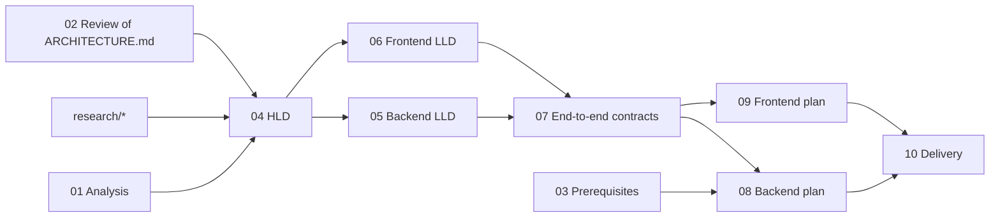

# Genesis — Documentation index

Genesis is an AI app builder for HighLevel: describe an app in chat, Claude writes it live into a Monaco editor over Server-Sent Events, and a sandboxed preview runs it against the user's real HighLevel contacts, conversations and calendars. Stack: Vue 3 + shadcn-vue, Firebase (Auth, Firestore, Cloud Functions 2nd gen on Node 24, Hosting), Claude (`@anthropic-ai/sdk`).

This folder is the complete design and delivery record, written before implementation. `ARCHITECTURE.md` is the original single-file draft; it is kept unchanged for history and is **superseded** by this suite (its review: `02`).

## Reading order

| #   | Document                                                                       | Read it to…                                                                                                                                               | Audience                    |
| --- | ------------------------------------------------------------------------------ | --------------------------------------------------------------------------------------------------------------------------------------------------------- | --------------------------- |
| 01  | [Analysis and proposal](01-analysis-and-proposal.md)                           | understand what the assignment asks, how it will be judged, the proposed approach, 5-day plan, risks, open questions                                      | everyone — start here       |
| 02  | [Architecture review](02-architecture-review.md)                               | see the 54 findings on the original draft and what changed                                                                                                | reviewers, interviewers     |
| 03  | [Prerequisites](03-prerequisites.md)                                           | set up accounts, Firebase, HighLevel app + sandbox, secrets, spikes (Day 0)                                                                               | implementer                 |
| 04  | [High-level design](04-high-level-design.md)                                   | the 21 key questions with decision / why / rejected / trade-offs / interview line; containers, data model, security zones, **full repository tree (§10)** | everyone                    |
| 05  | [Backend system design](05-backend-system-design.md)                           | functions topology, OAuth + token lifecycle, HighLevel proxy, generation pipeline, commit/snapshots, testing                                              | backend                     |
| 06  | [Frontend system design](06-frontend-system-design.md)                         | routes, state ownership, SSE client, editor, preview/bridge, snapshots, UX states                                                                         | frontend                    |
| 07  | [End-to-end system design](07-end-to-end-system-design.md)                     | **canonical contracts** (REST, SSE v1, bridge v1, runtime SDK v1, Firestore schema, errors), flows, state machines, threat model, FMEA, operations        | everyone; wins on conflicts |
| 08  | [Backend implementation plan](08-backend-implementation-plan/00-overview.md)   | build the backend task by task (BE-0 … BE-8) with code, tests, commands, commits                                                                          | implementer                 |
| 09  | [Frontend implementation plan](09-frontend-implementation-plan/00-overview.md) | build the SPA task by task (FE-0 … FE-8); code verified by typecheck, lint, 90 tests and a production build                                               | implementer                 |
| 10  | [Delivery: Git, CI/CD, deployment](10-delivery-git-and-deployment.md)          | repo setup, secret hygiene, CI workflow, deploy runbook, smoke checks, README template, Loom script, submission email                                     | Day 5                       |

Background research ([`research/`](research/)): [01 assignment deconstruction + traceability matrix](research/01-assignment-deconstruction.md) · [02 HighLevel platform](research/02-highlevel-platform.md) · [03 Firebase platform](research/03-firebase-platform.md) · [04 LLM generation](research/04-llm-generation.md) · [05 frontend stack](research/05-frontend-stack.md).
Prompts: [Claude Design UI brief](prompts/01-claude-design-genesis-ui.md).

## How the documents relate

## Conventions

- **Requirement IDs** (`R-AUTH1`, `R-BE4`, `R-FE6`, `R-B3` …) come from `research/01` §3; its §8 maps every requirement to design sections, plan tasks and verification.
- **Task IDs** `BE-x.y` / `FE-x.y` are stable; commits reference them. Each task lists files, interfaces (what it consumes and produces), steps with code, the command to run and the commit message.
- **Contracts live in code**: `functions/src/contracts/*.ts` (zod) is the source of truth, copied to `frontend/src/contracts/` by `npm run contracts:sync`; CI fails on drift. `07` §3 describes them in prose.
- **Conflict rule**: `07` §3 (contracts) > implementation plans (code) > LLDs (`05`, `06`) > HLD (`04`) > analysis (`01`).
- Dates are absolute (the suite was written on 2026-09-26); versions were checked against the npm registry that day.

## Decisions still open (from `01` §11)

1. Default model/effort — `claude-opus-5` at `effort: medium`.
2. Commit this `docs/` folder to the public repository — recommended (it shows the process).
3. Reviewer demo account with the sandbox location pre-connected — recommended.
4. `minInstances: 1` for `api` and `generate` during the review window (~USD 5–15), back to 0 after.
