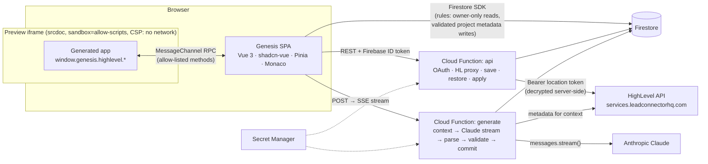

# Genesis — Analysis & Proposal

**Status:** Proposal — decisions integrated, ready for implementation planning
**Date:** 2026-09-26
**Author:** Claude (consultant / senior peer) with Aditya
**Scope:** The whole take-home: `frontend/` (Vue 3 + shadcn-vue SPA), `functions/` (Firebase Cloud Functions), Firestore data + rules, HighLevel OAuth + API integration, Claude streaming generation, deployment, README and Loom.
**Inputs:** `GENESIS_ASSIGNMENT_V2.pdf`, `docs/ARCHITECTURE.md` (initial draft), research notes in [`research/`](research/).

> Facts are cited to research notes. Where the initial draft is corrected, the full reasoning lives in [`02-architecture-review.md`](02-architecture-review.md).

---

## 0. What we're building — restated

Genesis is an AI app builder for HighLevel. A user signs up with email and password, connects **one HighLevel sub-account** through OAuth, creates a project and describes an app in chat. Claude **streams** the answer: a short explanation into the chat and **files into a Monaco editor, character by character**. When the stream finishes, the files are validated, committed atomically and snapshotted, and a **sandboxed live preview** runs the app against the user's **real HighLevel data** (contacts, conversations, calendars). The user can edit files, restore any snapshot, and apply or discard partial results after an interrupted or failed generation. A follow-up prompt uses the same generation path with the current files already in context.

The one idea that shapes everything:

```
Generated code is untrusted. It runs with no network and no credentials.
It can only ask its host (the Genesis page) to perform an allow-listed HighLevel operation;
the host asks our backend; only the backend holds the HighLevel token.
```

This is not a generic "LLM writes a web page" tool: the model writes against a **typed, versioned HighLevel runtime SDK** (`window.genesis.highlevel.*`) whose contract lives in one file and drives the prompt, the backend routes and the browser bridge.

---

## 1. Problem & scope

**Outcome:** a reviewer watches (or runs) sign-up → connect HighLevel → prompt → live stream → real sandbox data in the preview → manual edit → restore, and can defend every architectural choice in the follow-up interview.

**In scope (must):** every requirement in [`research/01`](research/01-assignment-deconstruction.md) §3.1–3.7 (What to Build, constraints, deliverables) and the implicit requirements I-01…I-12 that are needed to ship that product.

**Implemented assignment bonuses:** generation cancellation (R-B1), snapshot diff (R-B3), Cloud Function rate limits (R-B4), Load more in generated apps (R-B5), and HighLevel webhooks into the preview (R-B6). Iterative refinement (R-B2) is not a separate feature — the required generator already includes current files. Create/update contact, send message, and free slots stay out: they are prerequisite “familiarize” verbs, not product requirements.

**Also out of scope:** eval harness, Anthropic fast mode, Playwright smoke, multiple locations per user, collaborative editing, framework-based generated apps (Vue/React inside the preview), durable resumable generation jobs, publishing generated apps to the HighLevel marketplace, custom domains.

---

## 2. Current state (facts)

| Fact                                         | Detail                                                                                                                                                                                                                                                                                                  |
| -------------------------------------------- | ------------------------------------------------------------------------------------------------------------------------------------------------------------------------------------------------------------------------------------------------------------------------------------------------------- |
| Repository                                   | `genesis/` contains only `docs/ARCHITECTURE.md` (a single "locked" draft). No code, no git repo yet                                                                                                                                                                                                     |
| Developer machine                            | Node **24.15.0**, npm 11.12.1, **Java 17** (Firebase emulators now require **Java 21+**), gh 2.95, git 2.50; `firebase-tools` not installed                                                                                                                                                             |
| Platform changes since the draft was written | Cloud Functions **Node 20 is decommissioned 2026-10-30** (the draft pins Node 20); TypeScript 7 is out but **incompatible with typescript-eslint** (use 5.9); firebase-tools 15 requires Java 21 for emulators; `@vee-validate/zod` does not support zod 4                                              |
| HighLevel specifics the draft missed         | Token endpoint is **form-urlencoded**; location **name needs `locations.readonly`**; `Version` headers differ per API family; contacts cursor is `searchAfter`; redirect URIs containing "highlevel" are **rejected**; 100 req / 10 s per location ([`research/02`](research/02-highlevel-platform.md)) |
| Firebase specifics                           | Hosting rewrites buffer responses and time out at **60 s** (SSE must hit the function URL); 2nd-gen functions stream fine; client disconnect → CPU throttling, so work must not continue after the client leaves ([`research/03`](research/03-firebase-platform.md))                                    |

---

## 3. What HighLevel will judge (summary)

Full rubric with red flags: [`research/01`](research/01-assignment-deconstruction.md) §6. In short:

1. **It works end-to-end on the deployed URL** (Loom flow, first try).
2. **Security judgment** — LLM output treated as untrusted; no credential in generated code; tokens encrypted and server-only; rules tests.
3. **HighLevel correctness** — OAuth + rotation under concurrency, right versions/endpoints, adapters that hide HighLevel pagination quirks, reauth states.
4. **Streaming + LLM engineering** — clean SSE protocol, robust parser, validation, graceful failure with partial results, bounded context and cost.
5. **Data & versioning** — atomic commits, cheap snapshots, restore without loss.
6. **Frontend craft** — idiomatic Vue 3, clean state boundaries, every loading/empty/error state, shadcn-vue throughout.
7. **Code quality and communication** — strict TypeScript, modular code, tests on the risky modules, a README whose decisions are real trade-offs, a crisp Loom.
8. **Scope discipline and AI maturity** — core first, bonuses ranked, and every line explainable.

---

## 4. Review of the initial draft (summary)

`docs/ARCHITECTURE.md` gets the **big shape right**: LLM-as-untrusted-producer, no generic proxy, path-based tenancy, one cursor contract, location-level OAuth, fetch-based SSE straight to the function URL, `srcdoc` sandbox without `allow-same-origin`, one provider behind a thin interface, full snapshots per generation, a README draft and a Loom script.

It has **defects that would fail requirements or open security holes**. The top ten (all 54 findings, with fixes, are in [`02-architecture-review.md`](02-architecture-review.md)):

| #   | Finding                                                                                                                                                                                                                     | Severity                        |
| --- | --------------------------------------------------------------------------------------------------------------------------------------------------------------------------------------------------------------------------- | ------------------------------- |
| 1   | The **Firebase ID token is handed into the untrusted iframe** — generated code could exfiltrate it and read/write the user's entire Firestore subtree for an hour. Contradicts the draft's own principle                    | Critical                        |
| 2   | **Node 20 runtime** — undeployable from 2026-10-30, inside the review window                                                                                                                                                | Critical                        |
| 3   | Token refresh performs the **HTTP call inside a Firestore transaction** — transactions retry and don't serialize side effects; concurrent refreshes burn the rotated refresh token and wrongly mark users `reauth_required` | Critical                        |
| 4   | Files are written into the live project **one by one mid-stream**, contradicting its own "never corrupts the last working app" promise — an interrupted generation leaves a broken mix                                      | Critical                        |
| 5   | **Connected location name cannot be shown**: no `locations.readonly` scope, no client-readable status document                                                                                                              | Critical (explicit requirement) |
| 6   | **Location name gap only on HighLevel**: the draft omitted `locations.readonly`. Write/send/availability verbs are prerequisite “familiarize,” not What to Build — keep a read-only runtime                                 | High                            |
| 7   | "Bounded … **external** context" is required; the draft explicitly sends none and has no budgets                                                                                                                            | High                            |
| 8   | `generate` function **timeout unspecified** (default 60 s kills generations)                                                                                                                                                | High                            |
| 9   | Streaming scanner drops prose, leaks partial markers into chat/editor, grows unbounded, and is brittle to attribute order                                                                                                   | High                            |
| 10  | Rules allow clients to write files/messages/project internals with no schema checks; manual saves have no enforceable version check                                                                                         | High                            |

---

## 5. Alternatives considered (the major forks)

### 5.1 How generated code reaches HighLevel

| Option                                                                                                                                                                                                                        | Verdict                                                                                                                                                        |
| ----------------------------------------------------------------------------------------------------------------------------------------------------------------------------------------------------------------------------- | -------------------------------------------------------------------------------------------------------------------------------------------------------------- |
| A. Give the preview a HighLevel token                                                                                                                                                                                         | Rejected — credential in attacker-shaped code                                                                                                                  |
| B. Preview `fetch`es our proxy with the user's Firebase ID token (initial draft)                                                                                                                                              | Rejected — the ID token is a credential too (Firestore REST access for an hour); also forces CORS for `Origin: null`                                           |
| **C. Host bridge** — preview has **no network** (CSP) and talks to the parent over a `MessageChannel`; the parent validates allow-listed calls and invokes our per-resource proxy; only the backend holds the HighLevel token | **Chosen** — zero credentials in the sandbox, one CORS origin, per-preview call budgets, and a real HighLevel Custom Page uses the same parent-messaging shape |

### 5.2 How the LLM emits files while streaming

| Option                                                                                    | Verdict                                                                       |
| ----------------------------------------------------------------------------------------- | ----------------------------------------------------------------------------- |
| **Line markers** `⟦FILE path⟧…⟦/FILE⟧`, `⟦DELETE path⟧` + incremental parser + validation | **Chosen** (proven parser, [`research/04`](research/04-llm-generation.md) §6) |
| Tool use with eager input streaming                                                       | Upgrade path — needs incremental JSON unescaping for live display             |
| Structured JSON output                                                                    | Poor live streaming                                                           |
| Markdown fences                                                                           | Ambiguous                                                                     |

### 5.3 Preview runtime

**`srcdoc` sandbox + network-blocking CSP + bridge** (chosen) vs Sandpack (network + third-party bundler) vs WebContainers (COOP/COEP, heavy, licensing) vs a separate preview origin (best isolation; the upgrade path). Details: [`research/05`](research/05-frontend-stack.md) §5.

### 5.4 Which writes go through Cloud Functions

| Option                                                                                                                                                                                       | Verdict                                                                                   |
| -------------------------------------------------------------------------------------------------------------------------------------------------------------------------------------------- | ----------------------------------------------------------------------------------------- |
| Everything through the client + rules                                                                                                                                                        | Rules become a second, hard-to-test application layer for versioning and generation locks |
| Everything through functions                                                                                                                                                                 | Loses the rules-validated CRUD the assignment explicitly allows                           |
| **Hybrid rule: clients write only simple owned metadata (project create/rename/soft-delete); anything that touches the working tree, history, secrets or external APIs is a server command** | **Chosen** — rules stay small and testable; invariants live in one place                  |

### 5.5 Partial results vs "never break the last working app"

**Stage each validated file durably as it completes; commit everything atomically at the end; on interruption keep the staged files and offer "Apply N files" / "Discard" / "Retry".** Rejected: writing files straight into the project (breaks the app) and discarding everything (violates "partial results preserved").

### 5.6 Version control model

| Option                                                                                                                                       | Verdict                                                                                                                             |
| -------------------------------------------------------------------------------------------------------------------------------------------- | ----------------------------------------------------------------------------------------------------------------------------------- |
| Full copy of every file per snapshot (draft)                                                                                                 | Works; duplicates unchanged files; restore snapshots copy everything again                                                          |
| **Content-addressed blobs + small snapshot manifests; linear append-only history; checkpoint before overwriting unsnapshotted manual edits** | **Chosen** — same simplicity, deduplicated storage, O(1)-content restore snapshots, instant "which files changed" for the diff view |
| Delta chains / git objects                                                                                                                   | Complexity with no benefit at this scale                                                                                            |

### 5.7 Generation durability

**Request-scoped SSE with a lease + heartbeat** (chosen): abort the model on disconnect, finalize as `interrupted` with staged files, detect dead instances via stale heartbeats. Rejected for now: a durable job (Cloud Tasks) with a resumable event log — correct at scale, too much for five days; listed as the first "would improve".

### 5.8 Sharing contracts between frontend and backend

**`functions/src/contracts/` is the single source (zod + types); a script copies it into `frontend/src/contracts/` and CI fails on drift** (chosen). Rejected: npm workspaces (Firebase deploys the `functions/` folder alone — local workspace packages and a root lockfile break reproducible deploys) and hand-mirrored types (the draft's approach; drift is silent).

### 5.9 Model

**Claude Opus 5 (`claude-opus-5`)** by default with adaptive thinking streamed as a visible plan, effort `medium`, server-side refusal fallbacks, prompt caching. Configurable per environment; Sonnet 5 is the faster/cheaper switch if you choose it (§11).

---

## 6. Proposed design (overview)



Key properties:

- **Two HTTP functions** with different profiles: `api` (short REST calls) and `generate` (long-lived SSE, 540 s timeout). Browser calls function URLs directly (Hosting rewrites buffer streams and cut at 60 s).
- **Firestore layout** by path: `users/{uid}/projects/{id}/{files|messages|generations|snapshots|blobs}`; server-only top-level `hlConnections/{uid}` (AES-256-GCM encrypted tokens), `oauthStates`; a client-readable `users/{uid}/integrations/highlevel` status projection for the badge.
- **Runtime SDK manifest** (`contracts/hl-runtime.ts`): **seven read methods** — `location.get`, `contacts.list|get`, `conversations.list|messages`, `calendars.list|events` — with zod schemas; drives prompt text, backend routes and browser bridge validation. One page shape `{ items, nextCursor, hasMore }` because HighLevel list APIs are paginated; generated apps are not required to page.
- **SSE protocol v1**: `generation.started`, `generation.phase`, `assistant.thinking`, `assistant.delta`, `file.started`, `file.delta`, `file.completed`, `file.deleted`, `heartbeat`, and exactly one terminal `generation.completed | generation.failed`.
- **Token manager**: proactive + reactive refresh, in-process single-flight, cross-instance Firestore lease, HTTP call **outside** transactions.

The full HLD is [`04-high-level-design.md`](04-high-level-design.md); canonical contracts are in [`07-end-to-end-system-design.md`](07-end-to-end-system-design.md) §3.

---

## 7. Scope (assignment vs this submission)

The required product and the assignment bonuses below are implemented. HighLevel writes stay out.

| In this submission                                                                                                                                                                                             | Still out                                                                |
| -------------------------------------------------------------------------------------------------------------------------------------------------------------------------------------------------------------- | ------------------------------------------------------------------------ |
| Auth, OAuth, project CRUD, SSE generation, editor, preview with real CRM data, snapshots + restore, Apply / Discard / Retry, cancel (R-B1), diff (R-B3), rate limits (R-B4), Load more (R-B5), webhooks (R-B6) | write/send/freeSlots APIs, eval harness, Anthropic fast mode, Playwright |

---

## 8. Delivery plan

Implementation plans: [`08-backend-implementation-plan/`](08-backend-implementation-plan/00-overview.md) and [`09-frontend-implementation-plan/`](09-frontend-implementation-plan/00-overview.md). Delivery mechanics (git, CI, deploy, README, Loom): [`10-delivery-git-and-deployment.md`](10-delivery-git-and-deployment.md).

| Day             | Backend                                                                                                                                               | Frontend                                                                                            | Exit criterion                                                                       |
| --------------- | ----------------------------------------------------------------------------------------------------------------------------------------------------- | --------------------------------------------------------------------------------------------------- | ------------------------------------------------------------------------------------ |
| **0 (evening)** | Prerequisites ([`03`](03-prerequisites.md)): accounts, Firebase project on Blaze, HL app + sandbox + seed data, Java 21                               | —                                                                                                   | All "Day 0 done when" boxes ticked                                                   |
| **1**           | BE-0 foundation, BE-1 contracts, BE-2 rules + tests; **spikes S1–S11** (HL OAuth/API shapes → fixtures); deploy `health` + a streaming smoke function | FE-0 foundation, FE-1 auth, FE-2 projects                                                           | Sign up → dashboard → create project, on the deployed URL; SSE smoke streams in prod |
| **2**           | BE-3 OAuth + tokens, BE-4 HL client/adapters/proxy                                                                                                    | FE-2 connection UI; **FE-6.1–6.3 preview compiler + runtime + bridge with a hand-written test app** | Connect HighLevel in prod; a static test app shows real contacts through the bridge  |
| **3**           | BE-5 generation core, BE-6 orchestration + scenario tests (fake provider)                                                                             | FE-3 workspace + chat, FE-4 SSE client/store, FE-5.1–5.5 editor streaming                           | Prompt → live stream in chat and editor → committed files → snapshot                 |
| **4**           | BE-7 save + restore; prod deploy; redirect URI registered                                                                                             | FE-5.6 save/conflicts, FE-6.4 preview panel, FE-7 snapshots                                         | Full Loom flow works on prod                                                         |
| **5**           | BE-8 production deploy + smoke                                                                                                                        | FE-8 UX-state audit + Hosting deploy                                                                | README, Loom, submission                                                             |

**If behind:** do not start any assignment bonus. Never cut: token isolation, atomic commit, snapshot restore, graceful errors, real HighLevel data in the preview.

**De-risking order:** the three riskiest unknowns are proven on Days 1–2, before any generation code: (1) HighLevel OAuth + API shapes against the sandbox, (2) SSE streaming from a deployed 2nd-gen function, (3) real HighLevel data rendered inside the sandboxed preview through the bridge.

---

## 9. Risks & mitigations

| Risk                                                                   | Likelihood | Impact | Mitigation                                                                                                       |
| ---------------------------------------------------------------------- | ---------- | ------ | ---------------------------------------------------------------------------------------------------------------- |
| HighLevel response shapes differ from docs (messages nesting, cursors) | Medium     | Medium | Day-1 spikes; tolerant adapters; recorded fixtures                                                               |
| HighLevel drops `state`                                                | Low        | High   | Spike S1; cookie-bound fallback                                                                                  |
| Localhost redirect URI rejected                                        | Medium     | Low    | Tunnel URL or seed the emulator with a Private Integration Token                                                 |
| Generation too slow for the 5-minute Loom                              | Medium     | Medium | Effort `medium`, compact-output rules, visible "Planning…" stream, fast-mode flag, trim dead air, backup project |
| Model breaks the marker protocol                                       | Low        | Medium | Tolerant parser, per-file validation, clear failure + retry; tool-use upgrade path                               |
| Emulator streaming differs from prod                                   | Low        | Medium | Deployed SSE smoke test on Day 1                                                                                 |
| Cost blow-up on a public URL                                           | Medium     | Medium | Anthropic console spend limit; `max_tokens` and prompt/file caps                                                 |
| Refresh-token race breaks a connection during the demo                 | Low        | High   | Single-flight + lease; unit tests with concurrent callers                                                        |
| Sandbox SMS cannot send (no phone number)                              | High       | Low    | Out of v1 — generated apps do not send messages                                                                  |
| Reviewer cannot OAuth into a private app                               | High       | Medium | Pre-connected reviewer demo account (credentials in the submission email only)                                   |
| Five days is tight                                                     | High       | High   | Assignment bonuses stay out; daily deploys of the required path                                                  |

---

## 10. Items resolved myself (for your quick verification)

- **Node 24** runtime everywhere (not 20). **TypeScript 5.9** (not 7). **Java 21** for emulators.
- **Express 5** inside functions (it is `firebase-functions` 7's own dependency).
- **Callback path `/v1/hl/oauth/callback`**; the Firebase project ID must not contain "highlevel".
- **Six read scopes**: `contacts.readonly conversations.readonly conversations/message.readonly calendars.readonly calendars/events.readonly locations.readonly`. Write scopes are not requested.
- **HighLevel v2 dated APIs** (not the new v3) behind adapters.
- **Tokens encrypted** at the application layer (AES-256-GCM, key in Secret Manager, AAD binds ciphertext to user and field) in a server-only top-level collection.
- **Preview has zero credentials and zero network**; all data flows through the host bridge.
- **Bounded multi-file projects**: ≤ 25 files, `index.html` + CSS + JS, depth ≤ 3, ≤ 100 KB per file, ≤ 300 KB total; `⟦DELETE⟧` supported (cannot delete `index.html`).
- **Every completed generation creates exactly one snapshot**; restore creates a new snapshot (append-only); a checkpoint snapshot protects unsnapshotted manual edits.
- **Manual save is a Cloud Function** with a version check; project metadata CRUD is client-side under strict rules.
- **Generated apps are read-only against HighLevel.** The SDK exposes list/get for contacts, conversations and calendars (plus `location.get` for the badge and prompt context).
- **Local development needs no paid keys**: fake LLM provider + HighLevel Private Integration Token seeding into the emulator.
- **No strict CSP header on the SPA** (it would be inherited by the `srcdoc` preview and block its inline scripts); other security headers are set; a separate preview origin is the documented upgrade.
- **CI runs lint, typecheck, unit + rules tests and builds; deployment is a documented manual runbook** with an optional workflow.
- **Docs**: this suite supersedes `ARCHITECTURE.md`, which stays in `docs/` unchanged for history; `00-index.md` marks it as superseded.

---

## 11. Open questions requiring your decision

Each has a default; nothing blocks the plan.

| #   | Question                                                                                 | Default if you don't answer                                                                                                                                 |
| --- | ---------------------------------------------------------------------------------------- | ----------------------------------------------------------------------------------------------------------------------------------------------------------- |
| Q1  | Model: Opus 5 (quality) or Sonnet 5 (faster, ~2.5× cheaper)?                             | `claude-opus-5`, effort `medium`; switch via env var after timing a real generation on Day 3                                                                |
| Q2  | Commit these planning docs to the **public** repo?                                       | Commit `04`, `07` and `research/` (they show reasoning); keep implementation plans too — they demonstrate the AI-assisted process. Remove anything personal |
| Q3  | Provide a reviewer demo account (pre-connected to your sandbox) in the submission email? | Yes                                                                                                                                                         |
| Q4  | Enable `minInstances: 1` on `api` and `generate` during the review window (~USD 5–15)?   | Yes, for two weeks after submission                                                                                                                         |

---

## 12. Document map

| Doc                                                                                  | Answers                                                                  |
| ------------------------------------------------------------------------------------ | ------------------------------------------------------------------------ |
| [`00-index.md`](00-index.md)                                                         | Reading order, conventions                                               |
| **`01-analysis-and-proposal.md`**                                                    | What and why (this file)                                                 |
| [`02-architecture-review.md`](02-architecture-review.md)                             | What was wrong with the initial draft and the corrections                |
| [`03-prerequisites.md`](03-prerequisites.md)                                         | Accounts, tools, console setup, secrets, sandbox seeding, spikes         |
| [`04-high-level-design.md`](04-high-level-design.md)                                 | Architecture, key questions answered with trade-offs, repo layout        |
| [`05-backend-system-design.md`](05-backend-system-design.md)                         | Backend internals                                                        |
| [`06-frontend-system-design.md`](06-frontend-system-design.md)                       | Frontend internals                                                       |
| [`07-end-to-end-system-design.md`](07-end-to-end-system-design.md)                   | Canonical contracts, every flow, state machines, security, failure modes |
| [`08-backend-implementation-plan/`](08-backend-implementation-plan/00-overview.md)   | Task-by-task backend build                                               |
| [`09-frontend-implementation-plan/`](09-frontend-implementation-plan/00-overview.md) | Task-by-task frontend build                                              |
| [`10-delivery-git-and-deployment.md`](10-delivery-git-and-deployment.md)             | Git, CI/CD, deploy runbook, README, Loom, submission                     |

## Appendix — research index

| File                                                                                   | Covers                                                                       |
| -------------------------------------------------------------------------------------- | ---------------------------------------------------------------------------- |
| [`research/01-assignment-deconstruction.md`](research/01-assignment-deconstruction.md) | Requirement IDs, implicit requirements, ambiguities, rubric, traceability    |
| [`research/02-highlevel-platform.md`](research/02-highlevel-platform.md)               | OAuth, scopes, endpoints, pagination, rate limits, webhooks, sandbox, spikes |
| [`research/03-firebase-platform.md`](research/03-firebase-platform.md)                 | Runtimes, streaming, disconnects, secrets, emulators, Firestore limits       |
| [`research/04-llm-generation.md`](research/04-llm-generation.md)                       | Model, SDK, protocol, parser proof, validation, context, cost, evals         |
| [`research/05-frontend-stack.md`](research/05-frontend-stack.md)                       | Versions, shadcn-vue, Monaco, SSE client, sandbox/CSP facts                  |
