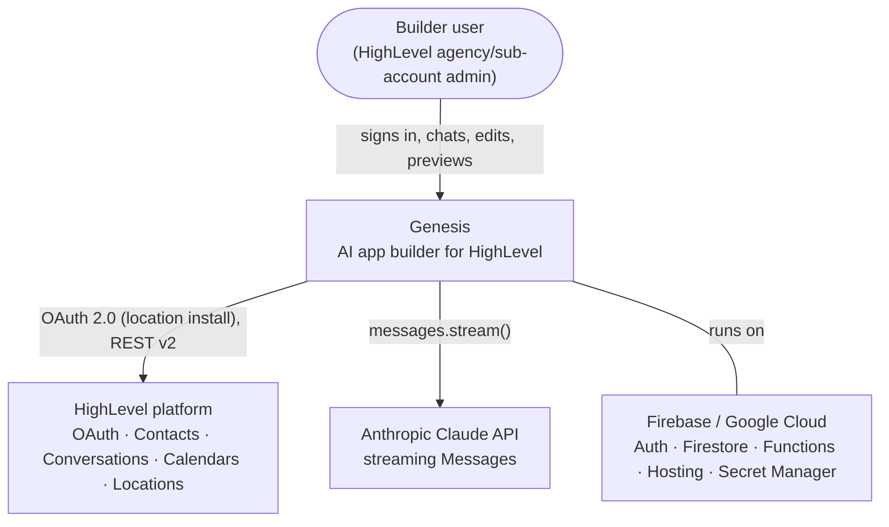
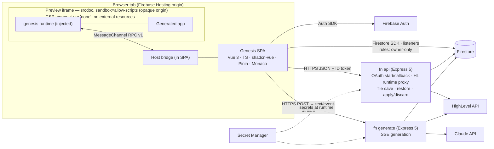
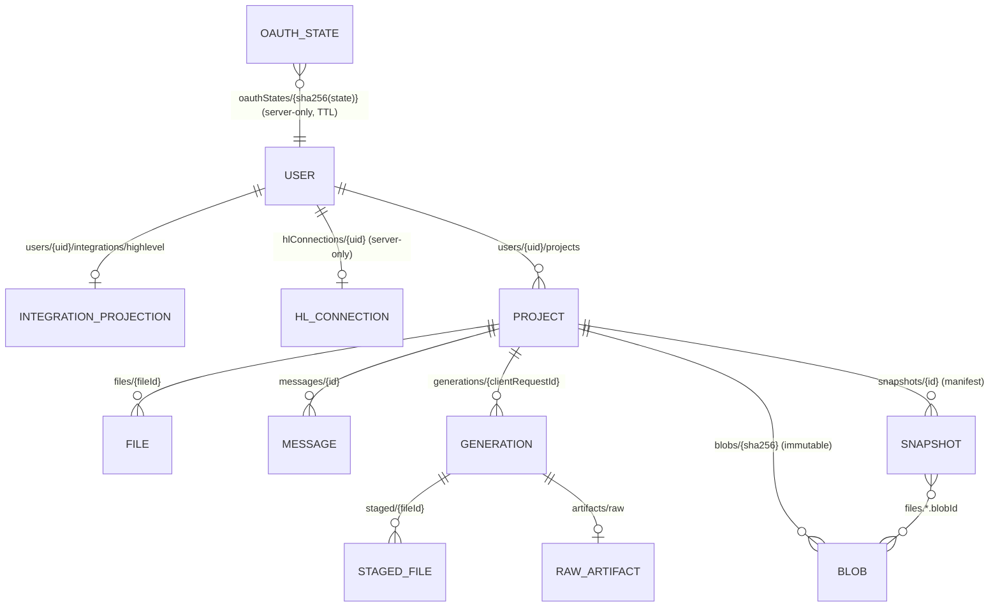
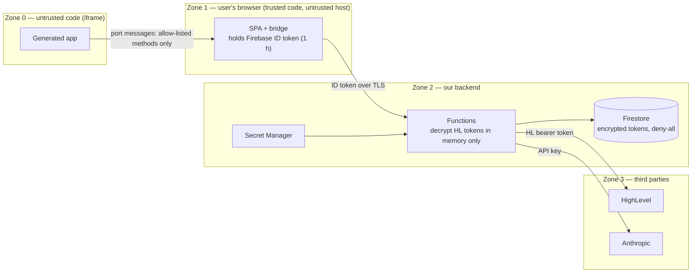
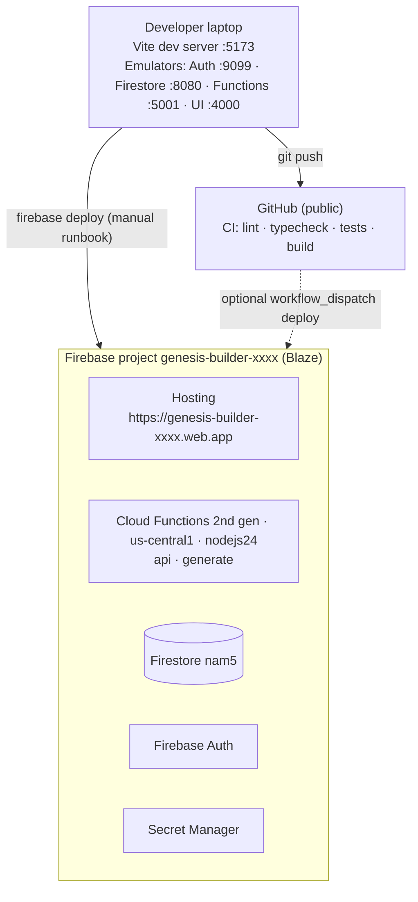

# Genesis — High-Level Design (HLD)

**Status:** Approved design for implementation
**Date:** 2026-09-26
**Audience:** implementers (human or AI), reviewers, and interviewers. Every decision here is written so it can be defended out loud: _what we chose, why, what we rejected, what it costs us._
**Related:** analysis [`01`](01-analysis-and-proposal.md) · review of the draft [`02`](02-architecture-review.md) · backend LLD [`05`](05-backend-system-design.md) · frontend LLD [`06`](06-frontend-system-design.md) · canonical contracts and flows [`07`](07-end-to-end-system-design.md)

---

## 1. System context



Genesis has one human actor (the builder) and three external systems. The generated apps are **artifacts** of Genesis, not actors: they only exist inside Genesis' preview sandbox.

## 2. Goals, non-goals, quality attributes

**Goals**

1. Turn a chat prompt into a working multi-file web app that uses **real HighLevel data**, streamed live.
2. Make every generation **safe** (untrusted code, zero credentials), **atomic** (never a half-applied app) and **reversible** (snapshots).
3. Be **deployable and demoable** by one engineer in five days, and **runnable locally without paid keys**.

**Non-goals:** HighLevel writes and free slots; multiple locations per user, collaboration, generated apps using frameworks/npm, publishing to the HighLevel marketplace, durable/resumable generation jobs. Cancel, diff, rate limits, Load more, and webhooks are implemented (R-B1, R-B3–R-B6).

**Quality attributes and measurable targets**

| Attribute                     | Target                                                                                                                                                                                  | How we verify                                                          |
| ----------------------------- | --------------------------------------------------------------------------------------------------------------------------------------------------------------------------------------- | ---------------------------------------------------------------------- |
| Security                      | No credential (HighLevel token, Firebase ID token, API key) ever reachable from generated code; tokens encrypted at rest in our data; rules deny cross-user access                      | Rules tests; bridge unit tests; manual console check inside the iframe |
| Responsiveness                | `generation.started` < 1.5 s p95 (warm); visible activity (plan or text) < 8 s; editor renders streamed text at 60 fps; preview compile < 50 ms for 300 KB; HighLevel proxy p95 < 1.5 s | Timings stored on each generation; manual profiling                    |
| Reliability                   | 0 partial commits; exactly one terminal state per generation; a dead instance's generation recovered as `interrupted` within 60 s                                                       | Integration test matrix with the fake provider                         |
| Cost                          | Typical generation ≤ USD 0.30                                                                                                                                                           | Usage persisted per generation; Anthropic console spend limit          |
| Operability                   | Every log line carries `requestId` (and `generationId`/`projectId` where relevant); no secrets or PII in logs                                                                           | Code review checklist                                                  |
| Simplicity                    | Firebase only: 2 functions, 1 database, 0 queues/caches                                                                                                                                 | —                                                                      |
| Portability of generated apps | Generated app depends only on the `window.genesis` contract (same shape as a HighLevel Custom Page talking to its host)                                                                 | Contract versioned (`genesis.version`)                                 |

## 3. Containers



| Container           | Tech                                              | Responsibility                                                              | Trust                                                      |
| ------------------- | ------------------------------------------------- | --------------------------------------------------------------------------- | ---------------------------------------------------------- |
| SPA                 | Vue 3, shadcn-vue, Pinia, Monaco, Firebase JS SDK | UI, auth session, realtime reads, SSE client, preview compiler, host bridge | Trusted code, untrusted environment (user's browser)       |
| Preview iframe      | Generated HTML/CSS/JS + injected runtime          | Run the user's app                                                          | **Untrusted** — no network, no credentials                 |
| `api` function      | Node 24, Express 5, firebase-functions 7          | OAuth, token lifecycle, HighLevel proxy, file save, restore, apply-partial  | Trusted; holds HL secrets                                  |
| `generate` function | Node 24, Express 5, `@anthropic-ai/sdk`           | Context → Claude stream → parse → validate → stage → atomic commit → SSE    | Trusted; holds LLM + HL secrets                            |
| Firestore           | Native mode, `nam5`                               | All durable state                                                           | Rules enforce tenancy for clients; Admin SDK for functions |
| Secret Manager      | —                                                 | 4 secrets                                                                   | —                                                          |

## 4. Key design questions — answered

Each answer: **Decision · Why · Rejected · Trade-offs · Interview line.**

### Q1. Where does untrusted generated code run, and what can it touch?

- **Decision:** In an `<iframe sandbox="allow-scripts allow-forms" srcdoc>` (never `allow-same-origin`), whose compiled document begins with a CSP meta tag that blocks all network egress (`default-src 'none'; connect-src 'none'; img-src data: blob:; …`). It can touch only its own DOM and a `MessagePort` given to it by the host.
- **Why:** The sandbox gives an opaque origin (no cookies, storage, parent DOM, top navigation, popups). The sandbox does **not** stop network requests; CSP does. Together they reduce generated code to "compute + render + ask the host".
- **Rejected:** Sandpack (third-party bundler, network), WebContainers (COOP/COEP, heavy), running on our origin (full XSS).
- **Why `allow-forms`:** without it browsers never fire `submit` in a sandboxed document, which silently breaks ordinary generated forms; CSP `form-action 'none'` keeps real submissions blocked. Found while verifying the frontend plan.
- **Residual risk:** CSP cannot stop a document from navigating its own frame (`navigate-to` never shipped), so malicious generated code could leak data it was given in a URL. It never holds a credential, the model never sees CRM records (metadata only), and the preview panel rebuilds the frame on any navigation; a separate preview origin would not change this.
- **Trade-offs:** No external images/fonts/CDNs in generated apps (inline SVG, data URIs, system fonts instead); `localStorage` must be shimmed in memory; the SPA can't use a strict `script-src` CSP because `srcdoc` inherits the parent's policy (upgrade path: separate preview origin).
- **Interview line:** _"The iframe is a calculator with a mailbox: it can compute and draw, and the only thing it can do to the outside world is post a letter to its host."_

### Q2. How does a generated app get real HighLevel data without any credential?

- **Decision:** A **host bridge**. The runtime injected into the iframe implements `window.genesis.highlevel.*` by sending `{ id, method, params }` over the `MessageChannel`. The SPA's bridge checks the method against the **runtime manifest** (11 allow-listed methods), validates params with zod, enforces per-preview budgets, then calls `GET/POST /v1/projects/:projectId/hl/...` on the `api` function with the user's Firebase ID token. The function verifies the token and project ownership, loads and (if needed) refreshes the **encrypted** HighLevel token, calls HighLevel, normalizes the response and returns it. The iframe never sees any token.
- **Why:** The ID token is a credential too — the initial draft handed it into the iframe (critical finding F01). The bridge also removes the CORS problem of opaque origins and lets the host show a live "HL calls" log.
- **Rejected:** HighLevel token in the browser; ID token in the iframe; a generic `POST /proxy { url }`.
- **Trade-offs:** One extra hop (postMessage, sub-millisecond); the SPA must stay open for the preview to work (it always is).
- **Interview line:** _"Generated code gets capabilities, not credentials."_

### Q3. How are the HighLevel APIs exposed to the LLM? (the assignment's open question)

- **Decision:** A **typed, versioned runtime SDK** described by one **manifest** (`functions/src/contracts/hl-runtime.ts`): **seven read methods** — `location.get`, `contacts.list|get`, `conversations.list|messages`, `calendars.list|events` — with zod param schemas, normalized models (`Contact`, `Conversation`, `Message`, `Calendar`, `CalendarEvent`), one pagination contract `{ items, nextCursor, hasMore }`, and a typed error (`code`, `message`, `retryable`). The same manifest drives (1) the system prompt's API reference, (2) Express route registration and validation, (3) the browser bridge's allow-list and validation.
- **Why:** What to Build and the Loom require **real contacts, conversations, or appointments**. Create/update/send/availability are prerequisite “familiarize” verbs, not product requirements. LLMs write correct code against a small, consistent surface. HighLevel's raw API has two version headers, three pagination styles, epoch-ms vs ISO dates and nested response variants; hiding that behind a normalized SDK removes whole classes of generated-code bugs. The cursor fields exist because HighLevel list APIs are paginated; generated apps are not required to render Load more (bonus R-B5).
- **Rejected:** Letting the LLM call raw HighLevel REST (credentials + quirks); exposing HighLevel's full write surface; tool-calling at generation time to fetch data into code (data would be baked into files and stale).
- **Trade-offs:** New HighLevel capabilities require a manifest entry + adapter; that is intentional (explicit allow-list).
- **Interview line:** _"We designed an API for the model, not for humans: seven reads, one page shape, one error shape — and the same file generates the docs the model reads and the checks the server runs."_

### Q4. How does the model emit multiple files while we stream them live?

- **Decision:** A line-marker protocol — `⟦FILE path="…"⟧ … ⟦/FILE⟧` to create/replace, `⟦DELETE path="…"⟧` to delete — parsed by an incremental state machine that converts raw text deltas into `prose`, `file_start`, `file_chunk`, `file_end`, `file_delete`, `file_abort` events.
- **Why:** Raw text deltas are the file text, so the editor shows code as it is written; no JSON escaping. The parser is proven chunking-invariant (property test over 3,000 random splits) and guarantees the live editor text equals the saved text.
- **Rejected:** JSON tool calls (needs incremental JSON unescaping for live display — the upgrade path if evals show drift), structured JSON output (no live code), Markdown fences (ambiguous).
- **Trade-offs:** Protocol compliance depends on the model following instructions → mitigated by a tolerant parser, validation, clear failure, and retry.
- **Interview line:** _"Streaming format for humans, validation for trust — matching the markers is never enough to be saved."_

### Q5. What is validated, and what happens with malformed output?

- **Decision:** Three layers — path (on `file_start`), file (on `file_end`: size, UTF-8, markers, JS syntax via acorn, remote resources, credential/API-host policy), project (after the stream: `index.html` exists, all local references resolve, caps). Invalid files are rejected individually and reported live (`file.completed { status: 'rejected', issues }`). At the end: if the resulting project is valid, valid files commit and rejected ones are listed as warnings; if not, **nothing** commits, the generation fails with clear issues, the raw output is kept for inspection, and the user can retry.
- **Why:** "Malformed LLM responses handled gracefully, user sees clear errors" (R-C5) without ever writing an inconsistent app.
- **Rejected:** Committing whatever parsed (unsafe); failing the whole generation on the first bad file (throws away good work); auto-repair loop in v1 (latency/cost; listed as an improvement).
- **Trade-offs:** A project-level failure discards otherwise-valid files unless the user retries — acceptable because the user always sees why.
- **Interview line:** _"We validate like a CI pipeline for AI output: per-file checks as they stream, a whole-project check before commit, and nothing reaches the working tree unless the whole tree is sound."_

### Q6. How do we stream to the browser?

- **Decision:** Server-Sent Events over a `fetch()` POST (JSON body + `Authorization` header) directly to the `generate` function URL (2nd gen = Cloud Run, which streams). Protocol v1 envelope `{ v, seq, generationId, type, data }`; exactly one terminal event; heartbeat every 15 s; client watchdog 45 s.
- **Why:** `EventSource` can't POST or send headers; Firebase Hosting rewrites buffer responses and cut off at 60 s; SSE is simpler than WebSockets for one-directional streams and works over plain HTTPS.
- **Rejected:** WebSockets (bidirectional not needed), Firestore as the token channel (1 write/s/doc, cost), callable-function streaming (the assignment asks for an HTTP SSE endpoint with our own protocol), Hosting rewrites.
- **Trade-offs:** Needs CORS (exact origins) because Hosting and functions are different origins.
- **Interview line:** _"SSE over fetch: one POST in, typed events out, and a protocol where 'done' is a single, unambiguous event."_

### Q7. What happens on interruption or disconnect?

- **Decision:** Every validated file is **staged durably** as it completes (`generations/{id}/staged`). The working tree changes **only** in one atomic transaction at the end. If the stream fails, the model errors, the deadline hits, or the client disconnects: abort the model stream (stop spending), finalize the generation as `failed`/`interrupted` with the staged file list, and let the user **Apply N completed files**, **Discard**, or **Retry**. A lease with heartbeats marks generations from dead instances as `interrupted` after 60 s. User-initiated cancel (R-B1) aborts with `cancelled` when `cancelRequestedAt` is set.
- **Why:** Satisfies "partial results preserved" and "never break the last working app" at the same time (the draft could only do one). Cloud Run does not reliably keep working after the client leaves, so we don't pretend to.
- **Rejected:** Writing files into the project mid-stream (broken apps); discarding partial output; continuing after disconnect (throttled CPU); durable job queue (five-day scope); a Stop-generation control (bonus).
- **Trade-offs:** A dropped connection loses the in-flight file (never the completed ones). Resumable generations are improvement #2.
- **Interview line:** _"Partial results are preserved but never silently applied — the user decides."_

### Q8. How is version control modeled?

- **Decision:** Git-like but tiny: **content-addressed blobs** (`blobs/{sha256}`), **snapshot manifests** (`snapshots/{id}`: `seq`, kind `generation|checkpoint|restore`, `files: { fileId → { path, blobId, sizeBytes, language } }`, changed/deleted paths), and a **working tree** (`files/{fileId}` with `version`). History is **linear and append-only**: every completed generation creates one snapshot; restore writes the target's files and creates a new `restore` snapshot; before a commit or restore overwrites unsnapshotted manual edits, a `checkpoint` snapshot captures them.
- **Why:** Restore can never lose data; unchanged files are stored once; "which files changed" is a manifest comparison (instant diff list); listing snapshots is cheap (small documents).
- **Rejected:** Full copies per snapshot (duplication; restore snapshots copy everything), delta chains (complex), rewinding history (loses states).
- **Trade-offs:** Blobs are never garbage-collected in v1 (fine at demo scale; GC is a future job).
- **Interview line:** _"Snapshots are manifests over immutable blobs, so restore is just writing pointers back — and history only ever grows."_

### Q9. How is multi-tenancy enforced?

- **Decision:** By **path**: all user data lives under `users/{uid}/…`; rules grant reads only when `request.auth.uid == uid`; server-only data (`hlConnections`, `oauthStates`) is **deny-all** to clients; every function derives `uid` from a verified ID token and re-checks project ownership by reading `users/{uid}/projects/{projectId}` (a project ID from another user simply does not exist under your path).
- **Why:** A forgotten `where ownerId ==` cannot leak data; rules are short and testable; ownership checks cost one read.
- **Rejected:** Field-based `ownerId` checks on flat collections.
- **Interview line:** _"Tenancy is a path, not a filter."_

### Q10. Which writes go through the client vs Cloud Functions?

- **Decision:** Clients write **only simple owned metadata**: project create, rename/describe, soft-delete — validated by rules (`hasOnly` keys, sizes, `request.time`, status transitions, `locationId` equal to the server-written connection projection). Everything touching the **working tree, history, secrets or external APIs** is a server command: generation, manual file save (version check + generation lock + dirty flag), restore, apply-partial, OAuth, HighLevel proxy.
- **Why:** The assignment allows either; the hybrid keeps rules small and puts invariants (versions, locks, atomic multi-document writes) in one tested place.
- **Rejected:** All-client (rules become an untestable second backend), all-server (loses realtime optimistic CRUD and rules-validated simplicity).
- **Interview line:** _"Rules guard the metadata; functions guard the invariants."_

### Q11. How are HighLevel tokens stored, refreshed and revoked?

- **Decision:** Tokens are encrypted with **AES-256-GCM** (key from Secret Manager, AAD `hl:{uid}:{field}`) in `hlConnections/{uid}` (deny-all). A **client-readable projection** `users/{uid}/integrations/highlevel` holds only status, location name/timezone, scopes. Refresh is **proactive** (< 5 min left) and **reactive** (one retry on 401), **single-flight** per user in-process and **leased** across instances: a short transaction takes a 30 s lease, the HTTP refresh runs **outside** the transaction (10 s timeout), and a second transaction commits both rotated tokens and releases the lease. Invalid-grant → re-read (someone else may have refreshed) → otherwise `reauth_required`. Disconnect → tokens deleted.
- **Why:** HighLevel rotates refresh tokens on every use; Firestore transactions retry and can't serialize external calls (the draft's critical bug F31). Encryption keeps year-long refresh tokens unreadable in consoles, exports and backups.
- **Rejected:** Refresh inside a transaction; plaintext tokens; a Redis lock.
- **Interview line:** _"Rotation turns refresh into a distributed-mutex problem, so we solved it like one: single-flight locally, a lease globally, and never a network call inside a transaction."_

### Q12. What context does the model see, and how is it bounded?

- **Decision:** Static system prompt v1 (cached) + last 12 messages (≤ 4 KB each) + the current project (all files; bounded by the 300 KB project cap) + HighLevel **metadata** (location name, timezone, ≤ 20 calendar names, approximate contact count, methods available for the granted scopes; ≤ 2 KB; cached 5 min; omitted with a note if HighLevel is down) + the prompt (≤ 4,000 chars). Project files, HighLevel metadata and conversation notes are wrapped as **data, not instructions**. No contact/message records (PII) ever enter the prompt.
- **Why:** R-BE4 requires bounded project/session/**external** context. Metadata lets the model tailor the app ("Consultations" calendar, the location's timezone) without leaking PII or inviting prompt injection through record contents.
- **Rejected:** Summarization/RAG (unnecessary at this size), sending sample records (PII + injection).
- **Interview line:** _"Bounded by construction: capped project, capped history, metadata-only external context — the worst case is known before the request is sent."_

### Q13. How do we isolate HighLevel API quirks?

- **Decision:** One HTTP client (base URL, per-family `Version` header, 15 s timeout, retries with jitter on 429/5xx honoring `Retry-After`, rate-limit header logging, error mapping) and one **adapter per API family** that maps requests and normalizes responses (dates → ISO, nested/flat message shapes, cursor encoding with a `kind` tag). Calendar events without `calendarId` fan out across calendars server-side (≤ 10, concurrency 3).
- **Why:** HighLevel's surface is inconsistent; generated code should never see that. A v3 migration becomes an adapter change.
- **Interview line:** _"Adapters absorb the platform's inconsistencies so neither the model nor the UI has to."_

### Q14. How do we prevent concurrent generations and duplicate submits?

- **Decision:** `generationId = clientRequestId` (UUID from the browser) created with create-if-absent → a retried submit returns `409 DUPLICATE_REQUEST` pointing at the existing generation; a **project lease** (`activeGeneration { id, heartbeatAt }`) acquired in the start transaction → `409 GENERATION_IN_PROGRESS` for a second tab; stale lease (> 60 s) is taken over and the old generation marked `interrupted`.
- **Why:** Two generations writing the same files is a correctness bug; duplicate submits are a cost bug.
- **Interview line:** _"Idempotency by ID, mutual exclusion by lease, liveness by heartbeat."_

### Q15. How do we bound cost on a public URL?

- **Decision:** Generation has `max_tokens` 32k, a 300 s deadline, and prompt/file/project caps. Anthropic’s **console spend limit** is set operationally. Per-preview bridge budgets cap HighLevel calls from one iframe. In-app limits (R-B4): generation 10 / 10 min and 40 / day per user, global 200 / day, HighLevel proxy 240 / min per instance, OAuth start 5 / min, file save 60 / min, snapshot restore 10 / 10 min, plus `GENERATION_ENABLED`.
- **Why:** Open sign-up must not let one account drain the daily cap or flood HighLevel.
- **Interview line:** _"We bound what the model can emit, and we meter the endpoints that cost money."_

### Q16. Why Firebase only — no Redis, queues, Storage, Cloud Run services?

- **Decision:** Firestore handles state and locks (leases); two HTTP functions handle compute.
- **Why:** The assignment mandates Firebase; the scale is small; fewer moving parts is more reliable in five days. Files are small text (≤ 100 KB), so Cloud Storage adds nothing.
- **Trade-offs:** Firestore-based rate limiting would be the scale answer for bonus R-B4; v1 does not add it.

### Q17. How is frontend state organized?

- **Decision:** Firestore listeners are the single source of truth for durable data; Pinia holds ephemeral state (generation state machine, workspace UI); **Monaco models** hold unsaved text (they outlive components); large streaming buffers live outside Vue reactivity; a pure reducer applies SSE events to the generation state.
- **Why:** No duplicated sources of truth, no lost edits on tab switch, fast streaming without reactivity storms, testable logic.
- **Interview line:** _"Firestore owns truth, Pinia owns the moment, Monaco owns the keystrokes."_

### Q18. How are contracts shared between frontend and backend?

- **Decision:** `functions/src/contracts/*` (zod schemas + types, no platform imports) is the source of truth; `scripts/sync-contracts.mjs` copies it into `frontend/src/contracts/` with a "generated" header; CI runs `--check` and fails on drift.
- **Why:** Firebase deploys `functions/` in isolation, which makes npm workspaces and local packages fragile; hand-mirroring drifts silently.
- **Interview line:** _"One source of truth, one copy, one CI check."_

### Q19. How can it be developed and demoed locally without paid keys?

- **Decision:** Emulator Suite (Auth, Firestore, Functions) + a model switch, `LLM_PROVIDER`: `anthropic` (the default, locally too) calls Claude with a key from `functions/.secret.local`, and `fake` swaps in a scripted provider streaming realistic generations, including failure scripts + a script that seeds an emulator HighLevel connection from a sub-account **Private Integration Token**.
- **Why:** Reviewers run `firebase emulators:start` (R-DEL2) and should see real output by default; without a key the switch keeps the whole flow runnable; tests need deterministic streams; OAuth redirects to localhost may be refused.

### Q20. How does this map to a real HighLevel marketplace app?

- **Decision:** The generated app talks only to its host through `window.genesis` — the same "iframe asks its parent" shape HighLevel **Custom Pages** use (`postMessage` to the parent, context via Shared-Secret SSO). Shipping a generated app as a marketplace Custom Page means hosting the same bundle plus a thin runtime that implements `window.genesis.highlevel` against the app's own backend. The contract is versioned (`genesis.version = '1'`).
- **Interview line:** _"What we preview is already shaped like a HighLevel Custom Page; production is a hosting and SSO problem, not a rewrite."_

### Q21. What changes at 100× scale or with more time?

1. **Durable generation jobs** (Cloud Tasks) with a resumable event log, so a reload re-attaches mid-stream.
2. **Separate preview origin** so the SPA can adopt a strict CSP.
3. **Auto-repair loop**: feed validation issues back to the model once before failing.
4. **Patch operations** for large files (smaller outputs, faster refinement).
5. **Envelope encryption with Cloud KMS** + key rotation; **blob GC**; multi-location per user.

## 5. Component responsibilities (backend modules)

| Module                                  | Owns                                                                               | Never does                                            |
| --------------------------------------- | ---------------------------------------------------------------------------------- | ----------------------------------------------------- |
| `http/`                                 | Express app, middleware order, CORS, auth, validation, error envelope              | Business logic                                        |
| `modules/highlevel/oauth`               | State issuance/consumption, code exchange, connection creation                     | Store plaintext tokens                                |
| `modules/highlevel/connection`          | Encryption, token manager, projection, disconnect                                  | Call HighLevel data APIs                              |
| `modules/highlevel/client` + `adapters` | HTTP to HighLevel, normalization, cursors                                          | Know about projects or generations                    |
| `modules/highlevel/runtime`             | Runtime manifest → routes; ownership + location binding                            | Accept `locationId` from callers                      |
| `modules/generation`                    | Orchestration, context, prompt, provider, parser, validation, staging, commit, SSE | Write the working tree outside the commit transaction |
| `modules/files`, `modules/snapshots`    | Manual save, restore, blobs, snapshot building                                     | Run during an active generation                       |
| `contracts/`                            | Shared schemas and types                                                           | Import Node/Firebase/browser APIs                     |

## 6. Key flows (summary)

Full sequence diagrams: [`07`](07-end-to-end-system-design.md) §4.

**Connect HighLevel:** SPA `POST /v1/hl/oauth/start` → `{ authorizeUrl }` → HighLevel consent → `GET /v1/hl/oauth/callback?code&state` → consume state → form-encoded code exchange → `GET /locations/{id}` → encrypt + store tokens, write projection → 302 to `/dashboard?hl=connected` → badge shows "Connected: <location>".

**Generate:** SPA `POST generate/v1/projects/:id/generations { clientRequestId, prompt }` → start transaction (ownership, lease, idempotency, user message) → SSE `generation.started` → context (files, history, HighLevel metadata) → Claude stream → parser → live `assistant.*`/`file.*` events, per-file validation, staging → project validation → one commit transaction (files, blobs, checkpoint?, snapshot, assistant message, generation, project) → `generation.completed` → Firestore listeners update tree, tabs, snapshots → preview recompiles.

**Preview data call:** generated app `await genesis.highlevel.contacts.list({ limit: 20 })` → port message → bridge validates → `GET api/v1/projects/:id/hl/contacts?limit=20` → token manager → HighLevel `POST /contacts/search` → normalized page → bridge → app renders.

**Restore:** Sheet → Restore #3 → `POST /v1/projects/:id/snapshots/:sid/restore` → transaction (no active generation; checkpoint if dirty; write files from blobs; delete extras; new `restore` snapshot; system message) → listeners refresh editor and preview.

## 7. Data model overview



Field-level schema, writers/readers, indexes and TTLs: [`07`](07-end-to-end-system-design.md) §3.5.

## 8. Security architecture



| Control                                                                                                                | Mitigates                                                |
| ---------------------------------------------------------------------------------------------------------------------- | -------------------------------------------------------- |
| Sandbox + network-blocking CSP + bridge                                                                                | Credential theft and data exfiltration by generated code |
| Allow-listed runtime methods + zod validation (bridge and server)                                                      | Using the proxy as an open relay                         |
| `uid` from verified ID token; ownership re-check per request; `locationId` only from the stored connection             | Cross-tenant access, IDOR                                |
| Path-based rules; deny-all server collections; schema-validated project writes                                         | Direct Firestore tampering                               |
| AES-256-GCM tokens (AAD binds user + field); secrets in Secret Manager; no secrets in git (scanning + push protection) | Token/secret leakage                                     |
| Single-use hashed OAuth state bound to `uid`, 10 min TTL                                                               | OAuth CSRF / account injection                           |
| Exact-origin CORS, no cookies                                                                                          | Cross-site request abuse                                 |
| Limits, deadlines, prompt/file caps                                                                                    | Runaway generation cost                                  |
| Prompt: data-not-instructions wrappers, no PII; generated apps use `textContent`                                       | Prompt injection, preview XSS                            |
| Errors never include stacks, tokens or provider bodies                                                                 | Information disclosure                                   |

Threat model table: [`07`](07-end-to-end-system-design.md) §6.

## 9. Deployment view



Environments: **local** (emulators, fake or real LLM, PIT-seeded HighLevel) and **production** (one Firebase project). No staging project (five-day scope); Hosting preview channels are available if needed.

## 10. Repository structure

```
genesis/
├── .github/
│   ├── workflows/
│   │   ├── ci.yml                         # contracts drift · lint · typecheck · unit + rules tests · build
│   │   └── deploy.yml                     # optional manual deploy (workflow_dispatch)
│   └── pull_request_template.md
├── docs/                                  # this suite + original ARCHITECTURE.md draft
├── frontend/                              # Vue 3 SPA → Firebase Hosting (plan: docs/09-frontend-implementation-plan)
│   ├── public/favicon.svg
│   ├── scripts/check-bundle.mjs           # first-paint bundle budget (CI)
│   ├── src/
│   │   ├── main.ts · env.d.ts
│   │   ├── app/ (App.vue · router.ts · guards.ts · config-error.ts · NotFoundPage.vue · layouts/AuthLayout.vue · layouts/AppLayout.vue)
│   │   ├── assets/main.css                # Tailwind v4 entry + shadcn-vue theme tokens (+ success/warning)
│   │   ├── components/
│   │   │   ├── ui/                        # shadcn-vue generated components (owned code)
│   │   │   └── common/ (AppHeader · UserMenu · ThemeToggle · PageState · RelativeTime · OfflineBanner · ConfirmDialog).vue
│   │   ├── composables/ (useAuth · useZodForm · useTheme · useConfirm · useFirestoreDoc · useFirestoreQuery · firestore-errors).ts
│   │   ├── contracts/                     # GENERATED from functions/src/contracts — do not edit
│   │   ├── features/
│   │   │   ├── auth/ (SignInPage.vue · SignUpPage.vue · AuthForm.vue · auth.schemas.ts · auth-errors.ts · redirect.ts)
│   │   │   ├── highlevel/ (ConnectionCard.vue · ConnectionBadge.vue · useHighLevelConnection.ts · connection-query.ts · useOAuthReturnToast.ts)
│   │   │   ├── projects/ (DashboardPage.vue · ProjectCard.vue · ProjectFormDialog.vue · DeleteProjectDialog.vue · useProjects.ts · project-form.schema.ts)
│   │   │   ├── workspace/
│   │   │   │   ├── WorkspacePage.vue · WorkspaceHeader.vue · WorkspaceLayout.vue · workspace-context.ts
│   │   │   │   ├── chat/ (ChatPanel · MessageList · MessageItem · LiveAssistantMessage · ThinkingDisclosure · FileOpChips · GenerationStatusPill · GenerationOutcomeBanner · PromptComposer · ExamplePrompts).vue · message-meta.ts
│   │   │   │   ├── editor/ (CodePanel · FileTree · FileTreeNode · EditorTabs · CodeEditor · EditorStatusBar · SaveConflictDialog).vue · monaco-setup.ts · editor-models.ts · file-tree.ts
│   │   │   │   ├── preview/ (PreviewPanel · PreviewToolbar · PreviewFrame · PreviewConsole).vue · compile-preview.ts · preview-csp.ts · preview-refs.ts · host-bridge.ts · runtime/genesis-runtime.js
│   │   │   │   ├── stores/ (workspace.store.ts · generation.store.ts · generation.reducer.ts · generation.labels.ts · generation-bus.ts)
│   │   │   │   └── composables/ (useProjectFiles · useProjectMessages · useGeneration · useStreamingEditor · useRemoteFileSync · useFileSave · useWorkspaceShortcuts · usePreviewEvents).ts
│   │   │   └── snapshots/ (SnapshotHistorySheet.vue · SnapshotItem.vue · RestoreSnapshotDialog.vue · useSnapshots.ts)
│   │   ├── lib/ (env.ts · firebase.ts · http.ts · errors.ts · utils.ts · ids.ts · time.ts)
│   │   └── services/
│   │       ├── firestore/ (types.ts · paths.ts · converters.ts · projects.repo.ts · files.repo.ts · messages.repo.ts · generations.repo.ts · snapshots.repo.ts)
│   │       └── api/ (hl-oauth.api.ts · hl-runtime.api.ts · files.api.ts · snapshots.api.ts · generations.api.ts · generation-stream.ts)
│   ├── tests/                             # mirrors src/ (+ helpers/fake-monaco.ts, fixtures/sse.ts)
│   ├── components.json · index.html · package.json · package-lock.json · .prettierignore
│   ├── tsconfig.json · tsconfig.app.json · tsconfig.node.json · tsconfig.vitest.json · vite.config.ts · vitest.config.ts
│   ├── eslint.config.js
│   └── .env.example · .env.production (public values, committed)
├── functions/                             # Cloud Functions 2nd gen · Node 24 · ESM
│   ├── src/
│   │   ├── index.ts                       # exports api, generate
│   │   ├── composition.ts                 # composition root: builds the Express apps once per instance
│   │   ├── config/ (params.ts · runtime-config.ts)
│   │   ├── contracts/                     # SOURCE OF TRUTH shared with frontend
│   │   │   └── (index.ts · limits.ts · errors.ts · paths.ts · firestore-docs.ts · api.ts · sse.ts · hl-runtime.ts · bridge.ts)
│   │   ├── shared/ (firebase-admin.ts · firestore-paths.ts · app-error.ts · logger.ts · hash.ts · clock.ts · async.ts)
│   │   ├── http/
│   │   │   ├── create-http-app.ts · define-handler.ts · respond.ts · sse-smoke.routes.ts
│   │   │   └── middleware/ (request-context.ts · cors.ts · no-store.ts · require-auth.ts · error-handler.ts)
│   │   └── modules/
│   │       ├── projects/project-access.ts
│   │       ├── highlevel/
│   │       │   ├── oauth/ (oauth.routes.ts · oauth.service.ts · oauth-state.repo.ts · token-endpoint.client.ts)
│   │       │   ├── connection/ (connection.repo.ts · token-cipher.ts · token-manager.ts · connection.routes.ts)
│   │       │   ├── client/ (hl-http.client.ts · hl-errors.ts)
│   │       │   ├── adapters/ (cursor.ts · normalize.ts · contacts.adapter.ts · conversations.adapter.ts · calendars.adapter.ts · locations.adapter.ts)
│   │       │   ├── runtime/ (runtime.service.ts · runtime.routes.ts)
│   │       │   └── metadata/location-context.service.ts
│   │       ├── generation/
│   │       │   ├── generate.app.ts · orchestrator.ts · outcome.ts
│   │       │   ├── sse/sse-writer.ts
│   │       │   ├── context/ (context-builder.ts · render-context.ts)
│   │       │   ├── prompt/system-prompt.v1.ts
│   │       │   ├── llm/ (model-provider.ts · anthropic.provider.ts · fake.provider.ts · fake-scripts.ts)
│   │       │   ├── protocol/file-stream-parser.ts
│   │       │   ├── validation/ (file-rules.ts · validate-file.ts · validate-project.ts · html-refs.ts · js-syntax.ts)
│   │       │   ├── persistence/ (generations.repo.ts · commit.service.ts)
│   │       │   └── routes/generation-control.routes.ts   # apply + discard (mounted in api)
│   │       ├── files/ (file-save.service.ts · files.routes.ts)
│   │       ├── snapshots/ (blobs.repo.ts · snapshot-builder.ts · restore.service.ts · snapshots.routes.ts)
│   ├── test/ (unit/ · integration/ · rules/ · fixtures/ · helpers/)
│   ├── scripts/ (spike-oauth.ts · seed-pit-connection.ts · record-hl-fixtures.ts)
│   ├── package.json · package-lock.json
│   ├── tsconfig.json · tsconfig.test.json · vitest.config.ts · vitest.integration.config.ts
│   ├── eslint.config.js
│   ├── .env.example                       # non-secret params
│   └── .secret.local.example              # emulator-only secret overrides
├── scripts/sync-contracts.mjs             # contracts copy + --check
├── firebase.json · .firebaserc
├── firestore.rules · firestore.indexes.json
├── .env.example                           # documents every variable (frontend, functions, secrets)
├── .gitignore · .editorconfig · .nvmrc (24) · .prettierrc.json
├── package.json                           # root scripts only (no workspaces)
├── LICENSE
└── README.md
```

## 11. Technology choices

| Concern               | Choice (version)                                                             | Why                                                            |
| --------------------- | ---------------------------------------------------------------------------- | -------------------------------------------------------------- |
| Runtime               | Node **24** (functions `nodejs24`)                                           | Node 20 decommissions 2026-10-30; 24 is active LTS             |
| Backend framework     | Express **5** inside `onRequest`                                             | firebase-functions 7's own dependency; async error propagation |
| Validation            | zod **4**                                                                    | One schema language shared by both sides                       |
| LLM                   | `@anthropic-ai/sdk` 0.128, `claude-opus-5`                                   | Streaming helpers, adaptive thinking, fallbacks, caching       |
| HTML parsing (server) | `parse5`                                                                     | Spec-compliant reference extraction for validation             |
| JS syntax check       | `acorn`                                                                      | Fast, safe parse (no execution)                                |
| Frontend              | Vue 3.5, Vite 8, TypeScript **5.9**, Pinia 4, vue-router 5                   | Required stack; TS 7 breaks typescript-eslint                  |
| UI                    | shadcn-vue 2.8 (reka-ui 2), Tailwind 4, lucide, vue-sonner                   | Required; owned components                                     |
| Editor                | `@guolao/vue-monaco-editor` 1.6 + `monaco-editor` 0.57 (bundled)             | Required                                                       |
| SSE framing           | `eventsource-parser` 4                                                       | Spec-compliant framing; we own the domain protocol             |
| Tests                 | Vitest 5, happy-dom, @vue/test-utils, @firebase/rules-unit-testing 5         | Same runner both sides                                         |
| Lint/format           | ESLint 10 flat config, typescript-eslint 8, eslint-plugin-vue 10, Prettier 3 | —                                                              |

## 12. Risks and open items

Risk register and your open decisions (model choice, docs in public repo, reviewer account, min instances): [`01`](01-analysis-and-proposal.md) §9 and §11.
