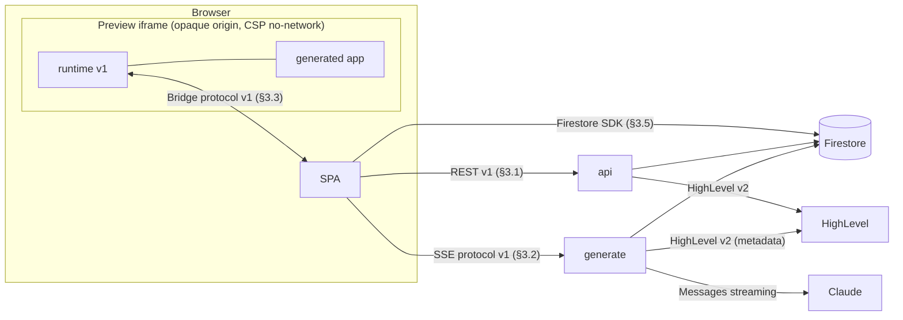
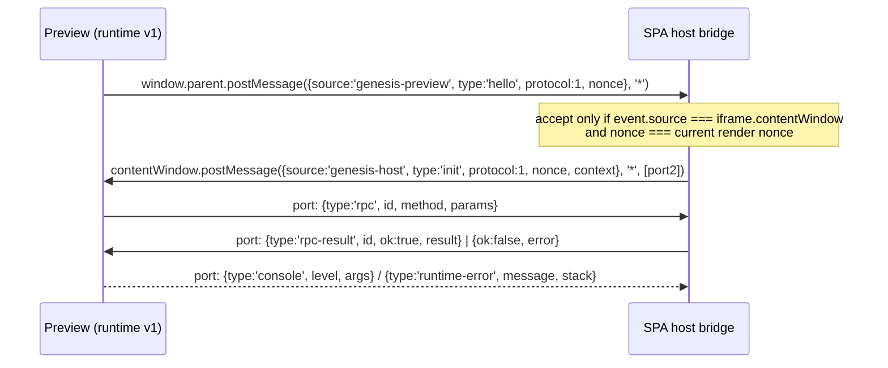
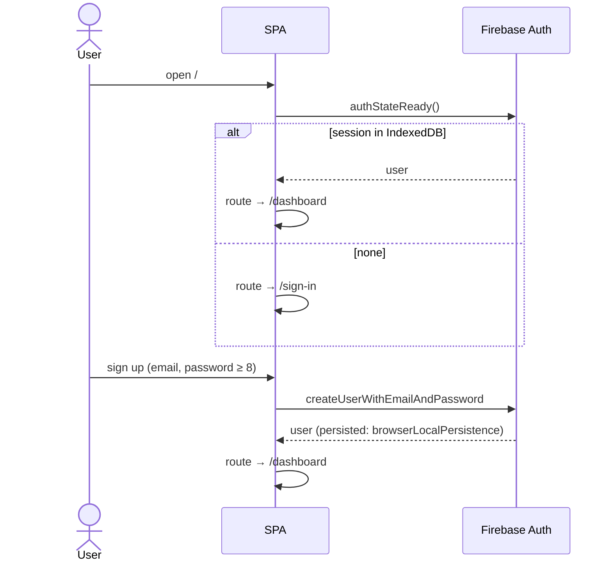

# Genesis — End-to-End System Design (whole system)

**Status:** Canonical. When any other document disagrees with **§3 (contracts)**, this file wins; fix the other document.
**Date:** 2026-09-26
**Scope:** How the SPA, the preview sandbox, the Cloud Functions, Firestore, HighLevel and Claude work together: every contract, every flow, every state machine, the security model, failure modes, operations, deployment and capacity.
**Related:** HLD [`04`](04-high-level-design.md) · backend LLD [`05`](05-backend-system-design.md) · frontend LLD [`06`](06-frontend-system-design.md)

---

## 1. Purpose and conventions

- "SPA" = the Genesis Vue app. "Preview" = the sandboxed iframe running a generated app. "API" = the `api` function. "GEN" = the `generate` function.
- Base URLs: `API = https://us-central1-<projectId>.cloudfunctions.net/api`, `GEN = https://us-central1-<projectId>.cloudfunctions.net/generate`. Locally: `http://127.0.0.1:5001/<projectId>/us-central1/api` and `…/generate`.
- All timestamps in Firestore are `Timestamp`; all timestamps on the wire are ISO-8601 strings unless stated (`ts` in SSE is epoch ms).
- Schemas are written in TypeScript notation; the executable versions are the zod schemas in `functions/src/contracts/`.

## 2. System diagram



---

## 3. Canonical contracts

### 3.1 REST API v1

Envelope: success `200/202 { "data": T }`; error `{ "error": { "code": ErrorCode, "message": string, "retryable": boolean, "details"?: object, "requestId": string } }` with the HTTP status from §3.6. Every response carries `X-Request-Id`. Auth = `Authorization: Bearer <Firebase ID token>`. All bodies are JSON (`Content-Type: application/json`). CORS: exact origins from `ALLOWED_ORIGINS`, methods `GET, POST, PUT, PATCH, DELETE, OPTIONS`, headers `Authorization, Content-Type, Accept, X-Request-Id`, no credentials, `max-age 600`.

#### 3.1.1 `api` function

| #   | Method & path                                                                        | Auth                                      | Request                                                                            | Success                                                                                     | Errors (beyond 401/500)                                                                                                        |
| --- | ------------------------------------------------------------------------------------ | ----------------------------------------- | ---------------------------------------------------------------------------------- | ------------------------------------------------------------------------------------------- | ------------------------------------------------------------------------------------------------------------------------------ |
| A1  | `GET /v1/health`                                                                     | none                                      | —                                                                                  | `{ ok: true, service: 'api', version }`                                                     | —                                                                                                                              |
| A2  | `POST /v1/hl/oauth/start`                                                            | ID token                                  | `{ returnPath?: string }` (must start with `/`, ≤ 200 chars, default `/dashboard`) | `{ authorizeUrl: string }`                                                                  | —                                                                                                                              |
| A3  | `GET /v1/hl/oauth/callback?code&state`                                               | **state** (no ID token; browser redirect) | query                                                                              | `302 → {APP_BASE_URL}{returnPath}?hl=connected`                                             | `302 → …?hl=error&reason=state_invalid\|denied\|exchange_failed\|not_location_token\|internal`                                 |
| A4  | `DELETE /v1/hl/connection`                                                           | ID token                                  | —                                                                                  | `{ status: 'disconnected' }`                                                                | —                                                                                                                              |
| A5  | `GET /v1/projects/:projectId/hl/location`                                            | ID token                                  | —                                                                                  | `Location`                                                                                  | HL codes, `PROJECT_NOT_FOUND`, `PROJECT_LOCATION_MISMATCH`                                                                     |
| A6  | `GET /v1/projects/:projectId/hl/contacts?query&limit&cursor`                         | ID token                                  | query                                                                              | `Page<Contact>`                                                                             | same                                                                                                                           |
| A7  | `GET /v1/projects/:projectId/hl/contacts/:contactId`                                 | ID token                                  | —                                                                                  | `Contact`                                                                                   | same                                                                                                                           |
| A8  | `GET /v1/projects/:projectId/hl/conversations?query&contactId&limit&cursor`          | ID token                                  | query                                                                              | `Page<Conversation>`                                                                        | same                                                                                                                           |
| A9  | `GET /v1/projects/:projectId/hl/conversations/:conversationId/messages?limit&cursor` | ID token                                  | query                                                                              | `Page<Message>`                                                                             | same                                                                                                                           |
| A10 | `GET /v1/projects/:projectId/hl/calendars`                                           | ID token                                  | —                                                                                  | `{ items: Calendar[] }`                                                                     | same                                                                                                                           |
| A11 | `GET /v1/projects/:projectId/hl/calendars/events?from&to&calendarId`                 | ID token                                  | query                                                                              | `{ items: CalendarEvent[] }`                                                                | same                                                                                                                           |
| A12 | `PUT /v1/projects/:projectId/files/:fileId`                                          | ID token                                  | `{ content: string, expectedVersion: number }`                                     | `{ fileId, path, version, sizeBytes, contentHash }`                                         | `PROJECT_NOT_FOUND`, `FILE_NOT_FOUND`, `FILE_VERSION_CONFLICT {currentVersion}`, `GENERATION_IN_PROGRESS`, `VALIDATION_FAILED` |
| A13 | `POST /v1/projects/:projectId/snapshots/:snapshotId/restore`                         | ID token                                  | `{}`                                                                               | `{ snapshotId, snapshotSeq, restoredFromSnapshotId, checkpointSnapshotId: string \| null }` | `SNAPSHOT_NOT_FOUND`, `SNAPSHOT_ALREADY_CURRENT`, `GENERATION_IN_PROGRESS`                                                     |
| A14 | `POST /v1/projects/:projectId/generations/:generationId/apply`                       | ID token                                  | `{}`                                                                               | `{ snapshotId, snapshotSeq, appliedPaths, deletedPaths }`                                   | `GENERATION_NOT_APPLYABLE`, `GENERATION_IN_PROGRESS`, `GENERATION_INVALID_OUTPUT {issues}`                                     |
| A15 | `POST /v1/projects/:projectId/generations/:generationId/discard`                     | ID token                                  | `{}`                                                                               | `{ discarded: true }`                                                                       | `GENERATION_NOT_APPLYABLE`                                                                                                     |

The HighLevel proxy is the seven read methods (A5–A11). Create/update/send/free-slots routes are out of v1. There is no cancel route (bonus R-B1). Per-route Cloud Function rate limits are out of v1 (bonus R-B4). The preview host still budgets HighLevel RPCs (`PREVIEW_LIMIT`) so one iframe cannot flood the proxy.

#### 3.1.2 `generate` function

| #   | Method & path                              | Auth                                  | Request                                                                | Success                                      | Errors (JSON, before the stream starts)                                                                                             |
| --- | ------------------------------------------ | ------------------------------------- | ---------------------------------------------------------------------- | -------------------------------------------- | ----------------------------------------------------------------------------------------------------------------------------------- |
| G1  | `GET /v1/health`                           | none                                  | —                                                                      | `{ ok: true, service: 'generate', version }` | —                                                                                                                                   |
| G2  | `POST /v1/projects/:projectId/generations` | ID token; `Accept: text/event-stream` | `{ clientRequestId: uuid-v4, prompt: string (1–4000 chars, trimmed) }` | `200 text/event-stream` (§3.2)               | `VALIDATION_FAILED`, `PROJECT_NOT_FOUND`, `GENERATION_IN_PROGRESS {activeGenerationId}`, `DUPLICATE_REQUEST {generationId, status}` |

### 3.2 SSE protocol v1

**Response headers:** `Content-Type: text/event-stream; charset=utf-8`, `Cache-Control: no-cache, no-store, no-transform`, `Connection: keep-alive`, `X-Accel-Buffering: no`, `X-Request-Id`.

**Frame:**

```
event: <type>
id: <seq>
data: <single-line JSON envelope>

```

**Envelope:** `{ "v": 1, "seq": number, "generationId": string, "ts": number /* epoch ms */, "type": EventType, "data": object }`

| `type`                 | `data`                                                                                                                                                   | Meaning                                       |
| ---------------------- | -------------------------------------------------------------------------------------------------------------------------------------------------------- | --------------------------------------------- |
| `generation.started`   | `{ projectId, model, promptVersion, startedAt }`                                                                                                         | First event (`seq = 1`)                       |
| `generation.phase`     | `{ phase: 'context' \| 'thinking' \| 'writing' \| 'validating' \| 'committing' }`                                                                        | Progress for the status line                  |
| `assistant.thinking`   | `{ text }`                                                                                                                                               | Summarized plan text (collapsible in chat)    |
| `assistant.delta`      | `{ text }`                                                                                                                                               | **Token delivery** — prose to the chat        |
| `file.started`         | `{ path, language: 'html' \| 'css' \| 'javascript', op: 'write' }`                                                                                       | **File boundary** open                        |
| `file.delta`           | `{ path, text }`                                                                                                                                         | **Token delivery** — file content             |
| `file.completed`       | `{ path, status: 'valid' \| 'rejected', sizeBytes, sha256, issues: Issue[] }`                                                                            | **File boundary** close + per-file validation |
| `file.deleted`         | `{ path, status: 'valid' \| 'rejected', issues: Issue[] }`                                                                                               | Delete operation parsed                       |
| `heartbeat`            | `{}`                                                                                                                                                     | Every 15 s                                    |
| `generation.completed` | `{ snapshotId, snapshotSeq, changedPaths, deletedPaths, rejected: { path, issues }[], warnings: Issue[], noChanges: boolean, usage: Usage, durationMs }` | **Completion** (terminal)                     |
| `generation.failed`    | `{ error: { code, message, retryable }, partial: Partial \| null }`                                                                                      | **Error** (terminal)                          |

```ts
type Issue = {
  code: string;
  message: string;
  severity: "error" | "warning";
  path?: string;
  line?: number;
  column?: number;
};
type Usage = {
  inputTokens: number;
  outputTokens: number;
  cacheReadInputTokens: number;
  cacheCreationInputTokens: number;
  costUsd: number;
};
type Partial = { stagedPaths: string[]; applyable: boolean };
```

**Invariants (server guarantees, client may rely on them):**

1. `generation.started` is first; `seq` starts at 1 and increases by exactly 1.
2. At most one file is open at a time; `file.delta` for path P occurs only between `file.started(P)` and `file.completed(P)`.
3. For `status: 'valid'`, the concatenation of that file's `file.delta.text` equals the committed content (`sha256` verifies it).
4. Exactly **one** terminal event (`generation.completed | generation.failed`); it is the last event; the server ends the response right after it.
5. No event is sent after the client disconnects; the persisted generation document then carries the outcome.

**Client rules:** ignore unknown `type`s; validate `data` with zod and drop invalid events (log once); if the stream ends without a terminal event, or no bytes arrive for 45 s, treat it as **disconnected** and reconcile from `users/{uid}/projects/{pid}/generations/{gid}`.

### 3.3 Preview bridge protocol v1



| Message (on the port) | Direction     | Shape                                                                                                                          |
| --------------------- | ------------- | ------------------------------------------------------------------------------------------------------------------------------ |
| `rpc`                 | iframe → host | `{ type: 'rpc', id: string, method: RuntimeMethodName, params: unknown }`                                                      |
| `rpc-result`          | host → iframe | `{ type: 'rpc-result', id, ok: true, result }` or `{ type: 'rpc-result', id, ok: false, error: { code, message, retryable } }` |
| `console`             | iframe → host | `{ type: 'console', level: 'log' \| 'info' \| 'warn' \| 'error', args: string[] }` (each arg ≤ 2 KB)                           |
| `runtime-error`       | iframe → host | `{ type: 'runtime-error', message: string, stack?: string }`                                                                   |

`context` = `{ location: { id, name, timezone } | null, project: { id, name }, hlStatus: 'connected' | 'reauth_required' | 'disconnected' }` (no secrets).

**Host limits:** unknown method → `UNKNOWN_METHOD`; params fail the manifest schema → `VALIDATION_FAILED`; > 6 in flight or > 120 calls/min → `PREVIEW_LIMIT`; serialized params > 64 KB → `VALIDATION_FAILED`; no answer in 20 s → `PREVIEW_TIMEOUT`. Every call is logged in the preview's "HighLevel calls" panel (method, duration, outcome — no payloads).

### 3.4 Runtime SDK v1 (what generated code sees)

```ts
interface GenesisRuntime {
  readonly version: "1";
  readonly ready: Promise<void>; // resolves after the bridge handshake
  readonly context: {
    // populated after ready
    location: { id: string; name: string; timezone: string } | null;
    project: { id: string; name: string };
  };
  readonly highlevel: {
    location: { get(): Promise<Location> };
    contacts: {
      list(p?: {
        query?: string;
        limit?: number;
        cursor?: string;
      }): Promise<Page<Contact>>;
      get(p: { contactId: string }): Promise<Contact>;
    };
    conversations: {
      list(p?: {
        query?: string;
        contactId?: string;
        limit?: number;
        cursor?: string;
      }): Promise<Page<Conversation>>;
      messages(p: {
        conversationId: string;
        limit?: number;
        cursor?: string;
      }): Promise<Page<Message>>;
    };
    calendars: {
      list(): Promise<{ items: Calendar[] }>;
      events(p: {
        from: string;
        to: string;
        calendarId?: string;
      }): Promise<{ items: CalendarEvent[] }>; // ≤ 31 days
    };
  };
}

type Page<T> = { items: T[]; nextCursor: string | null; hasMore: boolean }; // limit 1–100, default 20
type Location = { id: string; name: string; timezone: string | null };
type Contact = {
  id: string;
  name: string;
  firstName: string | null;
  lastName: string | null;
  email: string | null;
  phone: string | null;
  companyName: string | null;
  tags: string[];
  dateAdded: string | null;
};
type Conversation = {
  id: string;
  contactId: string | null;
  contactName: string | null;
  lastMessageBody: string | null;
  lastMessageType: string | null;
  lastMessageDate: string | null;
  unreadCount: number;
};
type Message = {
  id: string;
  conversationId: string;
  body: string | null;
  direction: "inbound" | "outbound";
  type: string | null;
  status: string | null;
  dateAdded: string | null;
};
type Calendar = {
  id: string;
  name: string;
  description: string | null;
  isActive: boolean;
};
type CalendarEvent = {
  id: string;
  calendarId: string;
  title: string | null;
  status: string | null;
  contactId: string | null;
  startTime: string;
  endTime: string;
};

class GenesisError extends Error {
  code: string;
  retryable: boolean;
}
```

Runtime guarantees: `window.genesis` is non-writable and frozen; calls made before `ready` are queued; `localStorage`/`sessionStorage` are in-memory shims; `console.*` and uncaught errors are mirrored to the host console panel.

### 3.5 Firestore schema

Legend: **W** = writer (C = client via rules, S = server Admin SDK), **R** = reader.

| Path                                          | Doc ID                         | Fields                                                                                                                                                                                                                                                                                                                                                                                                                                                                                                                                                                                                                                                                                                            | W                                     | R         | Notes                                                             |
| --------------------------------------------- | ------------------------------ | ----------------------------------------------------------------------------------------------------------------------------------------------------------------------------------------------------------------------------------------------------------------------------------------------------------------------------------------------------------------------------------------------------------------------------------------------------------------------------------------------------------------------------------------------------------------------------------------------------------------------------------------------------------------------------------------------------------------- | ------------------------------------- | --------- | ----------------------------------------------------------------- |
| `hlConnections/{uid}`                         | Firebase uid                   | `status: 'connected'\|'reauth_required'`, `source: 'oauth'\|'pit'`, `locationId`, `companyId: string\|null`, `hlUserId: string\|null`, `scopes: string[]`, `accessToken: Enc`, `refreshToken: Enc\|null`, `keyVersion: 1`, `expiresAt`, `refreshLock: { holder: string, leaseUntil: Timestamp } \| null`, `connectedAt`, `updatedAt`, `lastRefreshAt: Timestamp\|null`, `lastErrorCode: string\|null`                                                                                                                                                                                                                                                                                                             | S                                     | S         | **Deny-all** to clients. `Enc = { v: 1, iv, tag, ct }` (base64).  |
| `oauthStates/{sha256(state)}`                 | hex SHA-256                    | `uid`, `returnPath`, `createdAt`, `expiresAt`, `consumedAt: Timestamp\|null`                                                                                                                                                                                                                                                                                                                                                                                                                                                                                                                                                                                                                                      | S                                     | S         | Deny-all; TTL on `expiresAt` (+10 min)                            |
| `users/{uid}/integrations/highlevel`          | `highlevel`                    | `provider: 'highlevel'`, `status: 'connected'\|'reauth_required'\|'disconnected'`, `locationId: string\|null`, `locationName: string\|null`, `timezone: string\|null`, `scopes: string[]`, `connectedAt: Timestamp\|null`, `updatedAt`, `lastErrorCode: string\|null`                                                                                                                                                                                                                                                                                                                                                                                                                                             | S                                     | C (owner) | Public projection — **no tokens**                                 |
| `users/{uid}/projects/{projectId}`            | auto ID                        | **client fields:** `name` (1–60), `description` (0–280), `locationId: string\|null` (create only; must equal projection's `locationId` or null), `status: 'active'\|'deleted'`, `createdAt`, `updatedAt`, `deletedAt: Timestamp\|null` · **server fields (absent on create):** `latestSnapshotId: string\|null`, `snapshotSeq: number`, `fileCount`, `totalBytes`, `workingTreeDirty: boolean`, `activeGeneration: { id, startedAt, heartbeatAt } \| null`, `lastGenerationAt: Timestamp\|null`                                                                                                                                                                                                                   | C (create / rename / soft-delete) + S | C (owner) | Index: `status ASC, updatedAt DESC`                               |
| `…/projects/{pid}/files/{fileId}`             | first 20 hex of `sha256(path)` | `path`, `language`, `content` (≤ 100 KB), `sizeBytes`, `contentHash` (sha256 hex), `version` (≥ 1), `source: 'ai'\|'manual'\|'restore'`, `updatedAt`, `lastGenerationId: string\|null`                                                                                                                                                                                                                                                                                                                                                                                                                                                                                                                            | S                                     | C         | Working tree                                                      |
| `…/projects/{pid}/messages/{messageId}`       | auto ID                        | `role: 'user'\|'assistant'\|'system'`, `content`, `generationId: string\|null`, `createdAt`, `meta: { status?, changedPaths?, deletedPaths?, rejectedPaths?, snapshotId?, snapshotSeq? } \| null`                                                                                                                                                                                                                                                                                                                                                                                                                                                                                                                 | S                                     | C         | Ordered by `createdAt`                                            |
| `…/projects/{pid}/generations/{generationId}` | `clientRequestId` (UUID v4)    | `status: 'streaming'\|'completed'\|'failed'\|'interrupted'`, `prompt`, `promptVersion`, `model`, `effort`, `createdAt`, `startedAt`, `completedAt: Timestamp\|null`, `heartbeatAt`, `stopReason: string\|null`, `error: { code, message, retryable } \| null`, `result: { snapshotId, snapshotSeq, changedPaths, deletedPaths, rejected: {path, issues}[], warnings: Issue[], noChanges } \| null`, `partial: { stagedPaths, applyable, appliedAt: Timestamp\|null, appliedSnapshotId: string\|null, discardedAt: Timestamp\|null } \| null`, `usage: Usage\|null`, `timings: { ttftMs: number\|null, totalMs: number\|null }`, `context: { fileCount, historyMessages, externalIncluded: boolean, promptChars }` | S                                     | C         | Stale if `status = 'streaming'` and `heartbeatAt` older than 60 s |
| `…/generations/{gid}/staged/{fileId}`         | same as file ID                | `path`, `op: 'write'\|'delete'`, `content: string\|null`, `sizeBytes`, `contentHash: string\|null`, `issues: Issue[]` (warnings only), `createdAt`                                                                                                                                                                                                                                                                                                                                                                                                                                                                                                                                                                | S                                     | C         | Only **valid** operations are staged                              |
| `…/generations/{gid}/artifacts/raw`           | `raw`                          | `text` (≤ 900 KB), `truncated: boolean`, `sizeBytes`, `createdAt`                                                                                                                                                                                                                                                                                                                                                                                                                                                                                                                                                                                                                                                 | S                                     | C         | Raw completion for debugging                                      |
| `…/projects/{pid}/snapshots/{snapshotId}`     | auto ID                        | `seq` (1, 2, …), `kind: 'generation'\|'checkpoint'\|'restore'`, `label` (≤ 120 chars), `generationId: string\|null`, `restoredFromSnapshotId: string\|null`, `parentSnapshotId: string\|null`, `files: Record<fileId, { path, blobId, sizeBytes, language }>`, `fileCount`, `totalBytes`, `changedPaths: string[]`, `deletedPaths: string[]`, `createdAt`                                                                                                                                                                                                                                                                                                                                                         | S                                     | C         | Ordered by `seq desc`                                             |
| `…/projects/{pid}/blobs/{sha256}`             | content SHA-256 hex            | `content`, `sizeBytes`, `createdAt`                                                                                                                                                                                                                                                                                                                                                                                                                                                                                                                                                                                                                                                                               | S                                     | C         | Immutable, create-if-absent                                       |

**Rules summary** (full text: plan task BE-2.1): server-only top-level collections deny all; `users/{uid}` document itself denies all; integrations are owner-read-only; projects allow owner read + validated create/edit/soft-delete; everything below a project is owner-read-only.

### 3.6 Error catalog

| Code                                                                                          | HTTP            | Retryable  | Default user message                                                                                          | Raised by        |
| --------------------------------------------------------------------------------------------- | --------------- | ---------- | ------------------------------------------------------------------------------------------------------------- | ---------------- |
| `UNAUTHENTICATED`                                                                             | 401             | no         | "Please sign in again."                                                                                       | auth middleware  |
| `FORBIDDEN`                                                                                   | 403             | no         | "You don't have access to this."                                                                              | —                |
| `VALIDATION_FAILED`                                                                           | 400             | no         | "Some input was invalid." (+ `details.issues`)                                                                | validation       |
| `PAYLOAD_TOO_LARGE`                                                                           | 413             | no         | "That's larger than allowed."                                                                                 | save, proxy      |
| `PROJECT_NOT_FOUND`                                                                           | 404             | no         | "Project not found."                                                                                          | project access   |
| `FILE_NOT_FOUND` / `SNAPSHOT_NOT_FOUND` / `GENERATION_NOT_FOUND`                              | 404             | no         | "…not found."                                                                                                 | services         |
| `GENERATION_IN_PROGRESS`                                                                      | 409             | yes        | "A generation is already running for this project."                                                           | lease            |
| `DUPLICATE_REQUEST`                                                                           | 409             | no         | "This request was already submitted."                                                                         | idempotency      |
| `FILE_VERSION_CONFLICT`                                                                       | 409             | no         | "This file changed since you opened it." (`details.currentVersion`)                                           | save             |
| `SNAPSHOT_ALREADY_CURRENT`                                                                    | 409             | no         | "That snapshot is already the current version."                                                               | restore          |
| `GENERATION_NOT_APPLYABLE`                                                                    | 409             | no         | "There's nothing to apply from this generation."                                                              | apply/discard    |
| `PROJECT_LOCATION_MISMATCH`                                                                   | 409             | no         | "This project was built for a different HighLevel location. Reconnect that location or create a new project." | proxy            |
| `GENERATION_INVALID_OUTPUT`                                                                   | 422             | yes        | "The AI response couldn't be used safely." (+ issues)                                                         | outcome          |
| `GENERATION_REFUSED`                                                                          | 422             | no         | "The AI declined this request. Try rephrasing."                                                               | outcome          |
| `GENERATION_TRUNCATED`                                                                        | 422             | yes        | "The response was cut off before finishing."                                                                  | outcome          |
| `GENERATION_TIMEOUT`                                                                          | 504             | yes        | "Generation took too long and was stopped."                                                                   | deadline         |
| `GENERATION_INTERRUPTED`                                                                      | —               | yes        | "The connection was lost during generation."                                                                  | disconnect/stale |
| `CONTEXT_TOO_LARGE`                                                                           | 413             | no         | "The project is too large to send to the AI."                                                                 | outcome          |
| `LLM_RATE_LIMITED`                                                                            | 429             | yes        | "The AI service is busy — try again shortly."                                                                 | provider         |
| `LLM_UNAVAILABLE`                                                                             | 503             | yes        | "The AI service is unavailable right now."                                                                    | provider         |
| `HL_NOT_CONNECTED`                                                                            | 409             | no         | "Connect HighLevel to use live data."                                                                         | token manager    |
| `HL_REAUTH_REQUIRED`                                                                          | 409             | no         | "Your HighLevel connection expired — reconnect."                                                              | token manager    |
| `HL_SCOPE_MISSING`                                                                            | 403             | no         | "Genesis isn't allowed to do that in HighLevel. Reconnect to grant access."                                   | proxy            |
| `HL_FORBIDDEN`                                                                                | 403             | no         | "HighLevel refused this request."                                                                             | proxy            |
| `HL_NOT_FOUND`                                                                                | 404             | no         | "That HighLevel record wasn't found."                                                                         | proxy            |
| `HL_BAD_REQUEST`                                                                              | 422             | no         | HighLevel's sanitized message                                                                                 | proxy            |
| `HL_RATE_LIMITED`                                                                             | 429             | yes        | "HighLevel is rate limiting requests — try again shortly."                                                    | proxy            |
| `HL_UNAVAILABLE`                                                                              | 502             | yes        | "HighLevel is unavailable right now."                                                                         | proxy            |
| `OAUTH_STATE_INVALID` / `OAUTH_DENIED` / `OAUTH_EXCHANGE_FAILED` / `OAUTH_NOT_LOCATION_TOKEN` | redirect reason | varies     | Shown on the dashboard after redirect                                                                         | OAuth            |
| `PREVIEW_LIMIT` / `PREVIEW_TIMEOUT` / `UNKNOWN_METHOD`                                        | (bridge only)   | yes/yes/no | "Too many HighLevel calls from the preview." / "HighLevel call timed out." / "Unknown SDK method."            | bridge           |
| `INTERNAL`                                                                                    | 500             | yes        | "Something went wrong. Please try again."                                                                     | error handler    |

Never returned to clients: stack traces, tokens, provider response bodies, Firestore paths of other users.

### 3.7 Configuration catalog

The variable list, kinds and examples are in [`03-prerequisites.md`](03-prerequisites.md) §6. Validation (functions `runtime-config.ts`, frontend `env.ts`): URLs must parse; `ALLOWED_ORIGINS` non-empty; `ANTHROPIC_EFFORT ∈ {low, medium, high, xhigh, max}`; `LLM_PROVIDER ∈ {anthropic, fake}`; `TOKEN_ENCRYPTION_KEY` decodes to exactly 32 bytes. Invalid configuration fails the first request with `INTERNAL` and a clear server log line (never at deploy time, because secrets are runtime-only).

---

## 4. End-to-end flows

### 4.1 Sign up, sign in, session restore



### 4.2 Connect HighLevel (OAuth)

```mermaid
sequenceDiagram
  actor U as User
  participant S as SPA
  participant API as api
  participant FS as Firestore
  participant HL as HighLevel
  U->>S: Connect HighLevel
  S->>API: POST /v1/hl/oauth/start (ID token)
  API->>API: rate limit; state = 32 random bytes
  API->>FS: oauthStates/{sha256(state)} = {uid, returnPath, expiresAt: +10m}
  API-->>S: {authorizeUrl}
  S->>HL: navigate to /v2/oauth/chooselocation?…&state
  U->>HL: log in (if needed), choose sub-account, approve
  HL->>API: GET /v1/hl/oauth/callback?code&state
  API->>FS: txn: read state (exists, not expired, not consumed) → set consumedAt
  alt invalid state
    API-->>U: 302 /dashboard?hl=error&reason=state_invalid
  end
  API->>HL: POST /oauth/token (form: authorization_code, user_type=Location)
  HL-->>API: access_token, refresh_token, expires_in, locationId, scope
  API->>HL: GET /locations/{locationId} (Version 2021-07-28)
  HL-->>API: {location: {name, timezone}}
  API->>FS: batch: hlConnections/{uid} (encrypted) + users/{uid}/integrations/highlevel (projection)
  API-->>U: 302 /dashboard?hl=connected
  S->>FS: projection listener → "Connected: <location name>"
```

### 4.3 Token refresh under concurrency

```mermaid
sequenceDiagram
  participant R1 as Request A (instance 1)
  participant R2 as Request B (instance 2)
  participant FS as Firestore
  participant HL as HighLevel
  R1->>FS: txn: expiresAt < now+5m and no live lease → set refreshLock{holder:A, leaseUntil:+30s}
  R2->>FS: txn: lease held by A → busy
  R1->>HL: POST /oauth/token (refresh_token=R0) — outside any transaction, 10 s timeout
  HL-->>R1: access A1, refresh R1 (R0 now invalid)
  R1->>FS: txn: holder == A → write enc(A1), enc(R1), expiresAt; refreshLock = null
  R2->>FS: poll after backoff: expiresAt fresh → return A1 (no second refresh)
  Note over R1,R2: Within one instance, concurrent callers share one in-flight promise (single-flight)
```

Invalid grant on refresh → re-read: if another holder refreshed meanwhile, use the new token; else set `status = reauth_required` in both documents → `HL_REAUTH_REQUIRED`.

### 4.4 Project CRUD (client + rules)

Create: SPA `addDoc(users/{uid}/projects, {name, description, locationId: projection.locationId ?? null, status: 'active', createdAt: serverTimestamp(), updatedAt: serverTimestamp(), deletedAt: null})` → rules validate keys, sizes, timestamps and `locationId`. Rename: `updateDoc({name, description, updatedAt})`. Soft-delete: `updateDoc({status: 'deleted', deletedAt, updatedAt})` — rejected while a generation is active. Dashboard query: `where status == 'active' orderBy updatedAt desc limit 50`.

### 4.5 Open the workspace

Listeners: project doc, `files` (all), `messages` (orderBy createdAt, limit 200), `generations` (orderBy createdAt desc, limit 1 — for reconciliation and partial banners), `snapshots` (orderBy seq desc, limit 50; only while the sheet is open), integration projection. Monaco models are created lazily per opened file. The preview compiles from the committed files.

### 4.6 Generate (happy path)

```mermaid
sequenceDiagram
  actor U as User
  participant S as SPA
  participant G as generate
  participant FS as Firestore
  participant HL as HighLevel
  participant C as Claude
  U->>S: prompt + Send
  S->>G: POST /v1/projects/{pid}/generations {clientRequestId, prompt}
  G->>FS: limits; txn: project owned+active, no live lease, generations/{id} absent → create generation(streaming), user message, project.activeGeneration
  G-->>S: SSE generation.started, phase:context
  G->>FS: read files, last messages
  G->>HL: location metadata (cached 5 min; tolerate failure)
  G->>C: messages.stream (system cached + context + prompt)
  G-->>S: phase:thinking, assistant.thinking…
  loop text deltas
    C-->>G: text_delta
    G->>G: parser → prose / file events
    G-->>S: assistant.delta / file.started / file.delta
    opt file closed
      G->>G: validate file
      G->>FS: generations/{id}/staged/{fileId}
      G-->>S: file.completed {status, sha256, issues}
    end
  end
  C-->>G: message_stop (end_turn), usage
  G-->>S: phase:validating → project validation OK → phase:committing
  G->>FS: ONE txn: checkpoint (if dirty), files, blobs, snapshot #n, assistant message, generation(completed), project (lease cleared)
  G-->>S: generation.completed {snapshotId, changedPaths, usage}
  FS-->>S: listeners → tree/tabs/snapshot list update → preview recompiles
```

Heartbeat: every 15 s the server sends `heartbeat` and updates `generation.heartbeatAt` + `project.activeGeneration.heartbeatAt`.

### 4.7 Malformed output

- A file with an invalid path or failing checks → `file.completed {status:'rejected', issues}`; the stream continues.
- An unterminated file (next marker or end of stream) → `file.completed {status:'rejected', issues:[{code:'FILE_UNTERMINATED'}]}`.
- End of stream: project validation of `current ⊕ valid ops`. OK → commit valid ops; `generation.completed` lists `rejected` + `warnings`. Not OK (e.g. `index.html` references a rejected `app.js`, or no `index.html` in a new project) → `generation.failed {error: GENERATION_INVALID_OUTPUT, partial: {stagedPaths, applyable: false}}`; raw text saved; chat shows the issues and a Retry button.
- Zero operations with `end_turn` and no rejected files (e.g. the user asked a question) → `generation.completed {noChanges: true}` with a snapshot identical to the previous manifest (one generation ⇒ one snapshot invariant).

### 4.8 Interrupted stream and partial apply

```mermaid
sequenceDiagram
  participant S as SPA
  participant G as generate
  participant FS as Firestore
  participant API as api
  S--xG: network drops mid-stream
  G->>G: req 'close' → abort Claude; finalize interrupted (staged kept)
  G->>FS: generation status=interrupted, partial={stagedPaths:[index.html, styles.css], applyable:true}
  S->>S: reader error / no terminal event → state 'reconciling'
  S->>FS: listen generations/{gid}
  FS-->>S: status interrupted, partial
  S->>S: banner "Connection lost — 2 files completed" [Apply 2 files] [Discard] [Retry]
  S->>API: POST …/generations/{gid}/apply
  API->>FS: txn: project validation of current ⊕ staged → commit (checkpoint if dirty, files, blobs, snapshot, system message), partial.appliedSnapshotId
  API-->>S: {snapshotId}
```

### 4.10 Snapshot restore

```mermaid
sequenceDiagram
  actor U as User
  participant S as SPA
  participant API as api
  participant FS as Firestore
  U->>S: History → Restore #3 → confirm
  S->>API: POST /v1/projects/{pid}/snapshots/{sid}/restore
  API->>FS: txn: no active generation; read target manifest + blobs + current files
  alt working tree dirty
    API->>FS: create checkpoint snapshot (#n+1) of current files (+missing blobs)
  end
  API->>FS: write files from blobs (version+1, source 'restore'); delete files absent from target
  API->>FS: create restore snapshot (#n+2, restoredFrom #3); system message; project.latestSnapshotId, workingTreeDirty=false
  API-->>S: {snapshotId, snapshotSeq, checkpointSnapshotId}
  FS-->>S: listeners → editor models refresh → preview recompiles
```

### 4.11 Manual edit, save and conflict

Edit in Monaco (model becomes dirty) → Ctrl/Cmd+S → `PUT …/files/{fileId} {content, expectedVersion}` → txn: no active generation; version matches; size OK → file `version+1`, `source 'manual'`; project `workingTreeDirty = true`, `totalBytes` adjusted → listener echoes the new version → model clean → preview recompiles. On `409 FILE_VERSION_CONFLICT` the SPA opens the conflict dialog: **Keep mine** (retry with `expectedVersion = currentVersion`) or **Use theirs** (replace the model with the remote content).

### 4.12 Preview data call

```mermaid
sequenceDiagram
  participant GA as Generated app
  participant RT as runtime (iframe)
  participant BR as Host bridge (SPA)
  participant API as api
  participant TM as token manager
  participant HL as HighLevel
  GA->>RT: await genesis.highlevel.contacts.list({limit: 20})
  RT->>BR: port {type:'rpc', id, method:'contacts.list', params}
  BR->>BR: allow-list + zod params + budgets
  BR->>API: GET /v1/projects/{pid}/hl/contacts?limit=20 (ID token)
  API->>API: verify token; project owned+active; location binding
  API->>TM: getAccessGrant(uid) (refresh if < 5 min)
  API->>HL: POST /contacts/search {locationId, pageLimit: 20} (Version 2021-07-28)
  HL-->>API: {contacts, total}
  API->>API: normalize → {items, nextCursor, hasMore}
  API-->>BR: {data: page}
  BR-->>RT: port {type:'rpc-result', id, ok:true, result}
  RT-->>GA: resolves Page<Contact>
```

On HighLevel 401: force refresh once and retry; still 401 → `HL_REAUTH_REQUIRED` (projection updated; the SPA badge switches to "Reconnect").

### 4.13 Reauth and disconnect

- Refresh invalid → `reauth_required` → badge "Reconnect HighLevel" → Connect flow again (replaces the connection; same or different location).
- `DELETE /v1/hl/connection` → delete `hlConnections/{uid}`; projection `disconnected`; projects keep their `locationId` (a reconnect to a different location yields `PROJECT_LOCATION_MISMATCH` for old projects).

---

## 5. State machines

### 5.1 Generation (persisted)

```mermaid
stateDiagram-v2
  [*] --> streaming: start txn
  streaming --> completed: commit OK
  streaming --> failed: invalid output / refusal / truncation / timeout / LLM error
  streaming --> interrupted: client disconnect / stale heartbeat (>60 s)
  failed --> [*]
  completed --> [*]
  interrupted --> [*]
  note right of interrupted: partial.applyable → Apply sets partial.appliedSnapshotId;\nDiscard sets partial.discardedAt (status unchanged)
```



### 5.2 Generation (client store)

`idle → submitting → streaming → completed | failed | interrupted`, plus `streaming → reconciling → (terminal)` when the stream drops. `submitting → idle` on pre-stream errors (409/400) with a toast. Terminal states return to `idle` when the user sends the next prompt or dismisses the banner.

### 5.3 HighLevel connection

`(none) → connected` (OAuth) · `connected → connected` (refresh) · `connected → reauth_required` (invalid grant / repeated 401) · `reauth_required → connected` (OAuth again) · `connected|reauth_required → disconnected` (DELETE).

### 5.4 Project generation lease

`activeGeneration = null` → set in start txn → heartbeat every 15 s → cleared by commit or finalize; if `heartbeatAt` is older than 60 s, the next start/apply treats it as stale (old generation → `interrupted`).

### 5.5 OAuth state

`issued (10 min) → consumed` (single use) or `expired` (TTL deletes it).

---

## 6. Security model

### 6.1 Data classification

| Class                    | Examples                                           | Storage                       | Exposure                                 |
| ------------------------ | -------------------------------------------------- | ----------------------------- | ---------------------------------------- |
| Secret                   | Anthropic key, HL client secret/ID, encryption key | Secret Manager                | Functions memory only                    |
| Credential               | HL access/refresh tokens                           | `hlConnections` (AES-GCM)     | Decrypted in function memory per request |
| Credential (short-lived) | Firebase ID token                                  | Browser memory (SDK)          | Sent to our functions only               |
| Customer data (PII)      | Contacts, messages, appointments                   | **Not stored** by Genesis     | Streams through the proxy to the preview |
| User content             | Prompts, files, messages, snapshots                | Firestore under `users/{uid}` | Owner only                               |
| Public config            | Firebase web config, function URLs                 | Frontend bundle               | Public by design                         |

### 6.2 Threat model (STRIDE-lite)

| #   | Threat                                                                                      | Mitigation                                                                                                                          | Verified by                        |
| --- | ------------------------------------------------------------------------------------------- | ----------------------------------------------------------------------------------------------------------------------------------- | ---------------------------------- |
| T1  | Generated code exfiltrates credentials                                                      | No credentials in iframe; CSP blocks network; `sandbox="allow-scripts allow-forms"` + `form-action 'none'`                          | Bridge tests; manual console check |
| T1b | Generated code leaks CRM data by navigating its own frame (CSP can't block self-navigation) | Residual, accepted: data is the user's own and never a credential; the model never sees records; the preview rebuilds on navigation | Manual                             |
| T2  | Generated code abuses the proxy (loops, spam reads)                                         | Allow-list, zod, host bridge budgets, prompt rules                                                                                  | Bridge tests                       |
| T3  | User A reads/writes user B's data                                                           | Path rules; uid from token; ownership re-check                                                                                      | Rules tests; API integration tests |
| T4  | Client tampers with server-owned fields (snapshot pointers, lease)                          | Rules `hasOnly`/`affectedKeys`; server-only subcollections                                                                          | Rules tests                        |
| T5  | OAuth CSRF / account injection                                                              | Hashed single-use state bound to uid, 10 min                                                                                        | Unit tests                         |
| T6  | Refresh race wipes a valid connection                                                       | Single-flight + lease + re-read on invalid grant                                                                                    | Token manager tests                |
| T7  | Token leak from database access/exports                                                     | AES-256-GCM with AAD; key in Secret Manager                                                                                         | Cipher tests                       |
| T8  | Prompt injection via project files or HighLevel metadata                                    | Data-not-instructions wrappers; metadata only; validation of every output                                                           | Review                             |
| T9  | XSS in preview through HighLevel data                                                       | Sandbox + CSP containment; prompt requires `textContent`                                                                            | Manual                             |
| T10 | Cost exhaustion                                                                             | Prompt/file/project caps, 300 s deadline, `max_tokens` 32k, Anthropic console spend limit                                           | Deadline + provider tests          |
| T11 | Secrets committed to the public repo                                                        | `.gitignore`, scanning + push protection, `.env.example` only                                                                       | CI + GitHub                        |
| T12 | Information disclosure in errors                                                            | Error envelope without stacks/bodies; logs without tokens/PII                                                                       | Error-handler tests                |
| T13 | Malformed model output corrupts a project                                                   | Staging, validation, atomic commit                                                                                                  | Generation integration tests       |
| T14 | Replay of a cursor across resources                                                         | Cursor `k` (kind) checked on decode                                                                                                 | Cursor tests                       |

---

## 7. Failure modes and effects (FMEA)

| Failure                                       | User impact             | Detection                        | Handling                                                                                             |
| --------------------------------------------- | ----------------------- | -------------------------------- | ---------------------------------------------------------------------------------------------------- |
| Claude 429/529/5xx before any output          | Generation fails fast   | Provider error                   | `generation.failed LLM_*` (retryable); nothing staged                                                |
| Claude error mid-stream                       | Partial output          | Iteration throws                 | Staged valid files kept; `generation.failed` with `partial`; Apply/Discard/Retry                     |
| `max_tokens` reached                          | Last file truncated     | `stop_reason`                    | Truncated file rejected; rest committed if the project validates, else failed `GENERATION_TRUNCATED` |
| Refusal (after fallbacks)                     | No app                  | `stop_reason: refusal`           | `GENERATION_REFUSED`, nothing applied                                                                |
| Protocol violation (no markers, bad paths)    | Partial/no files        | Parser + validation              | Per-file rejection; project validation decides                                                       |
| Browser disconnect                            | Stream stops            | `req` close; client reader error | Server aborts + `interrupted`; client reconciles                                                     |
| Function instance dies mid-generation         | Stuck "streaming"       | Heartbeat older than 60 s        | Treated as `interrupted` on next access; lease taken over                                            |
| Generation exceeds 300 s                      | Stops                   | Deadline timer                   | `GENERATION_TIMEOUT` with partial                                                                    |
| Firestore commit transaction fails            | No commit               | Exception                        | Retry once; else `generation.failed INTERNAL` with staged files applyable                            |
| HighLevel 401                                 | Preview call fails once | 401                              | Force refresh + retry; then `HL_REAUTH_REQUIRED`                                                     |
| HighLevel 429                                 | Slow/failed calls       | 429 + headers                    | Backoff (Retry-After) ≤ 2 retries; `HL_RATE_LIMITED`                                                 |
| HighLevel 5xx/timeout                         | Failed calls            | Status/timeout                   | ≤ 2 retries; `HL_UNAVAILABLE`                                                                        |
| HighLevel metadata fetch fails during context | Less tailored app       | Exception                        | Context notes "metadata unavailable"; generation proceeds                                            |
| Refresh token invalid                         | Disconnected            | Invalid grant                    | Re-read; `reauth_required`; UI prompts reconnect                                                     |
| OAuth state missing/expired                   | Connect fails           | Callback check                   | Redirect `hl=error&reason=state_invalid`; retry                                                      |
| Manual save during generation                 | Save blocked            | Lease                            | `409 GENERATION_IN_PROGRESS`; editor read-only anyway                                                |
| Two tabs generate                             | Second blocked          | Lease                            | `409 GENERATION_IN_PROGRESS` with active ID                                                          |
| Duplicate submit (retry)                      | No double charge        | Doc exists                       | `409 DUPLICATE_REQUEST` → client attaches via Firestore                                              |
| Preview runtime error                         | App broken              | `runtime-error` messages         | Console panel badge; the chat suggests "Ask Genesis to fix: <error>"                                 |
| Preview infinite call loop                    | Quota burn              | Budgets                          | `PREVIEW_LIMIT` errors to the app; banner in preview toolbar                                         |
| Secret missing/invalid config                 | All calls fail          | Config validation                | `INTERNAL` + explicit server log; runbook                                                            |

---

## 8. Observability and operations

**Log schema** (JSON via `firebase-functions/logger`): `severity`, `message`, `requestId`, `route`, `uidHash` (first 12 hex of SHA-256(uid)), `projectId`, `generationId`, `latencyMs`, `status`, `code`, plus domain fields (`hlStatus`, `hlRateRemaining`, `hlTraceId`, `model`, `stopReason`, `inputTokens`, `outputTokens`, `ttftMs`). Never log tokens, prompts in full (log length only), file contents or HighLevel records.

**Key events:** `oauth.start`, `oauth.callback.ok|error`, `token.refresh.ok|busy|invalid_grant`, `hl.call` (method, status, latency, remaining), `generation.start|phase|complete|fail|interrupt`, `commit.ok|conflict`, `restore.ok`.

**Runbooks**

| Situation                                       | Action                                                                                                               |
| ----------------------------------------------- | -------------------------------------------------------------------------------------------------------------------- |
| Cost spike                                      | Lower Anthropic console spend limit; check logs for the top `uidHash`                                                |
| User stuck in `reauth_required`                 | Ask them to reconnect; if repeated, check `token.refresh.invalid_grant` logs and HighLevel app status (uninstalled?) |
| Generation stuck `streaming`                    | Automatically recovered after 60 s by lease staleness (next start/apply treats it as `interrupted`)                  |
| HighLevel 429 bursts                            | Check `hlRateRemaining`; lower host-bridge budgets if a generated app is looping                                     |
| Rotate `HL_CLIENT_SECRET` / `ANTHROPIC_API_KEY` | `firebase functions:secrets:set …` → redeploy affected functions                                                     |
| Rotate `TOKEN_ENCRYPTION_KEY`                   | Set new version → redeploy → users reconnect (v1 has no dual-key read)                                               |

---

## 9. Deployment topology and environments

| Aspect           | Local                                                        | Production                            |
| ---------------- | ------------------------------------------------------------ | ------------------------------------- |
| Frontend         | Vite dev server `http://localhost:5173`                      | Hosting `https://<projectId>.web.app` |
| Functions        | Emulator `127.0.0.1:5001` (host Node 24)                     | `us-central1`, `nodejs24`, 2nd gen    |
| Firestore / Auth | Emulators (8080 / 9099)                                      | `nam5` / Firebase Auth                |
| Secrets          | `functions/.secret.local`                                    | Secret Manager                        |
| Params           | `functions/.env` + `.env.local`                              | `functions/.env` + `.env.<projectId>` |
| LLM              | `fake` (default locally) or `anthropic`                      | `anthropic`                           |
| HighLevel        | PIT-seeded connection or OAuth via localhost/tunnel redirect | OAuth with the prod redirect URI      |
| Frontend env     | `frontend/.env.local` (`VITE_USE_EMULATORS=true`)            | `frontend/.env.production`            |

## 10. Capacity and cost

| Dimension                       | Expected (demo + review)                                                    | Headroom                                    |
| ------------------------------- | --------------------------------------------------------------------------- | ------------------------------------------- |
| Users                           | < 20                                                                        | Firestore/Functions scale far beyond        |
| Generations                     | < 200 total                                                                 | —                                           |
| Concurrent generations          | ≤ 5                                                                         | `generate` max 5 instances × 20 concurrency |
| HighLevel calls                 | < 5k/day                                                                    | 200k/day/location limit                     |
| Firestore writes per generation | ~40–60 (commit) + ~25 staging + ~20 heartbeats                              | Free tier covers demo                       |
| Cost                            | Anthropic ~USD 0.2–0.3/generation; infra ~USD 5–15/month with min instances | Budget alert USD 25                         |

## 11. Traceability

Requirement → design → task → verification matrix: [`research/01`](research/01-assignment-deconstruction.md) §8.

## 12. Repository structure (ownership)

| Path                                        | Owner module                                             | Deployed as                                            |
| ------------------------------------------- | -------------------------------------------------------- | ------------------------------------------------------ |
| `frontend/`                                 | SPA                                                      | Firebase Hosting (`frontend/dist`)                     |
| `functions/src/contracts/`                  | Shared contracts (source)                                | Part of functions; copied to `frontend/src/contracts/` |
| `functions/src/modules/highlevel/*`         | OAuth, tokens, HighLevel client, adapters, runtime proxy | `api` (+ `generate` for metadata/refresh)              |
| `functions/src/modules/generation/*`        | Generation pipeline                                      | `generate` (+ control routes in `api`)                 |
| `functions/src/modules/files`, `snapshots`  | Save, restore                                            | `api`                                                  |
| `firestore.rules`, `firestore.indexes.json` | Data security                                            | `firebase deploy --only firestore`                     |
| `firebase.json`, `.firebaserc`              | Deploy config                                            | —                                                      |
| `scripts/sync-contracts.mjs`                | Contract sync                                            | CI                                                     |
| `.github/workflows/`                        | CI (+ optional deploy)                                   | GitHub Actions                                         |

Full tree: [`04-high-level-design.md`](04-high-level-design.md) §10.
