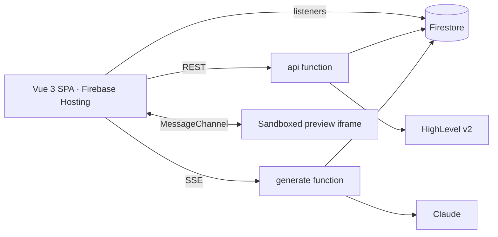

# Genesis — Delivery: Git, CI/CD, deployment, README, Loom, submission

**Status:** Runbook · **Date:** 2026-09-26
**Covers:** R-DEP1–R-DEP5, R-DEL1–R-DEL4 ([`research/01`](research/01-assignment-deconstruction.md) §3).
**Used by:** BE-0.1 (CI file), BE-8.6 and FE-8.6 (deploy + smoke), Day 5 (README, Loom, email).

---

## 1. Repository

- Public GitHub repository `genesis` (R-DEL1) with `/functions`, `/frontend`, root `firebase.json`, `.firebaserc`, `.env.example`, `README.md`, `LICENSE`, `docs/`.
- Settings → **Code security**: enable _Secret scanning_ and _Push protection_ (blocks pushes that contain API keys). Settings → **Branches**: protect `main` (require the `ci` checks, no force-push).
- Add the topics `vue`, `firebase`, `highlevel`, `claude`, `sse` and a one-line description with the live URL.

```bash
cd /Users/mac/Developer/genesis
git init -b main                         # BE-0.1 Step 1
gh repo create genesis --public --source . --remote origin --description "AI app builder for HighLevel — Vue 3 + Firebase + Claude"
git push -u origin main
```

## 2. Secret hygiene (before the first push and before submission)

| Never committed                                                                 | Where it lives                                                                             |
| ------------------------------------------------------------------------------- | ------------------------------------------------------------------------------------------ |
| `ANTHROPIC_API_KEY`, `HL_CLIENT_ID`, `HL_CLIENT_SECRET`, `TOKEN_ENCRYPTION_KEY` | Secret Manager (`firebase functions:secrets:set`), `functions/.secret.local` for emulators |
| HighLevel Private Integration Token                                             | `HL_PIT` in your shell only (BE-3.8)                                                       |
| `functions/.env.local`, `functions/.env.<projectId>`                            | local files (git-ignored); `.env.<projectId>` holds **non-secret** params only             |
| Recorded HighLevel fixtures before scrubbing                                    | `functions/test/fixtures/hl/raw/` (git-ignored)                                            |
| Reviewer demo account password                                                  | submission email only                                                                      |

Committed on purpose: `.env.example` files and `frontend/.env.production` (Firebase web config and function URLs are public by design).

```bash
brew install gitleaks
gitleaks detect --no-banner --redact          # whole history; must report "no leaks found"
gitleaks protect --staged --no-banner          # optional pre-commit check
```

## 3. Branching, commits, reviews

- Solo, 5 days: **trunk-based on `main`** with small commits, CI green on every push. If you prefer PRs, one branch per plan phase (`feat/be-3-oauth`, `feat/fe-4-generation-client`) squash-merged after CI passes.
- **Conventional Commits** with scopes `functions`, `frontend`, `rules`, `contracts`, `repo`, `docs`, `ci` (e.g. `feat(functions): add token manager with single-flight refresh`). The plans give the message for every task.
- Every commit that changes `functions/src/contracts` also runs `npm run contracts:sync` in the same commit (CI fails otherwise).
- Tag the submission: `v1.0.0`.

`.github/pull_request_template.md`:

```markdown
## What

## Why

## How verified

- [ ] `npm run lint && npm run typecheck && npm test` (root)
- [ ] `npm run test:rules && npm run test:integration` (if functions/rules changed)
- [ ] Manual check (describe)
```

## 4. Continuous integration

### 4.1 `.github/workflows/ci.yml`

Jobs skip until their folder exists (the file is added on Day 1, before `functions/` and `frontend/` are complete).

```yaml
name: ci

on:
  push:
    branches: [main]
  pull_request:

concurrency:
  group: ci-${{ github.ref }}
  cancel-in-progress: true

permissions:
  contents: read

jobs:
  secrets:
    name: secret scan
    runs-on: ubuntu-latest
    steps:
      - uses: actions/checkout@v7
        with: { fetch-depth: 0 }
      - uses: gitleaks/gitleaks-action@v3
        env:
          GITHUB_TOKEN: ${{ secrets.GITHUB_TOKEN }}

  contracts:
    name: contracts in sync
    runs-on: ubuntu-latest
    steps:
      - uses: actions/checkout@v7
      - uses: actions/setup-node@v7
        with: { node-version: 24 }
      - run: node scripts/sync-contracts.mjs --check
        if: hashFiles('scripts/sync-contracts.mjs') != ''

  functions:
    name: functions (lint · typecheck · unit · build)
    runs-on: ubuntu-latest
    if: hashFiles('functions/package.json') != ''
    defaults: { run: { working-directory: functions } }
    steps:
      - uses: actions/checkout@v7
      - uses: actions/setup-node@v7
        with: { node-version: 24, cache: npm, cache-dependency-path: functions/package-lock.json }
      - run: npm ci
      - run: npm run lint
      - run: npm run typecheck
      - run: npm test
      - run: npm run build

  emulator-tests:
    name: rules + integration (emulators)
    runs-on: ubuntu-latest
    needs: functions
    if: hashFiles('functions/package.json') != ''
    steps:
      - uses: actions/checkout@v7
      - uses: actions/setup-node@v7
        with: { node-version: 24, cache: npm, cache-dependency-path: functions/package-lock.json }
      - uses: actions/setup-java@v6
        with: { distribution: temurin, java-version: 21 }
      - run: npm i -g firebase-tools@15
      - run: npm ci --prefix functions
      - run: npm run test:rules
      - run: npm run test:integration

  frontend:
    name: frontend (lint · typecheck · unit · build · bundle)
    runs-on: ubuntu-latest
    if: hashFiles('frontend/package.json') != ''
    defaults: { run: { working-directory: frontend } }
    steps:
      - uses: actions/checkout@v7
      - uses: actions/setup-node@v7
        with: { node-version: 24, cache: npm, cache-dependency-path: frontend/package-lock.json }
      - run: npm ci
      - run: npm run lint
      - run: npm run typecheck
      - run: npm test
      - run: npm run build
      - run: npm run check:bundle
```

> `if: hashFiles(...)` at job level is evaluated by GitHub before checkout, against the pushed commit, so the job is skipped cleanly when the folder is absent. The `test:*` root scripts use `--project demo-genesis`, so emulator tests never touch a real project.

### 4.2 Optional: `.github/workflows/deploy.yml` (manual)

Deploying from the laptop (§5) is enough for the assignment. This workflow documents the CI/CD path for the README's "deployment notes".

```yaml
name: deploy

on:
  workflow_dispatch:
    inputs:
      target:
        description: What to deploy
        type: choice
        options: [all, hosting, functions, firestore]
        default: all

permissions:
  contents: read
  id-token: write

jobs:
  deploy:
    runs-on: ubuntu-latest
    environment: production
    steps:
      - uses: actions/checkout@v7
      - uses: actions/setup-node@v7
        with: { node-version: 24 }
      - run: npm ci --prefix functions && npm ci --prefix frontend
      - uses: google-github-actions/auth@v3
        with:
          workload_identity_provider: ${{ secrets.GCP_WORKLOAD_IDENTITY_PROVIDER }}
          service_account: ${{ secrets.GCP_DEPLOY_SERVICE_ACCOUNT }}
      - name: Deploy
        run: |
          ONLY="${{ inputs.target }}"
          if [ "$ONLY" = "all" ]; then ONLY="functions,hosting,firestore"; fi
          npx firebase-tools@15 deploy --only "$ONLY" --project "${{ vars.FIREBASE_PROJECT_ID }}" --non-interactive
```

Setup (once): create a deploy service account with roles _Firebase Admin_, _Cloud Functions Admin_, _Service Account User_, _Secret Manager Secret Accessor_ (for deploy-time secret binding) and _Artifact Registry Writer_; create a Workload Identity pool for `token.actions.githubusercontent.com` restricted to this repository; store the provider and account in repository secrets, `FIREBASE_PROJECT_ID` as a repository variable. `functions/.env.<projectId>` is git-ignored, so either commit its non-secret values as `functions/.env.<projectId>` (they are not secrets) or write it in the job from repository variables before deploying.

## 5. Manual production deploy (the path used for the submission)

Prerequisites done ([`03-prerequisites.md`](03-prerequisites.md)): Blaze plan, Firestore `nam5`, Email/Password auth, HighLevel app with scopes, sandbox seeded, `firebase login`.

```bash
# 1. Secrets (once; values are prompted, never echoed)
firebase functions:secrets:set ANTHROPIC_API_KEY
firebase functions:secrets:set HL_CLIENT_ID
firebase functions:secrets:set HL_CLIENT_SECRET
firebase functions:secrets:set TOKEN_ENCRYPTION_KEY      # paste the output of: openssl rand -base64 32

# 2. Non-secret params: functions/.env.genesis-builder-7f3a (see root .env.example)
#    LLM_PROVIDER=anthropic, SSE_SMOKE_ENABLED=false, API_MIN_INSTANCES=1, GENERATE_MIN_INSTANCES=1 during review

# 3. Checks
npm run contracts:check && npm run lint && npm run typecheck && npm test
npm run test:rules && npm run test:integration
gitleaks detect --no-banner --redact

# 4. Deploy backend, then register the redirect URI, then the frontend
firebase deploy --only firestore
firebase deploy --only functions
firebase deploy --only hosting          # predeploy builds frontend/ with .env.production
```

After the first functions deploy: HighLevel app → Advanced settings → Redirect URL = `https://us-central1-<projectId>.cloudfunctions.net/api/v1/hl/oauth/callback` (exact match; R-DEP3). Webhook URL = `https://us-central1-<projectId>.cloudfunctions.net/hlWebhook`, with Contact*, Appointment*, InboundMessage, and OutboundMessage enabled. Create the Firestore TTL policies if not done (BE-2.2, plus `expiresAt` on collection groups `webhookEvents` and `events`). Set the Anthropic console spend limit and the GCP budget alert (prerequisites §4, §3).

```bash
gcloud firestore fields ttls update expiresAt --collection-group=webhookEvents --enable-ttl --project=<projectId>
gcloud firestore fields ttls update expiresAt --collection-group=events --enable-ttl --project=<projectId>
```

## 6. Post-deploy smoke checklist

Run **BE-8.6 Step 5** (backend, 11 checks) and **FE-8.6 Step 3** (frontend, 7 checks) against production, then the bonus checks: Stop mid-generation (`cancelled` plus Apply/Discard when files finished), the 11th generation in 10 minutes returns 429, History → View changes, Load more on a generated contacts list, and a sandbox contact create shows `webhook.delivered` and refreshes the preview. `GENERATION_ENABLED=false` returns 503; set it back to `true`. Then the full Loom path once (§8) with the reviewer demo account. Tag when all pass:

```bash
git tag -a v1.0.0 -m "Genesis submission"
git push origin v1.0.0
```

Roll back: `firebase hosting:clone <projectId>:live@<previous-version> <projectId>:live` for Hosting; redeploy the previous tag for functions (`git checkout v0.x && firebase deploy --only functions`). Spend control: Anthropic console monthly limit (prerequisites §4).

## 7. README template (root `README.md`, R-DEL2)

Keep it scannable; ≤ 10 decisions, ≤ 5 improvements, as the assignment asks.

````markdown
# Genesis — AI app builder for HighLevel

Describe an app in chat; Claude writes it live into a code editor; a sandboxed preview runs it against your real HighLevel contacts, conversations and calendars. Every generation is a restorable snapshot.

**Live app:** https://genesis-builder-7f3a.web.app
**Functions:** `https://us-central1-genesis-builder-7f3a.cloudfunctions.net/api` · `…/generate` (SSE)
**Demo video (≤ 5 min):** https://www.loom.com/share/…
**Reviewer account:** sent in the submission email (sandbox location already connected).

## What it does

- Email/password sign-in (Firebase Auth), HighLevel OAuth per user (one location), tokens encrypted server-side and refreshed automatically.
- Projects dashboard; three-panel workspace: chat, Monaco editor with file tree and tabs, live preview.
- Server-Sent Events stream Claude's output: tokens appear in the chat and in the file being written; interrupted runs keep finished files (Apply / Discard / Retry).
- Generated apps call `window.genesis.highlevel.*` (seven read methods: location, contacts, conversations, calendars) — the preview never holds a credential.
- Snapshot history with restore; manual edits with version-conflict handling.

## Architecture



Design docs: `docs/00-index.md` (analysis, HLD, backend/frontend/end-to-end design, implementation plans).

## Key architecture decisions

1. **Capabilities, not credentials, in the preview** — `srcdoc` iframe, `sandbox="allow-scripts allow-forms"`, CSP with `connect-src 'none'`; HighLevel calls go through a validated, budgeted MessageChannel bridge to the SPA, then the `api` proxy.
2. **One typed runtime SDK** (seven read methods, normalized models, opaque cursors) generated from a shared manifest that also drives the proxy routes, the bridge allow-list and the system prompt.
3. **SSE directly from a 2nd-gen function** (not through Hosting rewrites) with a versioned event envelope, heartbeats and exactly one terminal event; the Firestore generation document is the source of truth after a disconnect.
4. **Marker-based file protocol + streaming parser** instead of JSON tool output — files stream token by token into the editor; every file is validated (paths, size, JS syntax, policy) and staged before commit.
5. **One atomic commit primitive** for generations, partial applies and restores: checkpoint → content-addressed blobs → snapshot manifest → working tree, in a single transaction.
6. **Token lifecycle built for concurrency** — AES-256-GCM at rest (AAD bound to user and field), single-flight refresh per instance plus a Firestore lease across instances, HTTP never inside transactions.
7. **Path-based tenancy + security rules** — everything under `users/{uid}`; clients write only validated project metadata; tokens live in a server-only collection.
8. **Shared zod contracts** (`functions/src/contracts` → copied to the frontend, drift-checked in CI) for REST, SSE, bridge, errors and Firestore documents.
9. **Firestore listeners as the UI's source of truth**, Pinia only for ephemeral state, Monaco models for unsaved text.
10. **Claude Opus 5 with adaptive thinking**, cached system prompt, bounded project/session/HighLevel context, server-side fallback, and Anthropic console spend limits.

## Local development

Requirements: Node 24, Java 21 (emulators), Firebase CLI 15. The emulators run as the offline project `demo-genesis`; the step-by-step setup (env files, emulator values, the PIT seed for real HighLevel data) is in the [README](../README.md#local-setup).

**Model switch:** `LLM_PROVIDER` in `functions/.env.local`. `anthropic` (the default) calls Claude and needs `ANTHROPIC_API_KEY` in `functions/.secret.local`; if the key is empty, generation answers `GENERATION_DISABLED` and the log shows `generate.model_not_configured`. `fake` runs the scripted provider offline.

Tests: `npm test` (unit), `npm run test:rules`, `npm run test:integration` (emulators).

## HighLevel setup

1. Marketplace developer account → create a **Private** app, distribution **Sub-account**.
2. Scopes: `contacts.readonly conversations.readonly conversations/message.readonly calendars.readonly calendars/events.readonly locations.readonly`.
3. Redirect URL: `https://us-central1-<projectId>.cloudfunctions.net/api/v1/hl/oauth/callback`.
4. Client ID/secret → `firebase functions:secrets:set HL_CLIENT_ID` / `HL_CLIENT_SECRET`.
5. A sandbox sub-account with ≥ 30 contacts, a few conversations and appointments (script in `docs/03-prerequisites.md` §5.3).

## Deployment notes

- Firebase project on Blaze; Firestore `nam5`; functions `api`, `generate` on Node 24, `us-central1`.
- Secrets in Secret Manager; non-secret params in `functions/.env.<projectId>`; `.env.example` documents every variable.
- `firebase deploy --only firestore,functions,hosting`; CI (`.github/workflows/ci.yml`) runs lint, typecheck, unit, rules and emulator integration tests, build and bundle budget on every push; `deploy.yml` is a manual, keyless (Workload Identity) deploy.
- Manual steps: register the redirect URI after the first functions deploy; create Firestore TTL policies; set Anthropic and GCP budget alerts.

## What I would improve next

1. Serve previews from a separate sandbox origin so the SPA can adopt a strict CSP.
2. Multi-location and agency-level installs (marketplace distribution), with per-project location switching.
3. Durable generation jobs (Cloud Tasks/Workflows) so a generation survives the browser closing, with resumable streams.
4. Richer generated apps: a small component library and design tokens injected into the prompt.
5. Observability: OpenTelemetry traces across SPA → functions → HighLevel/Claude, cost dashboards per user.
````

## 8. Loom script (≤ 5:00, R-DEL3)

Record at 1440×900, dark or light consistently, browser zoom 100 %, notifications off. Use the reviewer demo account with the sandbox location already connected **plus** a fresh sign-up to show auth.

| Time      | Show                                                                                                                                                                                                                          | Say (short)                                                                                                                  |
| --------- | ----------------------------------------------------------------------------------------------------------------------------------------------------------------------------------------------------------------------------- | ---------------------------------------------------------------------------------------------------------------------------- |
| 0:00–0:20 | Title slide = README top                                                                                                                                                                                                      | "Genesis: describe an app, Claude builds it live on your HighLevel data."                                                    |
| 0:20–0:45 | Sign up a new user → dashboard; refresh (still signed in)                                                                                                                                                                     | Firebase Auth, session persists.                                                                                             |
| 0:45–1:15 | Connect HighLevel → choose the sandbox location → badge "Connected · …"                                                                                                                                                       | OAuth handled by a Cloud Function; tokens encrypted server-side, never sent to the browser.                                  |
| 1:15–1:30 | Create project "Front desk"                                                                                                                                                                                                   |                                                                                                                              |
| 1:30–2:40 | Prompt: _"Build a contact dashboard with search and a list of upcoming appointments."_ — watch planning, prose, `index.html`/`styles.css`/`app.js` streaming into Monaco (read-only), Network tab showing `text/event-stream` | SSE from the `generate` function; file boundaries, validation, atomic commit, snapshot #1.                                   |
| 2:40–3:10 | Preview: real sandbox contacts, search, appointments; open "HighLevel calls"                                                                                                                                                  | Preview has no credentials; calls go through a validated bridge to our proxy.                                                |
| 3:10–3:40 | Edit a heading in `index.html` → Cmd+S → preview updates                                                                                                                                                                      | Manual save with version checks.                                                                                             |
| 3:40–4:10 | Snapshots sheet → restore #1 → preview reverts                                                                                                                                                                                | Every generation is a snapshot; restore keeps a checkpoint of your edits.                                                    |
| 4:10–4:50 | **One decision, explained:** the preview trust boundary (diagram from the README)                                                                                                                                             | "LLM output is untrusted code. It runs in a sandboxed iframe with a network-blocking CSP and gets capabilities, not tokens…" |
| 4:50–5:00 | Close                                                                                                                                                                                                                         | Repo, docs, what's next.                                                                                                     |

Backup: if Claude is slow during recording, use the pre-recorded take of the generation segment or the second attempt (keep the first run's snapshot to restore). Rehearse twice; keep the final under 4:55.

## 9. Submission email

```
Subject: Genesis — HighLevel full-stack assignment (Aditya)

Hi <name>,

Here is my submission for the Genesis assignment.

Live app:        https://genesis-builder-7f3a.web.app
Repository:      https://github.com/<you>/genesis
Loom (4:50):     https://www.loom.com/share/…
Design docs:     docs/00-index.md in the repository

Reviewer account (sandbox location already connected):
  email:    <demo account>
  password: <sent only here>

Highlights: SSE streaming with partial recovery (Apply / Discard / Retry), sandboxed preview with a credential-free HighLevel bridge (seven read methods), snapshots with restore.

Thanks for your time — happy to walk through any part of it.
Aditya
```

## 10. Five-day schedule (delivery view)

| Day      | Backend                      | Frontend         | Delivery                                                  |
| -------- | ---------------------------- | ---------------- | --------------------------------------------------------- |
| 0 (prep) | Prerequisites, spikes S1–S12 | —                | Repo, push protection                                     |
| 1        | BE-0, BE-1, BE-2             | FE-0, FE-1       | CI green; first deploy + SSE smoke (BE-0.6)               |
| 2        | BE-3, BE-4                   | FE-2             | OAuth on prod redirect URI                                |
| 3        | BE-5, BE-6                   | FE-3, FE-4       | End-to-end generation with the fake provider, then Claude |
| 4        | BE-7, BE-8                   | FE-5, FE-6, FE-7 | Full Loom path works on prod                              |
| 5        | —                            | FE-8             | README, Loom, gitleaks, tag, email                        |

Assignment bonuses (cancel, diff, in-app rate limits, Load more, webhooks) are in this submission. HighLevel writes/free slots, evals, Anthropic fast mode, and Playwright stay out. Never cut: streaming, preview with real data, snapshots/restore, disconnection handling, README, Loom.

## 11. Final checklist

- [ ] Live URL loads; sign-up/sign-in/refresh/sign-out work.
- [ ] Connect HighLevel on production; badge shows the location name.
- [ ] A real Claude generation streams and the preview shows sandbox contacts, conversations and appointments.
- [ ] Edit + save, restore, interrupted → apply all work on production.
- [ ] CI green on `main`; `gitleaks detect` clean; no secrets in the repo.
- [ ] README: live URLs, HighLevel setup, local setup, ≤ 10 decisions, ≤ 5 improvements, deployment notes, Loom link.
- [ ] Loom ≤ 5:00 covers the required path and explains one decision.
- [ ] Email sent with links and reviewer credentials; `v1.0.0` tagged.
- [ ] `API_MIN_INSTANCES`/`GENERATE_MIN_INSTANCES` back to 0 after the review window.
