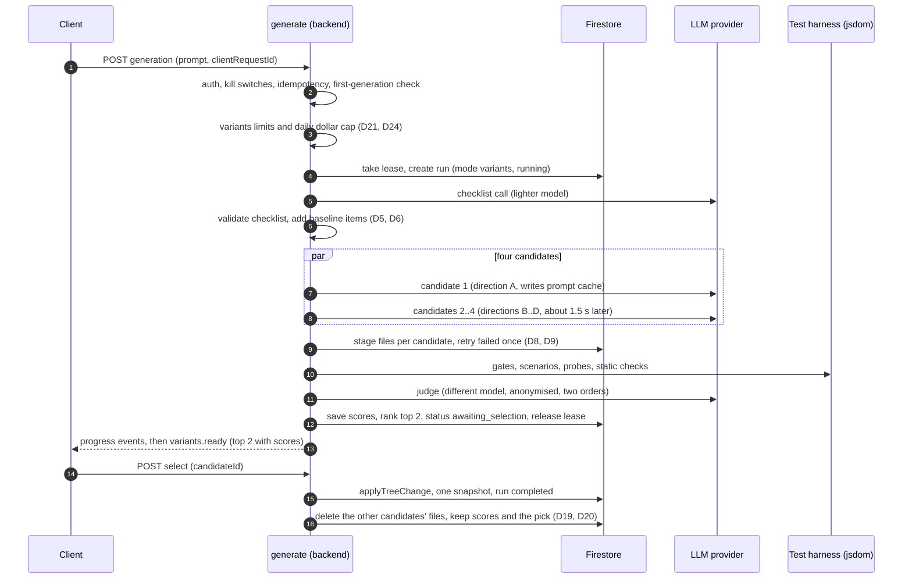

# Genesis — Add-on: Variants (4 candidates, scored, top 2 shown)

**Status:** Backend (BV-1 to BV-8, except the Cloud Tasks worker) and the frontend (chat-based choice, see [`15`](15-variants-frontend-implementation-plan/00-overview.md)) are implemented on `feat/variants-backend`. `VARIANTS_ENABLED` defaults to false in code and is true in `functions/.env.test-3ff4c`. Sections 3.1 to 3.6 carry an "As built" line where the code differs from the original decision. §14 lists improvements that could have been made, with the change for each. §15 lists the decisions to take next. Where this document disagrees with the code, §13 wins.
**Date:** 2026-10-07
**Audience:** implementers, reviewers. Every decision is written as _what we chose, why, what we rejected, what it costs us_, in the same style as [`04`](04-high-level-design.md).
**Related:** HLD [`04`](04-high-level-design.md) · backend LLD [`05`](05-backend-system-design.md) · contracts and flows [`07`](07-end-to-end-system-design.md) · backend plan [`08`](08-backend-implementation-plan/00-overview.md) · frontend plan [`09`](09-frontend-implementation-plan/00-overview.md)

> **Relationship to the existing suite.** This is an add-on. The existing single-candidate generation flow in `05`/`07`/`08` is unchanged; variants run only on a project's first generation. Contract additions (new SSE events, run statuses, routes, error codes) are described here and are to be merged into `07` §3 when implementation starts. Until then `07` remains canonical for everything that is not variants-specific.

> **Honesty notes.**
>
> - Cost figures are estimates, not measurements. They must be replaced with measured values from the usage we already persist per generation.
> - Statements about how other companies score generated output come from public research and benchmarks as the author remembers them. They are not verified details of any product's internal pipeline.
> - Items marked **Open** in §12 are not yet decided.

---

## 1. Summary

Today a user prompt produces one generated app. The product has so far been used by technical builders. For **business owners** a single result is a weak experience: they cannot tell whether it is the best design or merely the first one.

**The add-on:** when an owner sends the first prompt in a project, the backend generates **4 different candidates**, scores each against objective and judged criteria, and returns the **top 2** with their scores. The owner previews each on their real HighLevel data, one at a time, and picks one. Picking one commits exactly one snapshot.

**Principles**

1. **Gates stay on the score, and they do not hide a result.** The owner always sees the two highest scores (D14).
2. **Measure behaviour before judging looks.** About 70% of the score is deterministic; the LLM judge is capped at about 30%.
3. **The generator never sees the rubric.**
4. **Nothing is committed until the owner selects.** One run, one snapshot, as in `07`.
5. **Cost is bounded by a dollar budget**, enforced in code.

## 2. Scope and non-goals

**In scope (this document)**

- Run model, candidate generation, checklist, scoring, ranking, selection, limits and budget, reliability, contract impact.

**Out of scope for now**

- Frontend and UI design detail. The built UI is in [`15`](15-variants-frontend-implementation-plan/00-overview.md).
- Streaming results to the browser (see D2).
- Variants on follow-up prompts (see D1).
- Screenshots and headless-browser judging (see D26, assumed, not confirmed).
- A trained reward model or pairwise tournament judging.
- Dollar-metered limits for normal (single-candidate) generations.

---

## 3. Decision record

Status values: **Decided** (made by the product owner in discussion), **Proposed** (recommended by the author, not yet confirmed), **Replaced** (superseded), **Open** (needs a decision, see §12).

### 3.1 Product behaviour

#### D1 — Variants apply to the first generation in a project only — _Decided_

- **Chosen:** A project with no snapshot yet gets a variants run. Any later prompt uses the existing single-candidate pipeline.
- **Why:** The first prompt is where an owner is choosing a direction. Follow-ups are edits to a chosen design, so offering four alternatives of an edit adds cost and confusion.
- **Alternatives rejected:** (a) every prompt produces variants (4× cost on every edit, and "pick one of two" on a small tweak is noise); (b) variants only when the owner asks for them (needs UI, and most owners would not know to ask).
- **Cost of the choice:** An owner who dislikes the final result has no second round of variants. They must start a new project or iterate with follow-ups.

#### D2 — No streaming of results to the frontend — _Decided_

- **Chosen:** The client receives **progress events** while the run is in progress, then the final **top 2 with scores** when scoring is done. Candidate code is not streamed live.
- **Why:** Scoring is only possible after generation finishes, so the top 2 are not known until the end. Streaming "the top 2" would require either streaming all 4 or replaying stored output. The owner decided waiting for a finished result is acceptable.
- **Alternatives rejected:** (a) stream all 4 live then rank (4× SSE complexity, and the one-open-file-at-a-time invariant of SSE v1 breaks with parallel candidates); (b) generate, score, then replay the stored output of the top 2 as a simulated stream (extra protocol and code for a cosmetic effect).
- **Cost of the choice:** The owner waits longer with only progress feedback, roughly 1.5–3 minutes (author's estimate).

#### D15 — The owner sees scores only, plus a top-pick badge — _Decided_

- **Chosen:** For each of the two results, show the total out of 100 and four group scores (Works, Looks polished, Matches your request, Easy to use). The higher-scoring result carries a marker such as "Our top pick".
- **Why:** The owner chooses on how it looks and works. Reasons and rubric details are noise for a business owner.
- **Alternatives rejected:** (a) one-line reasons per result (explanations the judge produces are the least reliable part of the output); (b) all subscores (7 parameters is too much).
- **Cost of the choice:** An owner cannot see why a result scored lower. Reasons are still stored for debugging and calibration.
- **As built:** The chat shows the toggle text `Option N · score`, the total out of 100, four group bars, and "Our top pick". The direction label is on the ranked entry and is not shown.

#### D14 — Always show the top two scores — _Decided_

- **Chosen:** The owner always sees the two highest scores. A gate failure and a score under 25 do not remove a result. The run does not end with "No option was good enough to show." It fails only when no candidate produced a score at all.
- **Why:** On 2026-10-07 a real run scored 42 on all four and then showed nothing, because a gate failed. Hiding every result is worse than showing the best two we have.
- **Cost of the choice:** A weak or gate-failed page can be one of the two options. The scores are still shown, so the owner can see which is higher.

#### D20 — Record which candidate the owner picks — _Proposed_

- **Chosen:** Store the selected `candidateId`, the rank it had, and both scores.
- **Why:** It is real human preference data. It replaces the 30 hand-ranked examples we do not have, and lets us calibrate weights and the cut-off later.
- **Alternatives rejected:** none considered; the data is cheap and has no user-facing cost.
- **As built:** `variants.selection` stores `candidateId`, `rank`, `topPickWasSelected`, `scores: { total }` of the picked option, and `selectedAt`. The other option's total is not stored there.

### 3.2 Candidate generation

#### D7 — Diversity comes from fixed design directions — _Proposed_

- **Chosen:** Each candidate gets a different design-direction instruction appended to the shared prompt. For an appointments list, for example: dense table with filters; agenda grouped by day; cards with a summary strip; master-detail split.
- **Why:** The existing model call cannot set temperature or top_p, so sampling cannot produce diversity. Four runs of the same prompt would produce near-identical output.
- **Alternatives rejected:** (a) rely on sampling randomness (not available, per `research/04`); (b) let the model decide four different designs in one call (one output, one failure point, and token limits cap quality); (c) different models per candidate (confounds design differences with model differences, and costs differently).
- **Cost of the choice:** Directions must be authored and maintained per app category. A bad direction produces a bad candidate.
- **As built:** Four directions (table, agenda, cards, split) are in `directions.ts`. They are appended as a system block `Design direction — <label>` in `candidate-pipeline.ts`. Candidate 0 starts first. Candidates 1 to 3 wait `staggerMs + index × 150` ms, so about 1.65 s, 1.8 s, 1.95 s. They do not wait for candidate 0's first token.

#### D8 — Candidates stage separately and commit nothing during generation — _Proposed_

- **Chosen:** Each candidate stages under `candidates/{n}/staged`. The working tree and snapshots are untouched until selection.
- **Why:** Preserves "one generation, one snapshot" and "no partial commits" from `07`. A run whose owner never selects leaves no trace in the project.
- **Alternatives rejected:** (a) commit all four as snapshots (four snapshots for one generation, clutter in History, breaks the invariant); (b) commit the top 1 immediately and hold the rest (the owner has not chosen).
- **Cost of the choice:** Staged data for unselected candidates must be cleaned up (D19: deleted on selection; abandoned runs expire after 7 days).

#### D9 — One retry per failed candidate — _Proposed_

- **Chosen:** A candidate that fails validation is retried once with the validation issues fed back.
- **Why:** Most validation failures are single mistakes (a bad path, a size limit). One retry recovers most of them. More retries raise worst-case cost sharply.
- **Alternatives rejected:** (a) no retry (loses candidates that are one fix away); (b) up to N retries (unbounded cost, and a candidate needing several is probably poor).
- **Cost of the choice:** Worst-case run cost rises (see §8.4).
- **As built:** A candidate is retried once for validation failure, an empty write set, or a provider error. The retry message is a fixed line. The validation issues are not passed back, and the first attempt's staged files are not cleared before the retry.

#### D6 — Template fallback for the checklist — _Proposed_

- **Chosen:** If the checklist call fails twice or fails validation, use a template checklist per app type built from code, and continue the run.
- **Why:** A failed cheap call must not abort an expensive run.
- **Alternatives rejected:** abort the run (wastes the owner's attempt); proceed with no checklist (the "Fulfils the request" score would be empty).

### 3.3 Checklist (how requirements are derived)

#### D5 — Judge "did it do what was asked" with a checklist, not a holistic judge — _Decided_

- **Chosen:** Break the owner's prompt into yes/no requirements and verify each one. The checklist is a **hybrid**:
  1. **Baseline items from code** (loading, empty, error and pagination states for the app type).
  2. **Prompt-specific items from an LLM** (for "list of appointments": shows title, date/time and status; upcoming first. A `CalendarEvent` has no contact name, only `contactId`, so the checklist must not require one).
  3. **Each item verified by a probe** in the test harness where possible. The LLM judge handles only items a probe cannot check.
- **Shared** by all four candidates and by the scorer, generated **once** per run. Items are tagged `explicit` or `implied`, and `core` or `nice`.
- **Why:** A checklist gives evidence per requirement and spreads candidates out (a count, not a clustered 7 or 8 out of 10).
- **Alternatives considered:**

| Alternative                            | Why not chosen                                                                                                                                                               |
| -------------------------------------- | ---------------------------------------------------------------------------------------------------------------------------------------------------------------------------- |
| Holistic LLM judge ("rate 1–10")       | Implicit criteria, clustered scores, length and position bias, self-preference, no evidence trail. Still used for design and clarity only, with anchored rubrics (see D11).  |
| Fixed template per app type only       | Cannot capture prompt-specific requirements such as "sorted by upcoming". Kept as the baseline layer and as the D6 fallback.                                                 |
| Pairwise comparison between candidates | 4 candidates means 6 comparisons, position bias, and it ranks relative quality without saying whether a requirement was met. Possible later extra for the design score only. |
| Execution tests written by hand        | Someone must write tests per prompt. Replaced by automatic probes derived from the checklist.                                                                                |
| Human preference only                  | Needs users and volume. Becomes available through D20 over time.                                                                                                             |
| Trained reward model                   | Needs thousands of labelled examples we do not have.                                                                                                                         |
| Ask the owner clarifying questions     | Adds friction for a non-technical user.                                                                                                                                      |

- **Cost of the choice:** The checklist itself can be wrong (shallow, over-split, wrong SDK method). Mitigated by code-side validation (§6.3) and a pre-launch comparison on 20–30 realistic prompts.

#### D22 — Role-based models; a lighter model for the checklist — _Decided_

- **Chosen:** Model IDs are configured per role: candidate generation (main model), checklist (lighter model), judge (see D23).
- **Why:** The checklist call is short and structured, and it sits on the critical path before the four candidates can start, so latency matters more than its small cost.
- **Alternatives rejected:** (a) one model for everything (slower start, no saving); (b) the cheapest possible model (the checklist drives scoring, so weak checklists degrade every score).
- **Cost of the choice:** More configuration, and a quality check on the lighter model is required before launch.
- **Note:** Exact model IDs are not named here. They must be confirmed against the deployed account (see §12, item 2).

### 3.4 Scoring

#### D10 — Working and design count about equally — _Decided_

- **Chosen:** Works 35, Looks polished 30, Matches your request 15, Easy to use 10, Internal 10.
- **Why:** The owner selects on both how it looks and whether it works. A first draft with Works at 40 and design at 15 under-weighted what the owner actually sees.
- **Alternatives rejected:** works-heavy weights (design is what the owner sees); design-heavy weights (a pretty broken app must not win).
- **Cost of the choice:** Weights are unvalidated until calibrated against human picks (D20).

#### D11 — About 70% deterministic, judge capped at about 30% — _Proposed_

- **Chosen:** Deterministic checks carry about 70 of the 100 points. LLM-judged parts (visual design and clarity) carry about 30.
- **Why:** Deterministic checks are repeatable and explainable. Judged parts are needed where no measurement exists (aesthetics, plain-language clarity) and are bias-controlled (D13, D23, §7.4).
- **Alternatives rejected:** an all-judge score (see D5); an all-deterministic score (cannot assess design).

#### D12 — Score with fixtures, never with the owner's real data — _Proposed_

- **Chosen:** Scoring runs the generated app against **fixtures**: fake, realistic data we control, served by a mock `window.genesis`. The fixture data is not judged. It is a controlled input.
- **Why:**
  1. **Fairness.** All four candidates see identical input.
  2. **Triggerable situations.** Empty, error and next-page states cannot be forced on a live account.
  3. **Anti-hardcoding.** Running with two different fixture sets shows whether the app invents data.
  4. **Privacy and practicality.** Scoring is server-side while the HighLevel connection lives in the owner's browser. Real data would also pass through our scoring pipeline four times.
- **Alternatives rejected:** score on the owner's live data (non-deterministic, privacy, cannot test error or pagination); a single fixture set (cannot detect hardcoded data).
- **Cost of the choice:** The fixture set must be realistic enough to expose edge cases (long names, missing fields, odd timezones, 0/1/100 rows). The owner never sees fixture data; they preview on their real data.

#### D13 — Judge failure falls back to the objective score — _Proposed_

- **Chosen:** If the judge fails or two runs disagree by more than 15 points, the objective score decides, and the result is marked "unjudged".
- **Why:** A flaky judge must not block or randomise a run.
- **Alternatives rejected:** abort the run; trust a single judge run regardless.
- **As built:** Two sequential passes with seeded shuffles. Disagreement is the gap in visual plus clarity points only. On a gap above 15, or on any thrown error, visual and clarity are rescaled from that part's measured points, and every requirement item counts as not met. `notice: 'unjudged'` is set only when the whole call throws. Only candidates with `eligible` true are judged, and the judge runs only when two or more are eligible. See §14 for what is missing.

#### D23 — The judge uses a model different from the generator — _Proposed_

- **Chosen:** A mid-tier model, different from the generator, with structured output and a required evidence quote per score.
- **Why:** Judges tend to prefer output in their own style; a different model reduces self-preference. A cheaper tier controls cost.
- **Alternatives rejected:** the generator model as judge (self-preference); the lightest model (judging design needs capability).
- **Open point:** the generation model actually deployed must be confirmed (§12, item 2).

#### D17 — Top-2 selection — _Decided (replaces the distinctness rule)_

- **Chosen:**
  1. Rank every scored candidate. Show the two highest totals. Gates and the score of 25 do not drop a result (D14).
  2. Order by total, then Works points, then Data accuracy points, then candidate id.
  3. #1 is the top-ranked candidate and carries the top-pick marker.
  4. #2 is the next in that order.
- **Why:** The owner asked to always see the top two results. A different-direction substitute can hide the true second score.
- **Alternatives rejected:** the earlier rule that preferred a different design direction for #2 and treated totals within 3 points as a tie. It is not built, and `LIMITS.variants.tieMargin` is unused.
- **Cost of the choice:** The two shown options can share a design direction when two candidates of one direction score highest. Diversity depends on the four directions staying distinct (D7).

### 3.5 Limits and budget

#### D3 — Charging 4 rate-limit units per run — _Replaced_

- Replaced by D21. It would have used the shared per-user and global generation pool: only 2 variants runs per 10 minutes and about 50 a day globally, and variants would compete with follow-up edits.

#### D21 — Separate variants limits, switch and refunds — _Decided_

- **Chosen:** Variants have their own limits and their own `VARIANTS_ENABLED` switch. Normal generation limits are unchanged. The variants unit is **refunded** when the system is at fault: failure before any candidate finishes, or fewer than 2 candidates qualifying (the free retry then does not consume a new unit). User cancellation keeps the charge.
- **Why:** Variants and follow-ups have very different costs, so a shared pool misprices both. Separate limits can be sized directly from a dollar budget. A separate switch lets variants be disabled without disabling generation.
- **Alternatives considered:**

| Option                          | Worst-case daily spend (author's estimate) | Problem                                                                                                                        |
| ------------------------------- | ------------------------------------------ | ------------------------------------------------------------------------------------------------------------------------------ |
| A. 4 units from the shared pool | about $125                                 | Variants compete with follow-ups; 2 runs per 10 min per user; about 50 runs a day globally.                                    |
| B. 1 unit from the shared pool  | about $500                                 | Spend ceiling 4–8× today's; five accounts exhaust the global cap; bursts of up to 40 concurrent Anthropic calls from one user. |
| C. Separate limits (chosen)     | cap × worst-case run cost                  | One more limiter rule to maintain.                                                                                             |

- **Cost of the choice:** More configuration and a refund path in the limiter.
- **As built:** The refund runs when fewer than two candidates produced a score (any score, eligible or not). User cancel and a closed tab do not refund. Other failures refund. A variants run also spends one unit of the normal generation limits (D28).

#### D24 — $10 per day budget for variants, enforced as a dollar cap — _Budget Decided; enforcement Proposed_

- **Chosen:** The variants budget is **$10 per day**. Enforcement:
  1. A **daily dollar cap**: track actual spend per day (from the usage we already record and `estimateCostUsd`), and refuse new runs once the day's spend reaches $10.
  2. A **run cap** of 10 runs a day globally as a secondary guard.
  3. Per user: 2 runs per 10 minutes and 3 per day (so one user cannot use the whole day).
- **Why:** At about $0.85 typical per run, $10 is about 11 runs. At the estimated worst case of about $2.5 per run, a run count alone could reach about $25, so the count cannot be trusted as the only guard. A dollar counter is exact.
- **Alternatives rejected:** a count-only cap sized for the worst case (about 4 runs a day, far too few); a count-only cap sized for the typical case (can overspend); the earlier starting values of 3 per 10 minutes, 10 per day and 60 global, which assumed a larger budget.
- **Cost of the choice:** A new daily spend counter and a reserve-then-settle step. At a $10 budget the product can serve only about 10 variants runs a day.
- **Assumption to confirm:** the $10 covers variants only. Follow-ups stay on their existing limits (§12, item 4).

### 3.6 Execution and operations

#### D4 — Idempotency reuses `clientRequestId` — _Proposed_

- **Chosen:** `generationId = clientRequestId`, as today. A repeated request returns the stored state and starts nothing new.
- **Alternatives rejected:** a separate run ID scheme (two ID systems for the same concept).

#### D16 — Release the project lease at `awaiting_selection` — _Proposed_

- **Chosen:** When ranking is saved and the run reaches `awaiting_selection`, the lease is released. The owner may take as long as they like to choose.
- **Why:** Holding the lease would block other actions on the project for an unbounded time.
- **Cost of the choice:** The project can change before selection. This is handled by the existing checkpoint logic: if the working tree changed, a checkpoint snapshot is created before the selected candidate is committed.

#### D18 — Selection reuses `applyTreeChange` — _Proposed_

- **Chosen:** Selecting a candidate commits its staged files through the existing `applyTreeChange` (checkpoint, content-addressed blobs, manifest, working tree). One run produces one snapshot.
- **Alternatives rejected:** a new commit path (duplicates the most safety-critical code).

#### D19 — Unselected candidates are deleted on selection; abandoned runs expire after 7 days — _Decided_

- **Chosen:**
  - **On selection:** after the selected candidate is committed (D18), delete the files and staged data of **every other candidate** in the run. The owner sees only the chosen version and nothing else (product decision, 2026-10-07). The selection is final.
  - **Metadata kept:** each candidate's score, rank and direction, and the selected `candidateId` (D20), but no files. This is what later calibration needs.
  - **Abandoned runs** (owner never selects): a 7-day TTL on candidate documents and staged data. The owner may return to choose within that window.
- **Why:** With no way to see the other candidates, keeping their files has no product purpose. Deleting them saves storage, and unchosen content is not left behind.
- **Alternatives rejected:** (a) keep all candidates 7 days after selection (no UI reaches them, so it only costs storage); (b) keep them hidden for a short recovery window (adds a path nobody can use); (c) keep forever (unbounded storage).
- **Cost of the choice:** An owner who picks and then changes their mind cannot get the other version back. The existing version history still covers their own project, and they can start a new generation. Deletion must be reliable: a failed delete is retried, and the 7-day TTL acts as the backstop.
- **As built:** Select commits the chosen files. Nothing deletes the other candidates' staged files. Only the 7-day `expireAt` TTL removes them. Candidate and staged documents carry `expireAt`, and `firestore.indexes.json` has the TTL field overrides.

#### D25 — Execution model: in-request vs a Cloud Tasks worker — _Decided for now: in-request; worker is D37_

- **Current state:** `generate` is a Cloud Function (2nd gen) with a 540-second timeout. The generation runs inside the request and streams over SSE. The `functions/` code has no Cloud Tasks, Pub/Sub, scheduled or Firestore-trigger functions, so there is no background worker today.
- **Option 1 — In-request (reuses the current design):** the one request runs the checklist, the four candidates, scoring and ranking. Low effort and reuses the tested pipeline. Risks: the instance must stay alive for the whole run; continuing after the client disconnects is not guaranteed on request-based CPU (unverified on this deployment); an instance death loses in-flight candidates; the 540-second timeout is a hard wall; one instance holds 4 streams plus jsdom runs per request.
- **Option 2 — Cloud Tasks worker:** the request validates, creates the run and enqueues a task, then returns immediately. A worker function runs the pipeline, with its own timeout, retries and concurrency limits. The client reads status from the run document. Possibly one task per candidate, so a failure retries a single candidate. More effort: new function, queue and status model.
- **Author's recommendation:** build the candidate runner and the scoring pipeline as plain functions that take a run ID and do not depend on the HTTP response, so either entry point can call them. If reliability is the priority, choose Option 2 from the start.
- **To test before deciding:** how the deployed `generate` behaves after the client disconnects.
- **As built:** Option 1. `generate` runs the whole pipeline in the request. `res.on('close')` aborts the run (D36). Candidates are scored as soon as each finishes, with at most `scoringConcurrency` scorings at once and three scenarios at a time inside each scoring.

#### D26 — Visual quality judged from HTML/CSS source and DOM, no screenshots — _Open (assumed)_

- **Assumed:** the visual judge sees the source and the jsdom DOM. Headless Chromium for screenshots can be added later without changing the scoring contract.
- **Why assumed:** the product owner's answer to the question was not specified. Screenshots add infrastructure (a browser in the worker) and cost.
- **Alternative:** screenshot-based multimodal judging, which is stronger for aesthetics.
- **Cost of the assumption:** the Visual design score may be weaker for layout and colour than a screenshot-based judge.

---

## 4. End-to-end flow



**Steps**

1. **Admission.** Verify auth and the zod body. Check `GENERATION_ENABLED` and `VARIANTS_ENABLED`. Replay on a repeated `clientRequestId`. Check the project has no snapshot (D1). Check variants limits and the dollar cap (D21, D24). Take the lease. Create the run.
2. **Checklist.** One lighter-model call, validated in code, with baseline items added (D5, D6, D22).
3. **Context.** Build the shared prefix once so it can be cached.
4. **Fan-out.** Four candidate runners in parallel, each with its own design direction (D7). Candidate 1 starts first to write the prompt cache; 2–4 start about 1.5 seconds later. A concurrency cap and backoff handle Anthropic 429 and overload.
5. **Gates and scoring.** See §7.
6. **Ranking.** See D17.
7. **Selection.** See D18. After the commit, the other candidates' files are deleted (D19). Only the selected version remains.

## 5. Data model and contract impact

New or changed items, to be merged into `07` §3 on implementation. Names are provisional.

| Area                | Addition                                                                                                                                                                                                                                  |
| ------------------- | ----------------------------------------------------------------------------------------------------------------------------------------------------------------------------------------------------------------------------------------- |
| Run document        | `mode: "variants"`, `checklist`, `baseSnapshotId`, `ranking`, cost totals, and a new status `awaiting_selection`                                                                                                                          |
| Candidate documents | `candidates/{n}`: `direction`, `status`, `usage`, `score { total, parts, gates, judge }`, `rank`; staged files under `candidates/{n}/staged`; TTL field                                                                                   |
| SSE events          | Progress only: `variants.phase` (`checklist`, `generating`, `scoring`, `judging`), `candidate.progress`, `variants.ready` (top entries with ids, ranks and scores; files are read from Firestore, D29). `variants.started` does not exist |
| Routes              | `POST …/generations/:id/variants/select { candidateId }`; `GET …/variants` returns the stored ranking; `POST …/variants/discard` exists and the client calls the older partial discard instead                                            |
| Rate limits         | A new `variants` rule family (per-user windows, global day), a daily dollar counter, refund support; limiter `consume` gains a weight where needed and a `refund` method                                                                  |
| Config              | `VARIANTS_ENABLED`, `VARIANTS_COUNT` (default 4), `VARIANTS_DAILY_BUDGET_CENTS` (default 1000), per-user and global run limits, checklist model, judge model                                                                              |
| Errors              | `CANDIDATE_NOT_SELECTABLE`, `CANDIDATE_NOT_FOUND`, `GENERATION_NOT_AWAITING_SELECTION`. Denied admission falls back to a single generation with `fallbackReason` (D27); there are no `VARIANTS_*` errors                                  |
| Model provider      | Per-role model configuration; `PRICES` entries for the checklist and judge models                                                                                                                                                         |

## 6. Checklist specification

### 6.1 Shape

```json
{
  "appType": "list",
  "items": [
    {
      "id": "R1",
      "text": "Shows each appointment with its title, date and time, and status",
      "kind": "core",
      "source": "explicit",
      "check": {
        "type": "probe",
        "sdkMethod": "calendars.events",
        "expectFields": ["title", "startTime", "status"]
      }
    },
    {
      "id": "R2",
      "text": "Upcoming appointments appear first",
      "kind": "core",
      "source": "implied",
      "check": { "type": "probe", "assert": "sortedAscendingByStart" }
    }
  ]
}
```

`check.type` is `probe` or `judge`. `kind` is `core` or `nice`. `source` is `explicit` or `implied`.

### 6.2 Prompt rules (the detailed prompt text is the next design step)

- **Inputs:** the owner's prompt verbatim; the SDK method catalog (names, parameters, return fields); the baseline items already covered by code; the output schema.
- **Rules:** extract explicit requests first; add an implied item only if the request cannot work without it; never require data fields that are not in the SDK catalog; no visual or style requirements unless asked (design is judged elsewhere); one observable yes/no statement per item; between 3 and 8 items with at most 2 marked `nice`; plain language.

### 6.3 Code-side validation

Schema validity; every `sdkMethod` exists in the catalog (unknown items are dropped); item count within range; baseline duplicates removed; one retry, then the D6 fallback.

### 6.4 Probe vocabulary

A small fixed set the harness implements. The checklist model may only choose from it; anything outside becomes a `judge` item. The vocabulary is defined when the harness is specified (§12, item 5).

---

## 7. Scoring specification

### 7.1 Hard gates (pass or fail)

| Gate           | Check                                                                                                                                |
| -------------- | ------------------------------------------------------------------------------------------------------------------------------------ |
| Valid output   | Every file passes validation, the project validates, the response was not truncated                                                  |
| Boots cleanly  | No uncaught exception or unhandled rejection after the app starts in the harness                                                     |
| Uses real data | Run twice with two different fixture sets (A and B). The rendered records must change between runs. Hardcoded or invented data fails |
| Safe           | No credential or HighLevel host strings; the XSS probe fixture (a record containing ``) renders as text               |

The table above is the specification. §13.1 lists what each gate checks today. The security and quality checks to add to the `safe` gate and the scored parts are in §14.8 and D53 and D54.

### 7.2 Scored parameters (out of 100)

| #   | Parameter                        | Pts | Method                                                                                                                                                                      | Kind             |
| --- | -------------------------------- | --- | --------------------------------------------------------------------------------------------------------------------------------------------------------------------------- | ---------------- |
| 1   | Data accuracy                    | 20  | Rendered content compared with the fixture: names, counts, order, dates in the location timezone, "—" for missing values, no extra records                                  | Deterministic    |
| 2   | State handling                   | 15  | Loading, empty, error and two-page scenarios; error shows the thrown message; Load more calls the SDK with the cursor and appends                                           | Deterministic    |
| 3   | Fulfils the request              | 15  | Probes from the checklist (for example, typing in search calls the SDK with `query`); the judge handles items that cannot be probed, quoting evidence                       | Mixed            |
| 4   | Visual design                    | 20  | Anchored rubric (hierarchy, spacing and alignment, colour and type system, polish) blended with CSS proxies (distinct font sizes and colours, CSS variables, spacing scale) | Judge + measured |
| 5   | Clear for a business owner       | 10  | Plain language (jargon list), visible headline summary, one obvious primary action, human-formatted values                                                                  | Judge + measured |
| 6   | Accessibility and responsiveness | 10  | Labelled inputs, button text, heading order, `lang`, viewport meta, media queries or flexible layout, computable contrast                                                   | Deterministic    |
| 7   | Robustness and efficiency        | 10  | `textContent` over `innerHTML`, render budget for 100 rows, no console noise, no dead files                                                                                 | Deterministic    |

### 7.3 Groups shown to the owner (D10, D15)

| Group                | From  | Points |
| -------------------- | ----- | ------ |
| Works                | 1 + 2 | 35     |
| Looks polished       | 4 + 6 | 30     |
| Matches your request | 3     | 15     |
| Easy to use          | 5     | 10     |
| Internal             | 7     | 10     |

Parameter 7 feeds the total and is not shown as its own score.

### 7.4 Judge controls

- Candidates are anonymised and shuffled.
- The judge runs twice in different orders; scores are averaged.
- If the two runs disagree by more than 15 points, the objective score decides (D13).
- A different model from the generator (D23), structured output, and a required evidence quote per score.
- Judged parts are capped at about 30 of 100 (D11).
- The generator never sees the rubric.

This list is the specification. D13 and §14.5 describe how the judge behaves today.

### 7.5 Why not a holistic judge for correctness

A single "rate this 1–10" judge has implicit criteria, produces clustered scores that barely separate similar candidates, is biased toward longer and more elaborate output, is sensitive to position, may prefer its own model's style, and gives no audit trail. The plan keeps a judge only where no measurement exists, with anchored rubrics and the controls above.

---

## 8. Limits, budget and scale

### 8.1 Existing limits (unchanged by this add-on)

| Limit               | Value                                                                                         |
| ------------------- | --------------------------------------------------------------------------------------------- |
| Generation per user | 10 per 10 minutes, 40 per day                                                                 |
| Global generations  | 200 per day (`GENERATION_DAILY_GLOBAL_CAP`)                                                   |
| Kill switch         | `GENERATION_ENABLED`                                                                          |
| Prompt size         | 4,000 characters                                                                              |
| Files and sizes     | 25 files, 100 KiB per file, 300 KiB project                                                   |
| Output tokens       | 32,000                                                                                        |
| Generation deadline | 300 s                                                                                         |
| `generate` function | 540 s timeout, 2 GiB, concurrency 10, max 5 instances (set for variants; it was 1 GiB and 20) |
| Anthropic client    | `maxRetries: 2`, 600 s timeout, no client-side throttle                                       |

Rate limits are fixed windows in Firestore, consumed at admission, with no refund today. A request that passes one limiter and fails the next has already consumed the first.

### 8.2 Variants limits (starting values, D21 and D24)

| Limit            | Value                                                   |
| ---------------- | ------------------------------------------------------- |
| Per user         | 2 per 10 minutes, 3 per day                             |
| Global           | 10 runs per day                                         |
| Daily dollar cap | $10 for variants                                        |
| Switch           | `VARIANTS_ENABLED`                                      |
| Refund           | On system failure and on fewer than 2 scored candidates |

**Ordering requirement.** Check cheap global conditions (kill switch, dollar cap) first and consume per-user units last, or consume all rules in one transaction, so a denial at a later check does not leak earlier consumption.

### 8.3 Capacity implications

- Four concurrent LLM streams plus jsdom runs per request. At `generate` concurrency 20, one instance could hold up to 80 live streams in 1 GiB. Variants need a lower concurrency, a larger instance, or a separate function.
- The Anthropic client has no client-side throttle. A concurrency cap and backoff are required.

### 8.4 Cost model (author's estimates, unmeasured)

| Item                                  | Estimate                     |
| ------------------------------------- | ---------------------------- |
| Normal generation                     | $0.08–0.30                   |
| Variants run, typical                 | about $0.85 (range $0.4–1.3) |
| Variants run, worst case, all retries | about $2.5                   |

One measured run (2026-10-07, four candidates and the checklist, no judge) settled at 34 cents. That is one sample, and it is well below the typical estimate. The judge call adds to it.

### 8.5 Scale outlook

Assumptions: 1,000 daily active users, 0.3 new projects per user per day, 2 follow-up generations per user per day at about $0.15, typical variants run $0.85.

| Daily active users | Variants runs/day | Variants spend/day (typical) | Follow-ups/day | Total/day (typical) | Per month   |
| ------------------ | ----------------- | ---------------------------- | -------------- | ------------------- | ----------- |
| 1,000              | 300               | $255                         | $300           | about $555          | about $17k  |
| 10,000 (10×)       | 3,000             | $2,550                       | $3,000         | about $5,550        | about $166k |
| 100,000 (100×)     | 30,000            | $25,500                      | $30,000        | about $55,500       | about $1.7M |

- Sensitivity to new-project rate, per 1,000 users per day: 0.1 gives $85, 0.3 gives $255, 1.0 gives $850.
- Busy-hour concurrency assuming 10% of the day's runs in one hour and about 90 seconds per run: about 3 streams at 1×, about 30 at 10×, about 300 at 100×. Today's `generate` allows 100 streams, so 10× fits. 100× needs more instances and a higher Anthropic rate-limit tier arranged in advance.
- **Cost levers:** `VARIANTS_COUNT` of 3 instead of 4 (about 20–25% of variants spend), lighter models, prompt caching with staggered starts, retrying only validation failures.
- **Global cap formula:** daily cap = budget ÷ worst-case run cost. The current $10 budget is far below the 1,000-user scenario, so the numbers above matter only as the growth path.

## 9. Reliability matrix

| Failure                          | Handling                                                                                                                                 |
| -------------------------------- | ---------------------------------------------------------------------------------------------------------------------------------------- |
| Candidate fails validation       | One retry with a fixed message; the issue list is not passed back (D9, M44)                                                              |
| Fewer than 2 candidates scored   | Show the one option that exists and refund the variants unit, so a retry is free (D21)                                                   |
| Anthropic 429 or overload        | Staggered start, backoff, concurrency cap                                                                                                |
| Judge fails or disagrees         | That option is marked "unjudged" and its judged points are replaced (D13, M36)                                                           |
| Checklist call fails             | Template checklist (D6)                                                                                                                  |
| Client disconnects               | The in-request run aborts (D36) and the run is stored as `failed`. Surviving a closed tab needs D37                                      |
| Instance dies                    | Stale heartbeat marks the run interrupted. Scored candidates stay stored and cannot be chosen until recovery ranks them (M2, M3)         |
| Project changed before selection | Existing checkpoint logic (D16, D18)                                                                                                     |
| Run nears the function timeout   | A hard deadline of 480 s (`runHardDeadlineMs`) aborts the run. The 300 s phase and 180 s attempt limits are defined and not applied (M9) |
| Daily dollar cap reached         | The request falls back to one normal generation with `fallbackReason: budget`; normal generation is unaffected                           |

## 10. Impact on the existing system (high level)

Detail belongs to the implementation plan to be written next.

- **Contracts** (`functions/src/contracts/`): new events, statuses, errors, limits constants and schemas (§5), then `contracts:sync` to the frontend.
- **Orchestrator** (`modules/generation/orchestrator.ts`): the single-candidate pipeline becomes a reusable candidate runner that stages without committing and does not depend on the HTTP response.
- **Generation module**: new design-direction prompts, checklist step, scoring harness (jsdom, mock `window.genesis`, fixtures, probes, static checks), judge, ranking.
- **Persistence** (`persistence/`): candidate documents, staged storage per candidate, selection through `applyTreeChange`, deletion of the other candidates' files on selection (D19), and the 7-day TTL for abandoned runs.
- **Routes** (`variants/variants.routes.ts`): select, GET for the stored result, and a variants discard. The older `generation-control` discard is not extended for variants (M8).
- **Rate limits** (`modules/rate-limit/`): variants rules, dollar counter, refunds, check ordering.
- **Provider** (`llm/`): per-role models, prices, client-side concurrency cap.
- **Config** (`config/params.ts`, `runtime-config.ts`): new parameters from §5.
- **Infrastructure** (`index.ts`): concurrency and memory for variants, and possibly a worker function (D25).
- **Frontend**: deferred; it will need a comparison screen, selection flow, score presentation and handling of the new statuses and events.

## 11. Build order

1. Contracts: events, statuses, errors, limits, schemas.
2. Refactor the orchestrator into a reusable candidate runner.
3. Design directions and the checklist step.
4. Scoring harness: jsdom, mock `window.genesis`, fixtures, probes.
5. LLM judge.
6. Ranking and the select route.
7. Rate limits, refunds, dollar cap, kill switch and Anthropic throttle.
8. Scenario tests, and calibration from real owner picks.

## 12. Open items

| #   | Item                                                                                                                                                                                                                                           |
| --- | ---------------------------------------------------------------------------------------------------------------------------------------------------------------------------------------------------------------------------------------------- |
| 1   | **Checklist prompt text.** Written. It lives in `checklist-prompt.v1.ts`. It still needs a manual read against 20–30 real prompts before variants are enabled.                                                                                 |
| 2   | **Deployed generation model.** `params.ts` defaults `ANTHROPIC_MODEL` to `claude-sonnet-5`, while `00-index.md` names `claude-opus-5`. Needs checking; it affects cost and the choice of judge model (D23).                                    |
| 3   | **Execution model (D25).** Implemented as in-request. The Cloud Tasks worker is specified and not built. A closed tab aborts the run (D36).                                                                                                    |
| 4   | **Budget scope.** Confirm the $10 per day covers variants only and follow-ups stay on their existing limits.                                                                                                                                   |
| 5   | **Visual judging (D26)** confirmation, **probe vocabulary** and the **fixture set**.                                                                                                                                                           |
| 6   | **Unvalidated numbers.** The weights in D10 and the 15-point judge disagreement threshold are starting values pending calibration against owner picks (D20). The score of 25 is stored on each result and does not decide what is shown (D14). |
| 7   | **Whether "prompt generation" for the lighter model (D22) also covers the judge.** Assumed: checklist uses the lighter model; the judge uses a mid-tier model.                                                                                 |
| 8   | **Frontend** design export. The UI is built from the brief ([`15`](15-variants-frontend-implementation-plan/00-overview.md)). A designer's export is not yet applied.                                                                          |

## 13. What the implementation decided

These correct earlier sentences in this document. The plan is [`14`](14-variants-backend-implementation-plan/00-overview.md).

| Id  | Decision                                                                                                                                                                 |
| --- | ------------------------------------------------------------------------------------------------------------------------------------------------------------------------ |
| D27 | Variants off, over budget, over the variants limit, busy, or not the first generation falls back to one normal generation. The client hears why on `generation.started`. |
| D28 | A variants run also spends one unit of the existing generation limits.                                                                                                   |
| D29 | `variants.ready` carries ids, ranks and scores. The client reads each candidate's files from Firestore.                                                                  |
| D30 | Candidate ids are `c0`–`c3`. Only `ranking.top` can be selected.                                                                                                         |
| D31 | The merged checklist is 3–12 items. The model returns 1–8.                                                                                                               |
| D32 | The date-range probe is added by code, never offered to the checklist model.                                                                                             |
| D33 | Discard sets the generation to `cancelled` and `variants.resolution` to `discarded`.                                                                                     |
| D34 | At most 2 variants runs per instance. A third falls back with reason `busy`.                                                                                             |
| D35 | Select succeeds only when the project's snapshot is still the one the run started from.                                                                                  |
| D36 | Closing the request aborts an in-request run. It does not keep going. Surviving a closed tab needs the Cloud Tasks worker, which is not built.                           |

`generate` is 2GiB with concurrency 10. The checklist prompt lives in `functions/src/modules/generation/variants/checklist/checklist-prompt.v1.ts`. The judge model stays empty until it is set to something other than `ANTHROPIC_MODEL`, so the feature cannot turn on by accident. The deployed values in `functions/.env.test-3ff4c` are `ANTHROPIC_MODEL=claude-sonnet-5`, `VARIANTS_CHECKLIST_MODEL=claude-haiku-4-5`, `VARIANTS_JUDGE_MODEL=claude-opus-5`, and `VARIANTS_ENABLED=true`.

### 13.1 Scoring as built

The scoring in `harness/` is a smaller version of §7. This is what runs.

| Area      | Built                                                                                                                                                                                                                                                                                   |
| --------- | --------------------------------------------------------------------------------------------------------------------------------------------------------------------------------------------------------------------------------------------------------------------------------------- |
| Inlining  | `inline-project.ts` inlines local CSS and JS with parse5 and prepends the mock runtime. Hand-built nodes carry `tagName` and `namespaceURI`, because the parse5 serializer drops nodes without them                                                                                     |
| Sandbox   | One child process per scenario, `--permission` with read access to `node_modules` and the entry directory only, empty environment, a memory cap, an 8 s scenario timeout. It waits 40 ms after start, then reads `body.textContent`, the buttons, the inputs and the recorded SDK calls |
| Scenarios | `data`, `dataB`, `empty`, `error`, `adversarial`, `loading` always. `twoPages`, `search`, `rows100` when the checklist needs them. Three scenarios run at a time per candidate                                                                                                          |
| Fixtures  | Two sets, A (Ada North, Ben North) and B (Bea South, Cam South), two events each, anchored at 2026-01-05                                                                                                                                                                                |
| Gates     | `validOutput` is "index.html exists". `boots` is "no error and text rendered in the `data` run". `usesRealData` is "set A names appear in run A and none of set B, and set B names appear in run B". `safe` is "the adversarial markup was not rendered as an element"                  |
| Parts     | Data accuracy 20 and state handling 15 are split across the non-baseline probe items. Accessibility, robustness and the CSS proxies come from `static-checks.ts`. Visual and clarity have a measured part and a judged part                                                             |
| Eligible  | All gates pass and the total plus the unjudged room is at least 25. It is stored. It does not decide what is shown (D14)                                                                                                                                                                |
| Judge     | See D13 as built. Source files only, up to `judgeSourceBudgetBytes`, labels A to D, two seeded shuffles, evidence checked as a raw substring of the joined source                                                                                                                       |
| Ranking   | `rank.ts`, see D17                                                                                                                                                                                                                                                                      |
| Cost      | `centsOf` prices usage with the `PRICES` table and returns 0 for an unknown model. `actualCents` is candidates plus checklist. The judge's usage is summed into the SSE `usage` and not into the stored cost                                                                            |

## 14. Potential improvements

Each item is a change that would make the feature more reliable, cheaper, safer or easier to measure. Some are behaviour the plan describes and the first version does not include. Status is **Potential**. The last column is the change to make.

### 14.1 Run endings and recovery

| #   | Improvement                                                                                                                                                                                                        | Where                                               | Proposed change                                                                                                              |
| --- | ------------------------------------------------------------------------------------------------------------------------------------------------------------------------------------------------------------------ | --------------------------------------------------- | ---------------------------------------------------------------------------------------------------------------------------- |
| M1  | A closed tab is stored as `failed` with `INTERNAL`. The plan says `interrupted`, with scored options still selectable                                                                                              | `variants.orchestrator.ts` catch block              | Finalise as `interrupted` through one outcome function. Keep the scores already written to each candidate                    |
| M2  | `GET …/variants` returns only a stored ranking. An interrupted run has none                                                                                                                                        | `variants.repo.ts` `readSelection`                  | When no ranking exists, list the scored candidates, run `rankCandidates`, and return that without saving it                  |
| M3  | Select refuses a run that is not `awaiting_selection`, so an interrupted run with scores cannot be chosen from                                                                                                     | `variants.routes.ts`                                | Allow `interrupted` when the chosen candidate is in the on-demand ranking                                                    |
| M4  | An abort after all candidates finish throws before the ranking is saved, even when scores exist                                                                                                                    | `variants.orchestrator.ts` abort check              | On timeout or disconnect, rank what is scored and save it first                                                              |
| M5  | Cancel gives no terminal event. A timeout is stored as `INTERNAL`, not `GENERATION_TIMEOUT`                                                                                                                        | orchestrator catch                                  | Map each ending to a status, event, refund and error code in one place                                                       |
| M6  | A run where every candidate failed at the provider ends as `INTERNAL`, not `LLM_RATE_LIMITED` or `LLM_UNAVAILABLE`                                                                                                 | orchestrator                                        | Carry the provider error code of the last failed candidate onto the run                                                      |
| M7  | `markAwaiting` has no status check, so a late call can overwrite a cancelled or failed run                                                                                                                         | `variants.repo.ts`                                  | Require `status === 'streaming'` inside a transaction and make a second call a no-op                                         |
| M8  | `variants.discard` exists. The client calls the partial-generation discard, which does not clear a variants run, write the system message, or delete staged files. Discard is not allowed for an `interrupted` run | `generation-control.routes.ts`, `variants.store.ts` | Route discard for `mode === 'variants'` to the variants discard, write the message, delete staged files, allow `interrupted` |

### 14.2 Time, cost and limits

| #   | Improvement                                                                                        | Where                    | Proposed change                                                                                                                            |
| --- | -------------------------------------------------------------------------------------------------- | ------------------------ | ------------------------------------------------------------------------------------------------------------------------------------------ |
| M9  | `generationPhaseDeadlineMs`, `attemptDeadlineMs` and `scoringTimeoutMs` are defined and never used | `limits.ts`, `variants/` | Abort an attempt at its deadline, stop starting new scorings at the phase deadline, and give the scorer a timeout that returns what it has |
| M10 | The judge's cost is not in `actualCents` or in `variants.cost.judgeCents`                          | orchestrator             | Add the judge's priced usage to the settled cost and store it                                                                              |
| M11 | An unpriced model counts as $0 in `centsOf`                                                        | orchestrator             | Fail the run before any model call when a configured model has no price                                                                    |
| M12 | Refund counts shown results. Two gate-failed results suppress the refund                           | orchestrator             | Decide the refund rule from the eligible count and document it                                                                             |
| M13 | `variants.count` is written as 4 on create and the run uses `VARIANTS_COUNT`                       | `generations.repo.ts`    | Write the configured count                                                                                                                 |
| M14 | Stored usage and timings are not written when the run reaches `awaiting_selection`                 | `markAwaiting`           | Store summed usage and stage timings on the run                                                                                            |

### 14.3 Selection

| #   | Improvement                                                                                                    | Where                | Proposed change                                                     |
| --- | -------------------------------------------------------------------------------------------------------------- | -------------------- | ------------------------------------------------------------------- |
| M15 | Select does not read the candidate document. It does not check `scored`, `eligible` or an unexpired `expireAt` | `variants.routes.ts` | Read the candidate and check all three before committing            |
| M16 | The other candidates' staged files are not deleted after a pick                                                | `variants.routes.ts` | Delete them after the commit, best effort, with the TTL as backstop |
| M17 | The selection record keeps the picked total only                                                               | `variants.routes.ts` | Store the totals and group scores of every shown option             |
| M18 | The assistant line is "Applied the <label> option." The plan wording was a design-based sentence               | `variants.routes.ts` | Use one agreed sentence                                             |

### 14.4 Scoring

| #   | Improvement                                                                                                                                        | Where                                 | Proposed change                                                                                                    |
| --- | -------------------------------------------------------------------------------------------------------------------------------------------------- | ------------------------------------- | ------------------------------------------------------------------------------------------------------------------ |
| M19 | `validOutput` checks only that `index.html` exists                                                                                                 | `gates.ts`                            | Add project validation and the truncation check                                                                    |
| M20 | `boots` ignores unhandled rejections and does not require text beyond the title                                                                    | `gates.ts`, `sandbox-entry.ts`        | Collect `error` and `unhandledrejection`. Require visible text beyond the title                                    |
| M21 | `safe` has no scan for credential strings or HighLevel hosts, and no ban on `fetch`, `eval` and `XMLHttpRequest` in candidate code                 | `gates.ts`, `static-checks.ts`        | Add the static scan                                                                                                |
| M22 | `usesRealData` accepts one distinguishing name per run                                                                                             | `gates.ts`                            | Require at least three distinguishing tokens per set and fail when the two runs match                              |
| M23 | The fixtures hold 2 contacts and 2 events. There is one timezone and no missing-field rows                                                         | `fixtures.ts`                         | About 12 contacts and 14 events, two timezones, a missing field on every fourth record, branches by calendar count |
| M24 | The mock `calendars.events` ignores `from` and `to`, and does not reject a range over 31 days                                                      | `mock-genesis.ts`                     | Filter by range and reject over 31 days like the real adapter                                                      |
| M25 | The mock's error text, page cursor and loading state differ from the planned scenarios. Loading is a promise that never resolves, read after 40 ms | `mock-genesis.ts`, `sandbox-entry.ts` | Add a release hook so the loading state and the loaded state are both read                                         |
| M26 | The baseline items `loadMoreAppends` and `dateRangeCall` earn no state-handling points                                                             | `score.ts`                            | Give the 15 state points to the baseline items as well                                                             |
| M27 | Probes `rendersFields`, `state.empty` and the ordering checks do not use the item's fields or phrases                                              | `probes.ts`                           | Evaluate each record against its fields, with partial credit                                                       |
| M28 | `scoreCandidate` does not receive the calendar count, so fixtures cannot branch                                                                    | `score.ts`                            | Pass the calendar count into scoring                                                                               |
| M29 | Observations carry text, buttons, inputs and calls. They have no row elements, render time, node count or interaction log                          | `sandbox-entry.ts`                    | Record them so robustness and probes can use them                                                                  |
| M30 | The sandbox does not kill a child on a second message and has no output size cap                                                                   | `run-in-sandbox.ts`                   | Reject a second message and cap the payload                                                                        |
| M31 | Request points are weighted by item count, not by core, nice and baseline weights                                                                  | `score.ts`                            | Use the weights from §7                                                                                            |

### 14.5 Judge

| #   | Improvement                                                                                                                                   | Where                             | Proposed change                                                                 |
| --- | --------------------------------------------------------------------------------------------------------------------------------------------- | --------------------------------- | ------------------------------------------------------------------------------- |
| M32 | The two passes run one after the other. The second order may equal the first                                                                  | `judge.service.ts`                | Start both at once and swap the second order when it matches                    |
| M33 | Evidence is matched as a raw substring of all options joined, and not per option                                                              | `evidence.ts`, `judge.service.ts` | Normalise whitespace and case. Match against that option only                   |
| M34 | The shown text of the `data` run is not sent to the judge                                                                                     | `judge.service.ts`                | Send the first 3,000 characters per option                                      |
| M35 | Disagreement counts visual and clarity only                                                                                                   | `judge.service.ts`                | Compare the full judged points, including the requirement items                 |
| M36 | On disagreement or failure, the requirement points become 0                                                                                   | `aggregate.ts`                    | Use the measured fraction of that option's own score for all three judged parts |
| M37 | One failed pass discards the other                                                                                                            | `judge.service.ts`                | Use the pass that succeeded and log it                                          |
| M38 | `notice: 'unjudged'` is set only on a thrown error                                                                                            | `judge.service.ts`                | Set it when the call failed or every shown option was unjudged                  |
| M39 | The judge runs only when two or more options are eligible. Gate-failed options never receive judged points, even though they can now be shown | orchestrator                      | Judge every scored candidate that will be shown                                 |
| M40 | The system prompt is short and has no anchored rubric. `maxTokens` is 4,000 against a plan of 2,500                                           | `judge-prompt.v1.ts`              | Write the anchored rubric and set one value                                     |

### 14.6 Checklist and candidates

| #   | Improvement                                                                                                                                | Where                      | Proposed change                                                                                                        |
| --- | ------------------------------------------------------------------------------------------------------------------------------------------ | -------------------------- | ---------------------------------------------------------------------------------------------------------------------- |
| M41 | Model items come before baseline items. The plan puts baseline first                                                                       | `checklist.service.ts`     | Merge baseline first                                                                                                   |
| M42 | Duplicate ids are dropped. The plan renumbers them                                                                                         | `validate.ts`              | Pick one and document it                                                                                               |
| M43 | The allowed-probe text is a string in `render-checklist-user.ts`                                                                           | `render-checklist-user.ts` | Generate it from `LlmProbeSchema`                                                                                      |
| M44 | A retry does not clear staged files and does not pass the validation issues                                                                | `candidate-pipeline.ts`    | Clear the candidate's staged files and add the issue codes to the retry message                                        |
| M45 | The stagger is a fixed sleep and not a wait for candidate 0's first output                                                                 | `variants.orchestrator.ts` | Wait for the first output or `staggerMs`, whichever is first                                                           |
| M46 | The `ranking` phase is never sent                                                                                                          | orchestrator               | Send it before the ranking is saved                                                                                    |
| M47 | Only `variants.ready`, `variants.failed`, `variants.refund_failed`, `variants.settle_failed` and `variants.cancel_watch_failed` are logged | `variants/`                | Log admission, checklist, each candidate, each score, the judge, the ranking, the selection, the budget and the refund |

### 14.7 Frontend

| #   | Improvement                                                                                                           | Where                   | Proposed change                                                          |
| --- | --------------------------------------------------------------------------------------------------------------------- | ----------------------- | ------------------------------------------------------------------------ |
| M48 | `finishHandoff` and `requestHandoff` exist and nothing calls them. The editor does not open `index.html` after a pick | `variants.store.ts`     | Call the handoff when the project snapshot arrives                       |
| M49 | Escape does not close the double-check                                                                                | `VariantsChat.vue`      | Close it on Escape                                                       |
| M50 | Use this version and Start over stay enabled while offline                                                            | `VariantsChat.vue`      | Disable them when offline                                                |
| M51 | Focus does not move and no live region announces the choice                                                           | `VariantsChat.vue`      | Move focus to the heading and announce it                                |
| M52 | `variants-loaded` is accepted from a `failed` run                                                                     | `generation.reducer.ts` | Accept it only for `interrupted`, `awaiting_selection` and `reconciling` |
| M53 | `frontend/src/contracts/` keeps a stale "GENERATED" header                                                            | `contracts:sync`        | Run the sync                                                             |
| M54 | The progress view does not show how many versions are drafted                                                         | `VariantsProgress.vue`  | Show "N of 4 versions drafted"                                           |

### 14.8 Security and quality criteria for the score

Project validation already runs on every candidate (`validation/file-rules.ts`). A host of HighLevel's API or a credential-like string is an **error**, so the candidate fails validation. A call to `fetch`, `XMLHttpRequest`, `WebSocket`, `EventSource` or `sendBeacon`, an `innerHTML` assignment or `insertAdjacentHTML`, a dialog, and a remote CSS resource are **warnings**. The score does not read those warnings. The `safe` gate checks only that one adversarial record renders as text. The items below add what is not covered.

| #   | Improvement                                                                                                                                                                                                       | Where                             | Proposed change                                                                                                                                                       |
| --- | ----------------------------------------------------------------------------------------------------------------------------------------------------------------------------------------------------------------- | --------------------------------- | --------------------------------------------------------------------------------------------------------------------------------------------------------------------- |
| M55 | Outside code and network. Warnings for network APIs are not scored. Dynamic `import()`, external `<script>`, font and image URLs are not checked                                                                  | `static-checks.ts`, `gates.ts`    | Fail the `safe` gate on any network API, `import()`, or an external script, font or image URL. The app may only talk to `window.genesis`                              |
| M56 | Dynamic code. `eval`, `new Function`, string timers and `document.write` are not checked                                                                                                                          | `static-checks.ts`                | Fail the `safe` gate on any of them                                                                                                                                   |
| M57 | Unsafe output of data. `innerHTML` is a warning and is not scored. `outerHTML` is not checked. `href` and `src` built from record values are not checked, so a `javascript:` URL in a contact field is not caught | `static-checks.ts`, `fixtures.ts` | Penalise `innerHTML`, `outerHTML` and `insertAdjacentHTML`. Add a fixture record with a `javascript:` value and fail the gate when it becomes a live link             |
| M58 | Escaping the preview. `window.top`, `window.parent`, `window.open`, assigning `location`, and form posts to another origin are not checked                                                                        | `static-checks.ts`                | Fail the `safe` gate on any of them                                                                                                                                   |
| M59 | Secrets. The validator rejects the patterns it knows. The gate does not repeat the check on the inlined result                                                                                                    | `gates.ts`                        | Re-run the secret and host rules in the gate and report which rule fired                                                                                              |
| M60 | Storage and messaging. Cookies, `localStorage`, `sessionStorage` and stray `postMessage` are not checked                                                                                                          | `static-checks.ts`                | Fail the `safe` gate on cookie or storage access and on `postMessage` outside the bridge                                                                              |
| M61 | Data leaks. Console output of records and raw error text on screen are not checked                                                                                                                                | `sandbox-entry.ts`, `probes.ts`   | Capture console output in the harness. Penalise a record value in it. Check that the error scenario shows a plain message and not the raw error                       |
| M62 | Resource abuse. A timeout or memory stop gives a failed scenario and lost points. It does not fail a gate                                                                                                         | `run-in-sandbox.ts`, `gates.ts`   | Fail `boots` when the `data` scenario times out or exceeds memory. Count SDK calls and fail on a loop of repeated calls                                               |
| M63 | Instructions hiding in data or code. A record named "ignore previous instructions" is not used as a fixture. Comments in candidate code reach the judge unfiltered                                                | `fixtures.ts`, `judge.service.ts` | Add that record to the adversarial fixture and check it renders as text. Strip comments from the source sent to the judge and test that a comment cannot move a score |
| M64 | Efficiency of calls. The number of SDK calls per load and per keystroke is recorded in `calls` and not scored                                                                                                     | `score.ts`, `probes.ts`           | Score calls per load and per typed character. Require debounced search and no repeated page fetches. Fail a run that would exceed 120 calls a minute on the bridge    |
| M65 | Dates and time zones. The fixtures use one anchor date and one time zone. "Today" and "tomorrow" wording and sorting across a day boundary are not tested                                                         | `fixtures.ts`, `probes.ts`        | Add events either side of midnight in two time zones. Check local time, the day label and the order                                                                   |
| M66 | Long and odd data. Very long names, emoji, right-to-left text, missing fields and 100 or more rows are not in the fixtures. `rows100` runs only when the checklist asks                                           | `fixtures.ts`, `score.ts`         | Add those records and always run the large-list scenario for list apps. Check that the text still renders and no row is dropped                                       |
| M67 | Phone width. The static check only looks for `@media` or `overflow-x`                                                                                                                                             | `static-checks.ts`                | Render at 390 px in the harness. Fail on horizontal overflow. Check that buttons and inputs have a usable size                                                        |
| M68 | Keyboard and screen-reader use. Contrast and focus order are not measured                                                                                                                                         | `static-checks.ts`                | Check labels on inputs, names on buttons, heading order, visible focus styles, and contrast in light and dark when the CSS defines both                               |
| M69 | Read-only behaviour. The app's calls are not compared with the read methods the scopes allow. A refused call is not simulated                                                                                     | `mock-genesis.ts`, `probes.ts`    | Add a scenario where a method is refused. Check that the page says so and does not crash                                                                              |
| M70 | Stability across runs. Each scenario is run once                                                                                                                                                                  | `score.ts`                        | Run the `data` scenario twice and compare the text. Penalise a difference                                                                                             |
| M71 | Ease of follow-up edits. File count, file size and structure are not scored beyond dead files                                                                                                                     | `static-checks.ts`                | Score a small, readable structure: sensible file names, no single large file, no duplicated blocks                                                                    |

## 15. Decisions to take next

These decisions make the feature safer to run, cheaper to run, or easier to measure. Each uses the same format as §3. Status is **Proposed**. None is built.

#### D37 — Run variants on a worker, with progress on the run document — _Proposed_

- **Chosen:** The start route validates the request, creates the run and enqueues a Cloud Tasks task, then returns `202 { generationId }`. A worker function runs the checklist, the candidates, the scoring and the judge. It writes the phase and each candidate's stage to the run document. The client reads that document.
- **Why:** The in-request run stops when the tab closes (D36), holds one instance for up to eight minutes, and loses everything if the instance dies. A worker has its own timeout, retries and concurrency.
- **Alternatives rejected:** keep in-request (a closed tab costs the whole run); one task per candidate (more moving parts, and scoring needs all candidates' checklist and fixtures anyway).
- **Cost of the choice:** A new function and queue, a progress field on the run, a polling or listener path in the client, and a change to the leave warning.

#### D38 — One outcome table for every ending — _Proposed_

- **Chosen:** A single function maps a run's ending (ready with two, ready with one, nothing scored, all provider failures, user cancel, closed tab, timeout, hard failure) to the status, the SSE event, the error code, the refund, the stored message and the log line.
- **Why:** The catch block and the success path each decide these today, and they disagree (M1, M4, M5, M6).
- **Alternatives rejected:** keep two code paths with comments.
- **Cost of the choice:** One refactor of the orchestrator.

#### D39 — The ranking is derived from candidate scores — _Proposed_

- **Chosen:** The stored `variants.ranking` is a cache. `GET` and select compute the ranking from the candidate documents when it is missing or when the run is not `awaiting_selection`.
- **Why:** A crash between the last score and the ranking write leaves scored candidates that nobody can choose (M2, M3).
- **Alternatives rejected:** write the ranking after every candidate (needs a transaction per candidate and still races).
- **Cost of the choice:** An extra read of up to four candidate documents on a recovery.

#### D40 — Settle the budget from real usage of every stage — _Proposed_

- **Chosen:** Settlement adds the checklist, every candidate attempt and the judge, priced from `PRICES`. A configured model without a price fails the run at admission.
- **Why:** The $10 cap is only as good as the cost it counts. Today the judge is missing and an unpriced model counts as zero (M10, M11).
- **Alternatives rejected:** keep a flat reserve (it hides drift between the estimate and the real cost).
- **Cost of the choice:** The price table must be kept complete for every role model.

#### D41 — Score inside an isolated runtime with no network — _Proposed_

- **Chosen:** Run the scoring child in a separate Cloud Run service or job that has no service account and no egress. One process per candidate runs all scenarios in sequence on the same page, with a size cap on the returned observation.
- **Why:** Node's permission model does not block network access, so an escaped candidate could reach the metadata server of the instance that holds secrets. One process per scenario costs a fork each, about 9 per candidate.
- **Alternatives rejected:** `--permission` alone (documented as insufficient in the plan); a separate VM (more to run).
- **Cost of the choice:** A second deployable and a call between the two.

#### D42 — Fixtures sized like real accounts — _Proposed_

- **Chosen:** Two fixture sets of about 12 contacts and 14 events each. Two timezones. A missing field on every fourth record. Calendar count decides single or multi-calendar sets. The mock enforces the 31-day range and cursor paging.
- **Why:** Two records per set cannot expose sorting, paging, truncation or timezone mistakes, and a candidate that hardcodes two names would pass (M22, M23, M24).
- **Alternatives rejected:** generate fixtures with a model for each run (not repeatable).
- **Cost of the choice:** More fixture code to maintain.

#### D43 — Gates measure behaviour — _Proposed_

- **Chosen:** `validOutput` runs project validation and the truncation check. `boots` collects uncaught errors and unhandled rejections and requires text beyond the title. `safe` adds a static scan for credentials, HighLevel hosts, `fetch`, `eval` and `XMLHttpRequest`. `usesRealData` needs three distinguishing tokens per set and different output between sets.
- **Why:** A gate that passes a blank page or a hardcoded page does not protect the owner (M19 to M22).
- **Alternatives rejected:** leave the gates simple and let the judge catch problems (the judge sees source only).
- **Cost of the choice:** More false failures to tune. Gates no longer hide results (D14), so a false failure costs score points only.

#### D44 — A judge protocol with per-option evidence and honest fallback — _Proposed_

- **Chosen:** Two parallel passes with different orders. Each quote is normalised and matched against that option's own source or shown text. Disagreement is measured on the full judged points. A single good pass counts. A failed or disagreeing judge falls back to the measured fraction for all judged parts.
- **Why:** The current judge can be moved by a quote taken from another option and can zero the request points (M32 to M38).
- **Alternatives rejected:** a third pass (cost); drop the judge (no way to measure design).
- **Cost of the choice:** The judge call grows with the shown text, about 3,000 characters per option.

#### D45 — Judge visual quality from a rendered screenshot — _Proposed_

- **Chosen:** The isolated runtime (D41) renders each candidate's `data` run in headless Chromium and returns one image. The judge receives the image with the source. This resolves D26.
- **Why:** Source and DOM text do not show spacing, alignment or colour as the owner sees them, and visual design is 20 points.
- **Alternatives rejected:** source only (weak on layout); screenshots of every scenario (cost and time).
- **Cost of the choice:** A browser in the scoring runtime and the cost of image input to the judge.

#### D46 — A retry starts clean and carries the reason — _Proposed_

- **Chosen:** Before a retry, delete the candidate's staged files. Add the validation issue codes to the retry message. Put a deadline on each attempt.
- **Why:** Leftover files from the first attempt can reach the commit, and the model cannot fix an error it is not told about (M44, M9).
- **Alternatives rejected:** a fresh run without feedback (repeats the same error).
- **Cost of the choice:** A delete per retry.

#### D47 — Switch variants without a deploy — _Proposed_

- **Chosen:** `VARIANTS_ENABLED`, the per-user limits, and the dollar cap are read from a Firestore config document on each admission, with an allowlist of user ids and a percentage. The environment values are the default.
- **Why:** Stopping variants now needs a redeploy of `generate`, which takes minutes and restarts running generations.
- **Alternatives rejected:** keep environment parameters only (slowest way to stop spend).
- **Cost of the choice:** One extra read per admission, and a rule that locks the config document to admins.

#### D48 — One summary per run — _Proposed_

- **Chosen:** Each stage logs its duration and its cents. The run document stores `timings` and `usage` (M14, M47). A scheduled report sums runs per day by stage.
- **Why:** The numbers in §8.4 are estimates. The run's time and the cost split between the candidates, the checklist and the judge cannot be read from the store today.
- **Alternatives rejected:** read the Anthropic usage page (no link to a run).
- **Cost of the choice:** A few extra fields per run.

#### D49 — Delete what was not chosen — _Proposed_

- **Chosen:** After the commit, delete every other candidate's staged files in a batch with a retry. Store the totals and groups of all shown options in `variants.selection`. Keep the TTL as the backstop.
- **Why:** D19 is a product decision and the code does not do it (M16, M17).
- **Alternatives rejected:** rely on the 7-day TTL only (unchosen code stays for a week).
- **Cost of the choice:** A write batch on select.

#### D50 — A checklist quality check before a change ships — _Proposed_

- **Chosen:** Keep 20 to 30 recorded prompts with the expected probe sets. Run the checklist step on them whenever the prompt text, the SDK catalog or the checklist model changes, and compare the item counts and the probes chosen.
- **Why:** The checklist drives about 30 points of every score. A wording change in the prompt can move all of them (§12, item 1).
- **Alternatives rejected:** read a few outputs by hand (misses regressions).
- **Cost of the choice:** A recorded set to keep up to date.

#### D51 — The ranking rule has no unused parts — _Proposed_

- **Chosen:** Keep the plain top two (D17). Delete `LIMITS.variants.tieMargin` and any text about the distinct-direction rule, or bring the rule back as a tie-break only.
- **Why:** An unused constant implies a behaviour that is not there.
- **Alternatives rejected:** keep both.
- **Cost of the choice:** A contract change and a `contracts:sync`.

#### D52 — The owner's choice screen handles the whole journey — _Proposed_

- **Chosen:** Move focus to the choice and announce it. Escape closes the double-check. Offline disables Use and Start over. Show "N of 4 versions drafted". Call the handoff after a pick so the editor opens `index.html` and the mobile tab shows the preview. Decide once between the one-preview toggle and two previews side by side.
- **Why:** These are the moments where an owner can get lost or lose work (M48 to M54).
- **Alternatives rejected:** leave them to the existing workspace behaviour.
- **Cost of the choice:** A small amount of component code, and a layout decision for the two-preview option.

#### D53 — Security checks are gates, and a hit fails the candidate's gate — _Proposed_

- **Chosen:** The `safe` gate fails on any of these, found by a static scan of the inlined candidate and confirmed in the harness:
  - A network API (`fetch`, `XMLHttpRequest`, `WebSocket`, `EventSource`, `sendBeacon`), `import()`, or an external script, font or image URL. The app may only talk to `window.genesis`.
  - `eval`, `new Function`, a string passed to a timer, or `document.write`.
  - `innerHTML`, `outerHTML` or `insertAdjacentHTML` fed by a record value, or an `href` or `src` built from a record value that becomes a live `javascript:` link.
  - `window.top`, `window.parent`, `window.open`, an assignment to `location`, or a form post to another origin.
  - A token, an API key or a HighLevel host.
  - Cookies, `localStorage`, `sessionStorage`, or `postMessage` outside the bridge.
  - A record value in the console, or raw internal error text on screen.
- **Also fails a gate:** a run that times out, exceeds memory, or makes repeated calls in a loop (M62).
- **Instructions in data and code:** the adversarial fixture includes a record named like an instruction ("ignore previous instructions"). It must render as plain text. Comments are removed from the source sent to the judge, so a comment cannot move a score (M63).
- **Why:** The owner runs this code in their browser on real customer data. A gate is a clear pass or fail. A deduction can be outweighed by good looks. The validator already treats a host or a credential as an error and treats the others as warnings that the score ignores (M55 to M63).
- **Alternatives rejected:** deduct points only (an unsafe app can still win); leave it to the preview sandbox and its CSP (a second layer, not a replacement for not shipping the code).
- **Cost of the choice:** More false failures on code that uses these APIs for a harmless reason. Gates no longer hide results (D14), so a gate failure shows as a lower score and a plain flag.

#### D54 — The score measures efficiency, odd data, time, layout and accessibility — _Proposed_

- **Chosen:** Add these measurements to the deterministic parts (M64 to M71):
  - **Calls:** SDK calls per load and per keystroke, debounced search, no repeated page fetches, within the 120 calls per minute bridge budget.
  - **Dates and time zones:** correct local time, a clear today and tomorrow rule, and sort order across midnight in two time zones.
  - **Odd data:** very long names, emoji, right-to-left text, missing fields, and 100 or more rows without the layout breaking.
  - **Phone width:** usable at 390 px with no sideways scroll and tap targets large enough.
  - **Keyboard and screen reader:** focus order, visible focus, button and input names, and contrast in light and dark.
  - **Read-only behaviour:** only the read methods the scopes allow, and a clear message when a call is refused.
  - **Stability:** the same data renders the same way twice.
  - **Follow-up edits:** a small, readable file structure, because every later edit goes to the same code.
- **Why:** The current parts check that the page shows the right records. They do not check how it behaves with real accounts, on a phone, or under repeated edits.
- **Alternatives rejected:** leave them to the judge (it reads source and cannot measure calls, overflow, or contrast).
- **Cost of the choice:** A bigger harness and fixture set, and a longer scoring step per candidate, which D41 offsets with one process per candidate.
