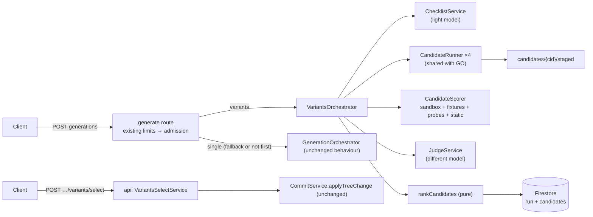

# Genesis Variants — Backend Implementation Plan (overview)

> **As built (2026-10-07).** The in-request entry is implemented. Each phase file starts with an "As built" block that lists what the code does and what is not built. Names in the phase files that differ from the repo are corrected there. Items not built are described in [`../13-variants-feature.md`](../13-variants-feature.md) §14 as missing handlings, and the decisions to build them are in §15. Decisions D27 to D36 below are in force. D14 and D17 changed: the top two scores are always shown, with no distinct-direction rule. The orchestrator is one class, `VariantsOrchestrator` in `variants/variants.orchestrator.ts`. It has no `execute` method and no `RunEvents` port.

> **For agentic workers:** REQUIRED SUB-SKILL: Use superpowers:subagent-driven-development (recommended) or superpowers:executing-plans to implement this plan task-by-task. Steps use checkbox (`- [ ]`) syntax for tracking. Give each worker: this overview's **Global Constraints** + **Coding Standards** + the single task it owns.

**Goal:** Add the variants feature to the Genesis backend: for the first generation in a project, produce 4 candidate apps, score them, rank the top 2, and let the owner select one, which commits exactly one snapshot.

**Design spec:** [`../13-variants-feature.md`](../13-variants-feature.md) (decisions D1–D26, scoring spec, limits, budget). Existing backend plan: [`../08-backend-implementation-plan/00-overview.md`](../08-backend-implementation-plan/00-overview.md). Canonical contracts: [`../07-end-to-end-system-design.md`](../07-end-to-end-system-design.md) §3.

> **Scope of this plan.** Backend and AI generation only. The frontend is a separate plan. **Test tasks are intentionally omitted** (per instruction); each task ends with a **Done when** line instead of a test command. A later pass adds unit, integration and scenario tests in the same `test/**` layout as `08`.

---

## Architecture (what changes)



- The existing single-candidate pipeline is **refactored, not forked**: its parse-validate-stage loop becomes `CandidateRunner`, used by both orchestrators.
- Scoring, checklist, judge and ranking are **plain functions and services that do not depend on HTTP**. This keeps the open execution-model decision (D25) cheap to change (see BV-8.4).
- Selection runs in the `api` function through the **unchanged** `CommitService.applyTreeChange`.

## Global Constraints

Everything in `08` §Global Constraints still applies. Additional rules for this feature:

- **No commit, push or deploy** unless the user explicitly asks (workspace rule).
- **LLM-authored code is executed only inside the harness sandbox** (BV-5.1): a separate child process, empty environment, no secrets, hard wall-clock and memory limits. It is never evaluated in the Functions process.
- **No HTTP or network call inside a Firestore transaction callback**, as in `08`.
- **No generated app code, prompts, fixtures' contents or scores' evidence quotes in logs.** Log ids, counts, scores, durations and costs only.
- **The generator never sees the rubric, the scorer's probes or the fixtures.** Only the design-direction instruction is added to its prompt.
- **Scoring is deterministic where it is deterministic.** Same files + same fixtures + same checklist ⇒ same objective score. Any randomness (judge order) is seeded from the run id.
- **One run, one snapshot.** Nothing is committed before selection. Selection is the only path to a snapshot for a variants run.
- **Variants never block normal generation.** Any inability to run variants (switch off, budget, limits, busy instance) falls back to a normal single-candidate generation (D27).
- **Money is integers.** Costs in the budget counter are in **cents** (`number`, integer). USD floats only in logs.
- Model IDs are configuration, not constants. The judge model must differ from `ANTHROPIC_MODEL` (D23); a startup check disables variants otherwise.

### New decisions introduced by this plan

These refine D1–D26 and need confirmation (they extend `../13-variants-feature.md` §3):

| ID  | Decision                                                                                                                                                                                                                                                                                                                                                                                | Status   |
| --- | --------------------------------------------------------------------------------------------------------------------------------------------------------------------------------------------------------------------------------------------------------------------------------------------------------------------------------------------------------------------------------------- | -------- |
| D27 | When variants cannot run (disabled, budget, user or global limit, busy instance), the request **falls back to a normal single generation** and `generation.started` says why. It never fails because of variants.                                                                                                                                                                       | Proposed |
| D28 | A variants run also consumes **1 unit** of the existing generation limits (10 per 10 min, 40 per day, global 200), because the owner sees it as one generation. The variants limits are **additional**. The existing middleware stays as the outer gate.                                                                                                                                | Proposed |
| D29 | `variants.ready` carries **ids, ranks and scores only**. The client reads candidate files from Firestore (`candidates/{cid}/staged`, already owner-readable by the existing rules). This replaces "files in `variants.ready`" in `13` §5.                                                                                                                                               | Proposed |
| D30 | Candidate ids are `c0`…`c3`. Only candidates in `ranking.top` are selectable.                                                                                                                                                                                                                                                                                                           | Proposed |
| D31 | Checklist size: the model authors 1–8 items (≤ 2 `nice`); code adds baseline items; the merged list must have 3–12 items. This replaces "3–8 after merge" in `13` §6.3.                                                                                                                                                                                                                 | Proposed |
| D32 | `dateRangeCall` is a **baseline-only** probe (added for `calendars.events`). It is not in the vocabulary offered to the checklist model.                                                                                                                                                                                                                                                | Proposed |
| D33 | A discarded variants run ends with status `cancelled` and `variants.resolution = "discarded"`. No new top-level status besides `awaiting_selection`.                                                                                                                                                                                                                                    | Proposed |
| D34 | Per-instance cap of 2 concurrent variants runs. Beyond it, requests fall back to single mode (reason `busy`).                                                                                                                                                                                                                                                                           | Proposed |
| D35 | A candidate can be selected only while the project's latest snapshot still equals the run's `baseSnapshotId`. Unsnapshotted manual edits are fine (the existing checkpoint protects them). If another snapshot was made since, selection fails with `CANDIDATE_NOT_SELECTABLE` (`reason: project_changed`). This refines D16 and the "project changed before selection" row in `13` §9. | Proposed |
| D36 | **Client disconnect in the in-request entry aborts the run** (same as single generation, review finding F36: after the response closes, Cloud Run may throttle CPU). Surviving a closed tab requires the Cloud Tasks entry (BV-8.4). This corrects the "run continues" row in `13` §9 for the in-request entry.                                                                         | Proposed |

## Open prerequisites (resolve before the phase that needs them)

| Needed by | Item                                                                                                                                                                |
| --------- | ------------------------------------------------------------------------------------------------------------------------------------------------------------------- |
| BV-3, 6   | Which model is actually deployed for generation (`claude-sonnet-5` default in `params.ts` vs `claude-opus-5` in docs). Sets the judge model (must differ) and cost. |
| BV-5.1    | Confirm the sandbox approach (child process with Node's permission model) on Node 24 in the emulator, and that its network limits are as assumed (see risks).       |
| BV-7, 8.4 | D25: in-request or Cloud Tasks. This plan builds the in-request entry and keeps the core callable by run id.                                                        |
| BV-5.3    | Fixture set contents and the probe vocabulary (this plan defines a starting set).                                                                                   |
| BV-4.5    | Checklist quality check on 20–30 realistic owner prompts with the lighter model (a manual evaluation, not a unit test).                                             |

## File map (new and changed)

```
functions/
├── package.json                                              + jsdom, css-tree (BV-5.1)
├── src/
│   ├── config/params.ts · runtime-config.ts                  ~ VARIANTS_* (BV-1.6)
│   ├── contracts/limits.ts                                   ~ LIMITS.variants (BV-1.1)
│   ├── contracts/variants.ts                                 + checklist, probes, score, ranking, DTOs (BV-1.3, 1.5)
│   ├── contracts/firestore-docs.ts                           ~ mode, awaiting_selection, candidate docs (BV-1.2)
│   ├── contracts/sse.ts                                      ~ variants.* events, started.mode (BV-1.4)
│   ├── contracts/errors.ts · api.ts · index.ts               ~ new codes, DTOs, exports (BV-1.5)
│   ├── shared/firestore-paths.ts                             ~ candidates, budget (BV-7.1)
│   ├── composition.ts                                        ~ wiring (BV-7.7)
│   ├── index.ts                                              ~ generate memory/concurrency (BV-8.1)
│   └── modules/
│       ├── rate-limit/rate-limiter.ts                        ~ consumeAll, refund (BV-2.1)
│       ├── rate-limit/variants-limits.ts · budget.repo.ts    + (BV-2.2, 2.3)
│       ├── rate-limit/variants-admission.ts                  + (BV-2.4)
│       └── generation/
│           ├── orchestrator.ts                               ~ uses CandidateRunner (BV-3.1)
│           ├── candidate/candidate-runner.ts · candidate-sink.ts   + (BV-3.1)
│           ├── llm/structured-client.ts · anthropic-structured.client.ts · fake-structured.client.ts   + (BV-3.3)
│           ├── llm/gated-provider.ts                         + (BV-3.4)
│           ├── prompt/sdk-catalog.ts                         + (BV-4.2)
│           ├── persistence/generations.repo.ts               ~ mode on start (BV-7.1)
│           └── variants/
│               ├── directions.ts                             + (BV-4.1)
│               ├── checklist/ prompt.v1.ts · baseline.ts · validate.ts · service.ts · template-fallback.ts   + (BV-4.2–4.5)
│               ├── harness/  sandbox/ · inline-project.ts · mock-genesis.ts · fixtures/ · run-scenarios.ts   + (BV-5.1–5.3, 5.5)
│               ├── probes/ · gates/ · static/ · scoring/     + (BV-5.4, 5.6–5.8)
│               ├── judge/ prompt.v1.ts · judge.service.ts    + (BV-6.1, 6.2)
│               ├── ranking/rank-candidates.ts · aggregate.ts + (BV-6.3, 6.4)
│               ├── persistence/variants.repo.ts              + (BV-7.1)
│               ├── variants.orchestrator.ts                  + (BV-7.3)
│               ├── variants-select.service.ts                + (BV-7.5)
│               └── variants.routes.ts                        + (BV-7.6)
firestore.indexes.json                                        ~ TTL field overrides (BV-7.2)
```

## Phases and tasks

| Phase                               | File                                                                                       | Tasks                                                                                                                                                       | Depends on |
| ----------------------------------- | ------------------------------------------------------------------------------------------ | ----------------------------------------------------------------------------------------------------------------------------------------------------------- | ---------- |
| BV-1 Contracts and config           | [`01-contracts-and-config.md`](01-contracts-and-config.md)                                 | 1.1 limits · 1.2 Firestore docs · 1.3 checklist, probes, score schemas · 1.4 SSE events · 1.5 DTOs and errors · 1.6 config parameters                       | —          |
| BV-2 Limits and budget              | [`02-limits-budget-and-admission.md`](02-limits-budget-and-admission.md)                   | 2.1 limiter `consumeAll` + `refund` · 2.2 variants rules · 2.3 daily budget repo · 2.4 admission service                                                    | BV-1       |
| BV-3 Candidate runner and LLM ports | [`03-candidate-runner-and-llm-ports.md`](03-candidate-runner-and-llm-ports.md)             | 3.1 extract `CandidateRunner` · 3.2 orchestrator adapter · 3.3 structured client · 3.4 gated provider                                                       | BV-1       |
| BV-4 Directions and checklist       | [`04-directions-and-checklist.md`](04-directions-and-checklist.md)                         | 4.1 design directions · 4.2 SDK catalog + checklist prompt · 4.3 probe vocabulary · 4.4 baseline items · 4.5 checklist service + validation + fallback      | BV-1, BV-3 |
| BV-5 Scoring harness                | [`05-scoring-harness.md`](05-scoring-harness.md)                                           | 5.1 sandbox · 5.2 inliner · 5.3 mock genesis + fixtures · 5.4 gates · 5.5 scenario runner · 5.6 probes · 5.7 static analyzers · 5.8 objective scorer        | BV-1, BV-4 |
| BV-6 Judge and ranking              | [`06-judge-and-ranking.md`](06-judge-and-ranking.md)                                       | 6.1 judge prompt · 6.2 judge service · 6.3 aggregation · 6.4 ranking                                                                                        | BV-3, BV-5 |
| BV-7 Orchestration and routes       | [`07-orchestration-persistence-and-routes.md`](07-orchestration-persistence-and-routes.md) | 7.1 paths + repo · 7.2 TTL + rules check · 7.3 variants orchestrator · 7.4 cancel and failures · 7.5 select service · 7.6 routes · 7.7 composition          | BV-2…BV-6  |
| BV-8 Operations and rollout         | [`08-operations-and-rollout.md`](08-operations-and-rollout.md)                             | 8.1 function sizing · 8.2 logging and cost records · 8.3 flags and rollout · 8.4 Cloud Tasks entry (conditional on D25) · 8.5 contract sync and doc updates | all        |

BV-2, BV-3 and BV-4 can proceed in parallel after BV-1. BV-5 is the largest phase and can be split between workers at 5.1–5.3 (infrastructure) and 5.4–5.8 (checks).

## Coding Standards

As `08` §Coding Standards, plus:

| Rule       | Detail                                                                                                                                                                         |
| ---------- | ------------------------------------------------------------------------------------------------------------------------------------------------------------------------------ |
| Pure cores | Ranking, aggregation, baseline items, checklist validation, probes' evaluation logic and budget math are pure functions with no I/O                                            |
| Ports      | Anything that talks to Anthropic goes through `ModelProvider` (streaming) or `StructuredClient` (JSON). Anything that executes generated code goes through `runInSandbox` only |
| Prompts    | Prompt text lives in versioned files (`*.v1.ts`) exporting the text and a `*_PROMPT_VERSION` string, recorded on the run                                                       |
| Config     | Read through `loadRuntimeConfig()` at request time. Never at module load                                                                                                       |

## Definition of done (backend variants)

- A first prompt on a new project, with `VARIANTS_ENABLED=true` and the fake providers, produces a run in `awaiting_selection` with 4 candidates, scores, and a ranking of up to 2.
- `POST …/variants/select` commits exactly one snapshot through `applyTreeChange` and completes the run.
- With variants disabled, over budget, over limit, or busy, the same request completes as a normal generation with the reason in `generation.started`.
- Failed candidates, a failed judge or a failed checklist degrade as in `13` §9 without failing the run (unless no candidate qualifies).
- Daily variants spend never exceeds `VARIANTS_DAILY_BUDGET_CENTS` (plus at most one run's overshoot).
- No generated code ever runs outside the sandbox; no secret is present in the sandbox environment.
- `contracts:sync` clean; lint and typecheck clean.

## Risks to watch

| #   | Risk                                                                                                                                                                                | Mitigation                                                                                                                                                                                                                                                                   |
| --- | ----------------------------------------------------------------------------------------------------------------------------------------------------------------------------------- | ---------------------------------------------------------------------------------------------------------------------------------------------------------------------------------------------------------------------------------------------------------------------------- |
| R1  | **Executing LLM-written JavaScript on our server.** jsdom is not a security boundary, and Cloud Run instances can reach the metadata server (service-account tokens).               | BV-5.1: child process, empty env, Node permission model, timeouts, memory cap. Verify network behaviour on the emulator and in staging. If isolation cannot be shown, run the harness in a separate, credential-less service. This is the main item to review before launch. |
| R2  | The harness is a model of a browser, not a browser. Layout-dependent behaviour (CSS, sizes) is not observed, so visual and responsive scores rely on source analysis and the judge. | Documented limitation (D26). Headless Chromium can be added behind the same `ScenarioObservation` contract.                                                                                                                                                                  |
| R3  | Row detection and field matching in the harness are heuristics. A correct app laid out unusually may lose Data accuracy points.                                                     | Tolerant matching, evidence stored per check, and calibration against owner picks (D20).                                                                                                                                                                                     |
| R4  | One function serves both modes. A variants run (4 streams plus sandbox processes) is heavy compared with a single generation.                                                       | BV-8.1 sizing and the per-instance cap (D34).                                                                                                                                                                                                                                |
| R5  | The preview compiler (frontend) and the harness inliner can drift, so a candidate may pass the harness yet render differently in the preview.                                       | BV-5.2 mirrors the host's inlining rules and records the source file; consider moving the compiler into `contracts`-synced shared code later.                                                                                                                                |
