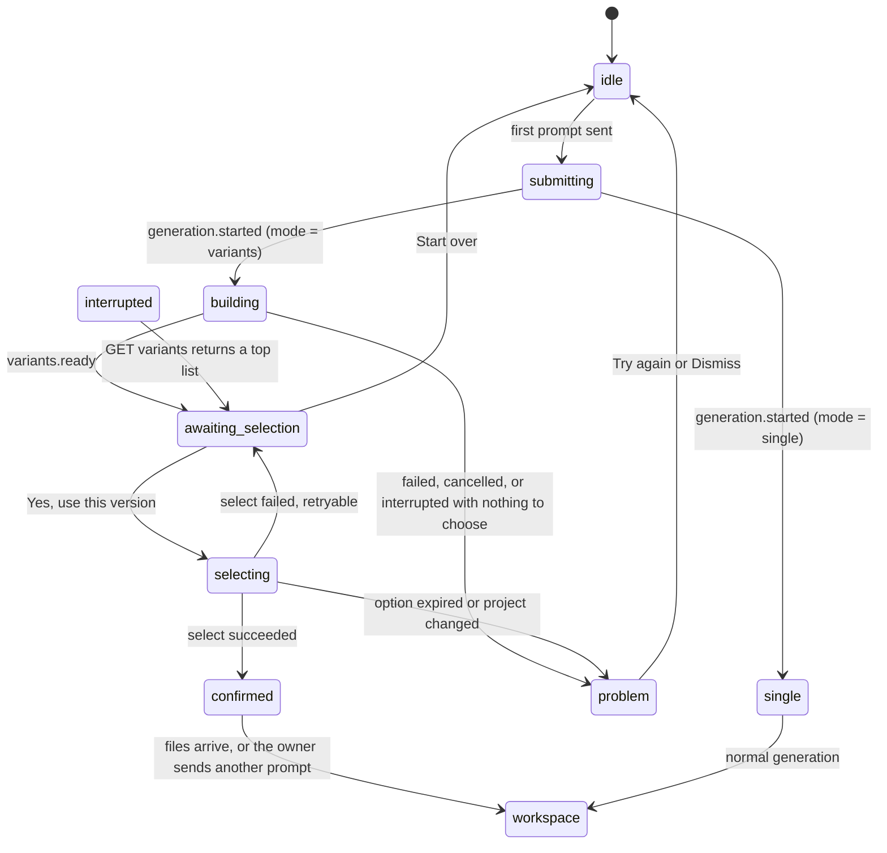
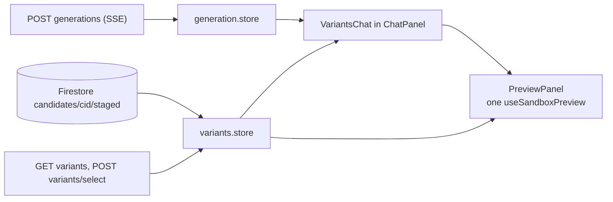

# Genesis Variants — Frontend as built

**Status:** This folder describes the frontend that is in the repo. It replaces the earlier task plan (FV-0 … FV-7). Where an older sentence in this folder disagrees with the files named below, the code wins.

**Goal that shipped:** On a project's first prompt the server may build four options and return the top two. The owner stays in the normal three-panel workspace. Progress, scores, and the pick live in the chat. The existing preview shows one option at a time, on the owner's HighLevel data. Picking one commits that version.

**Related:** decisions [`../13-variants-feature.md`](../13-variants-feature.md) · backend plan [`../14-variants-backend-implementation-plan/00-overview.md`](../14-variants-backend-implementation-plan/00-overview.md) · design brief [`../prompts/02-claude-design-variants-choice.md`](../prompts/02-claude-design-variants-choice.md)

## 1. What the owner sees



| Moment         | What the client shows                                                   | Where                               |
| -------------- | ----------------------------------------------------------------------- | ----------------------------------- |
| Working        | Plain-language stages, a Stop button, "usually two to three minutes"    | `VariantsProgress` inside the chat  |
| The choice     | A toggle of Option 1 and Option 2, the selected score, one live preview | `VariantsChat` and `PreviewPanel`   |
| Choosing       | "Use this version", then an in-place double-check                       | `SelectDoubleCheck`                 |
| After the pick | One line: "You picked Option N. Score X. This is now your app."         | `ChatPanel`                         |
| Not to plan    | Problem copy, or a fallback notice on a normal generation               | `VariantsProblem`, `FallbackNotice` |
| Follow-ups     | Unchanged single-candidate chat                                         | `mode !== 'variants'`               |

The three-panel layout stays mounted the whole time. `WorkspacePage` always renders `WorkspaceLayout`. There is no full-page stage and no `choosing` status. The run status is the server's `awaiting_selection`.

## 2. Architecture



- `generation.store` owns the stream, progress, `awaiting_selection`, recovery, and cancel.
- `variants.store` owns the loaded options, which option is selected, the double-check, select, discard, and the confirmation line.
- `useVariantsSession` (called from `WorkspacePage`) loads options when status becomes `awaiting_selection`.
- One preview. `PreviewPanel` swaps its file list to the selected option. It does not mount a second iframe.
- Candidate files are read once from Firestore and overlaid on the project's files (`candidate-files.ts`).

## 3. Decisions that the build followed

| ID   | What shipped                                                                                                                                                                             |
| ---- | ---------------------------------------------------------------------------------------------------------------------------------------------------------------------------------------- |
| FD1  | The workspace layout stays. Variants UI is a block in the chat, plus the existing preview.                                                                                               |
| FD2  | `generation.started.mode` decides. There is no predicted full-page stage while `submitting`.                                                                                             |
| FD3  | Lifecycle stays in `generation.store`. Options, selection, and confirmation stay in `variants.store`. Status name is `awaiting_selection`, not `choosing`.                               |
| FD4  | `useSandboxPreview` was extracted and `PreviewPanel` uses it. Option previews are that same panel, not a `CandidatePreview`.                                                             |
| FD5  | Files come from `candidates/{cid}/staged`, read once, overlaid with `overlayOps`.                                                                                                        |
| FD6  | The owner sees a total, four group bars, "Our top pick", and "Option N · score". Direction labels are not shown on the toggle. Gates, evidence, and the `unjudged` notice are not shown. |
| FD7  | Double-check is in the chat, not a modal. `DOUBLE_CHECK_BEFORE_SELECT` in `variants.labels.ts` can turn it off.                                                                          |
| FD8  | `budget`, `global_limit`, `user_limit`, and `busy` show a notice on a single generation. `disabled` and `not_first` show nothing.                                                        |
| FD9  | Leaving while a variants run is active warns that the build will stop. `awaiting_selection` does not warn.                                                                               |
| FD11 | There is no lazy `VariantsStage` chunk. The variants components load with the workspace.                                                                                                 |
| FD12 | The code panel and file tree stay available.                                                                                                                                             |

## 4. Copy the owner can see

Stages, in order: "Understanding your request", "Creating versions", "Testing them", "Reviewing the design", "Choosing the best two". Before a phase arrives, the label is "Starting".

Choice heading: "Choose from the two." or "One option is ready."

Double-check: "Use this version (score N)? The other option will be removed. You can keep changing the app in chat afterwards."

Problems (`variants.labels.ts`):

| Kind              | Title                                 |
| ----------------- | ------------------------------------- |
| `failed`          | We couldn't build your options        |
| `cancelled`       | Stopped                               |
| `interrupted`     | The connection was lost               |
| `none_qualified`  | We couldn't finish your options       |
| `provider_busy`   | The AI service is busy                |
| `expired`         | These options are no longer available |
| `project_changed` | This project changed                  |

`none_qualified` is only chosen when the error code is `GENERATION_INVALID_OUTPUT`. The backend's empty-score failure uses `INTERNAL`, which the client shows as `failed`.

## 5. What this build does not include

- A full-page stage that replaces `WorkspaceLayout`.
- Two previews side by side, or tabs that keep two iframes mounted.
- A `CandidatePreview` component.
- A confirmation screen with Continue. `requestHandoff` and `finishHandoff` exist on the store and no view calls them.
- A "Try again" next to the single option. One finished option uses the same Use / Start over actions as two.
- The Cloud Tasks progress path (FV-7.5). Progress still comes from the SSE stream.
- A variants-specific discard route on the client. Start over calls the existing `discardGeneration`.

## 6. File map

```
frontend/src/
├── services/api/variants.api.ts                         GET variants, POST variants/select
├── services/firestore/variants.repo.ts                  fetchCandidateOps
├── features/workspace/
│   ├── WorkspacePage.vue                                useVariantsSession(); layout unchanged
│   ├── stores/generation.reducer.ts · generation.store.ts
│   ├── composables/useGeneration.ts                     leave warning while building
│   ├── chat/ChatPanel.vue · LiveAssistantMessage.vue    VariantsChat, confirmation line, FallbackNotice
│   └── preview/useSandboxPreview.ts · PreviewPanel.vue  one preview, file list swaps
└── features/variants/
    ├── VariantsChat.vue · VariantsProgress.vue · VariantsProblem.vue · FallbackNotice.vue
    ├── OptionToggle.vue · ScoreSummary.vue · TopPickMarker.vue · SelectDoubleCheck.vue
    ├── option-label.ts · score-display.ts · candidate-files.ts · variants.labels.ts
    ├── useVariantsSession.ts
    └── stores/variants.store.ts
```
